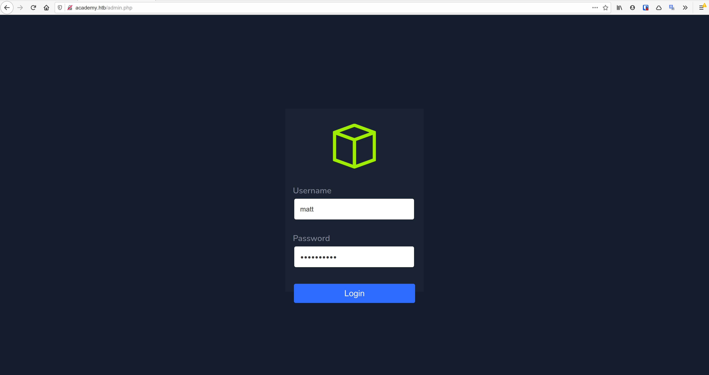

+++
authors = ["Matt Johnson"]
title = 'HTB: Academy Writeup'
date = '2021-02-27'
description = "Here's how to solve HackTheBox's Academy."
draft = false
tags = ["hackthebox","security"]
summary = "Here's how to solve HackTheBox's Academy."
+++



# High-Level Information

Machine Name: Academy

IP Address: 10.10.10.215

Difficulty: Easy

Summary: HackTheBox's Academy was a fun box that required an understanding of how to abuse web registration forms, move laterally on a Linux machine, parse logs for meaningful information, and abuse a dependency management executable to gain root access.

Tools Used: Nmap, Gobuster, Burpsuite, linPEAS

# Initial Foothold

As always, I began by running Nmap:

I spent a brief period of time trying to figure out whether port 33060 was the intended target, but I concluded it was likely a rabbit hole as I had difficulty finding any way to interact with the service. From there, I decided to enumerate the website:

 

I made an account and explored the website:

Unfortunately, there was little in the way of useful information besides finding a potential username, `egre55`. Running Gobuster against the site yielded some additional webpages worth exploring, however.

Notably, `admin.php` stood out. In determining how I could gain access to admin credentials, I decided to revisit the user registration process. I inspected the interaction via Burpsuite and found something interesting:

In the `POST` request associated with user creation, there's a third parameter in addition to the username and password. The parameter `roleid` was user-modifiable. I changed it from 0 to 1 and attempted to use the newly created account to log in as an administrator.

  

Following the lead regarding the "issue" identified with `dev-staging01.academy.htb`, I visited the site:

On the site, I found an API key for an application called Laravel.

I was unable to find the software version anywhere, so I was running a bit blind for this part. I was able to identify that a specific version of Laravel from 2018 was susceptible to RCE (CVE-2018-15133) and had known-working exploits available. One of those exploits, [a python-based script written by A.J. Javier](https://github.com/aljavier/exploit_laravel_cve-2018-15133), had the capability for spawning an interactive shell. I attempted to use it, first running the default command `uname -a` to determine whether the vulnerability applied to this particular version of Laravel:

# Privilege Escalation

After confirming that I was able to get remote code execution, I spawned an interactive shell. The shell itself was very limited, so I used `/usr/bin/php` to upgrade to a more practical shell.

The `www-data` user had extremely limited capabilities and appeared to be sandboxed within the `/var/www/` directory, so my internal enumeration was limited to that general area. I eventually happened upon a file that contained database credentials. The database credentials did not work with MySQL in the end. After that failed, I performed a password spraying attack on all users with login capabilities. The password was successfully used against the `cry0l1t3` user.

 

As shown above, the `cr0l1t3` user was a member of the `adm` group. On a typical Linux system, this group is responsible for system administration and, notably, monitoring. By running the `find` command, I was able to verify that fact and see which log files the group had read permission for.

Being able to parse Linux logs for useful information, whether that be for enumeration (on the offensive side) or forensics (on the IR side), is a bit of an art form. In production systems, you can't simply read them. There are thousands to millions of entries, most of which are benign. You need to know what kind of information is logged in each respective file, what specific information to look for, and whether identified information is useful vs. what is not. For those curious, here [\[1\]](https://www.dedoimedo.com/computers/audit.html) [\[2\]](https://www.eurovps.com/blog/important-linux-log-files-you-must-be-monitoring/) [\[3\]](https://sematext.com/blog/auditd-logs-auditbeat-elasticsearch-logsene/) are some useful resources to get started learning about Linux log inspection. In my case, using the `aureport` tool I was able to find credentials for the `mrb3n` user.

The `mrb3n` user was able to run `composer` as root. Composer is a PHP dependency management tool, but has a fatal flaw: one can execute scripts via the program. [GTFObins](https://gtfobins.github.io/) is an excellent website that identifies how to break out of restricted environments, escalate privileges, or successfully pivot on the machine using common tools found on Linux systems. For the Composer tool, there is an entry that specifies how to generate an interactive shell. Using this series of commands in combination with `sudo` privileges, one could escalate privileges to root.

