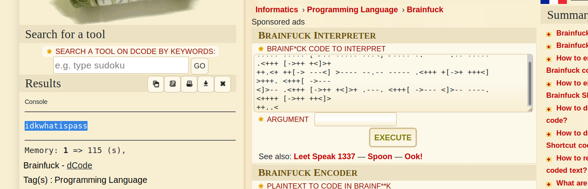

+++
authors = ["Matt Johnson"]
title = 'HTB: Frolic Writeup'
date = '2020-04-06'
description = "Here's how to solve HackTheBox's Frolic."
draft = false
tags = ["hackthebox","security"]
summary = "Here's how to solve HackTheBox's Frolic."
+++



# High-Level Information

Machine Name: Frolic

IP Address: 10.10.10.111

Difficulty: Medium

Summary: HackTheBox's Frolic was a machine that, given sufficient patience and enough enumeration, was relatively easy to get a foothold on via the vulnerable PlaySMS web application. The application is discovered by following an increasingly cryptic trail of hints. Once on the box, internal enumeration shows that there is an SUID program called 'rop' in a folder accessible by the user 'www-data'. In order to get a root shell, one has to use a ROP attack against the vulnerable strcpy() method within this program.

Tools Used: Nmap, Gobuster, Ook! Interpreter, Brainfuck Interpreter, Metasploit, gdb, ldd

# Initial Foothold

I attempted to enumerate SMB and see if there was any useful information, but there was nothing to see. Likewise with the Node-RED server. The Nginx server on port 9999 was interesting, however. Visiting http://10.10.10.111:9999/ showed only the default Nginx page, but enumerating directories with gobuster led to some discoveries:

The /backup directory gave me a set of credentials, 'admin:imnothuman', but they didn't give me access to any services. The /dev directory did not initially appear useful, but running a gobuster scan against it revealed a hidden service:

  

Revisiting the initial gobuster scan, the /admin directory redirected to a login panel. I was able to find credentials to gain access within the source code:

 

Upon further research, I determined that this seemingly random noise was an encoded, esoteric language called Ook! Using a decoder found online, I learned that it pointed to another hidden directory:

 

Assuming this was base64, I decoded it on my machine and ran 'file' against it, which demonstrated that it was a password-protected .zip file. The password was simply 'password'. Within the decompressed .zip file was the file 'index.php'. This file was encoded three times, first in hex, then in base64, and lastly in Brainfuck, which is similar to Ook!

  

The resulting string 'idkwhatispass' turned out to be the password needed to gain access to PlaySMS. From here, I used Searchsploit to find applicable vulnerabilities. The exploit I ended up using was an authenticated RCE tracked under CVE-2017-9101. Ordinarily, I try to avoid using Metasploit, but this time I happened to use it.

With a foothold on the system, it was time to focus on escalating privileges.

# Privilege Escalation

While doing some initial reconnaissance on the machine, I was able to discover an SUID binary called 'rop'. The program was designed to take a user argument and repeat it. Stress-testing the application revealed an inability to handle strings with 52 bytes or more. Inspecting the binary revealed that the program was likely using strcpy(), an old and dangerous function in C.

In order to get a root shell, I needed to craft a payload that would overwrite memory in a way that would run a system call to '/bin/sh'. For the payload, I would need to know:

1\. The length of the buffer.

2\. The address in memory of the system() function

3\. The address in memory of the exit() function

4\. The disk address of the library used by the program.

5\. The offset of /bin/sh within the previously mentioned library.

Already knowing the length of the buffer, the images below depict the rest of the steps needed to perform this exploit:

   

Running the program using this custom payload grants a root shell:

