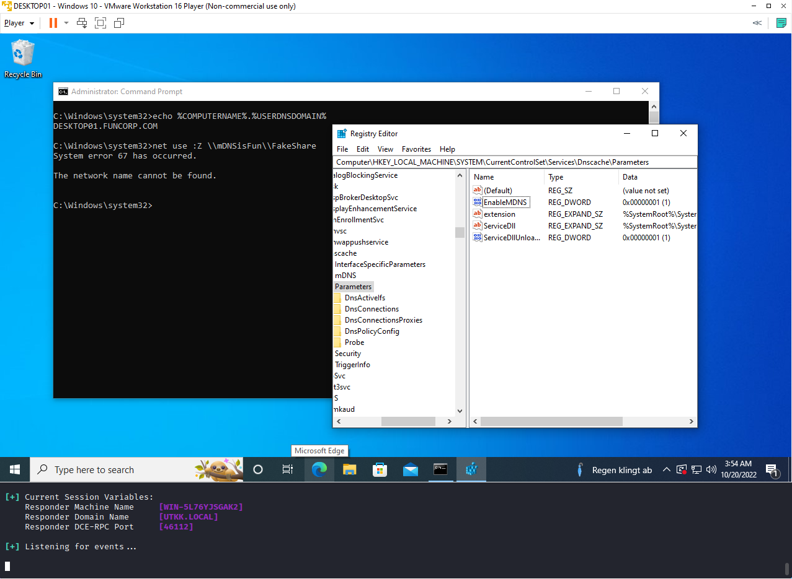

+++
authors = ["Matt Johnson"]
title = "Microsoft's foray into mDNS is introducing new security issues"
date = '2022-10-21'
description = "Microsoft has decided to go against its better judgement and enable mDNS on Windows by default. Since nobody else seems to have analyzed why this is such as bad decision, I decided to do so. It's not great."
draft = false
tags = ["microsoft","security"]
summary = "Microsoft has decided to go against its better judgement and enable mDNS on Windows by default. Since nobody else seems to have analyzed why this is such as bad decision, I decided to do so. It's not great."
+++

As a security professional who largely specializes in offensive security, my relationship with Microsoft could be defined as special. I love Microsoft, not for the usefulness of their products, but for the job security that they provide people like me and the thousands of other consultants out there whose entire job is to keep clients up to date on how Microsoft is exposing them to unnecessary risk. That being said, I thought we were turning the corner and that Microsoft was, at the very least, being mindful of the risks they expose their clients to (excluding programming errors, which are unfortunately necessary for ensuring the continued employment of their security engineers).

I may have thought wrong.



# Part 1: "I just want my technology to work"
For all the criticisms one can levy at Microsoft, it's pretty hard to argue that their products don't work. It may be slightly easier to argue the products don't work well, but I would argue that is in part a byproduct of why their products work. Microsoft's relentless pursuit of backward compatibility in a world designed around planned obsolescence has made them a reliable steward of the corporate network. When a company invests hundreds of thousands to millions of dollars in systems designed to last 15 years, Microsoft is happy to accommodate that. Servers running Windows Server 2008 (or even worse, Server 2003) can be found in a wide variety of corporate networks, chugging along right next to their allegedly modern counterparts. This leads to a beautiful multi-generation household that ensures that the world keeps turning and that companies can integrate new systems in a way that does not create conflicts with existing systems, software, and business processes.

There is a slight kink in the strategy though, and that is the fact that backward compatibility is somewhat of a double-edged sword. Not inherently, mind you, but one has to consider the implications of ensuring that modern systems which are designed by hundreds if not thousands of engineers, many of whom do nothing but focus on security, are compatible with systems designed nearly twenty years ago (and perhaps even longer when you consider the iterative nature of Windows) before anyone could even fathom the possibility of systemic cybersecurity risk.

backward compatibility has historically been and still is the main driver of vulnerabilities that lead to total network compromise. In the popular imagination, hackers are thought to identify vulnerable software and attack it. You can even see this reflected in the news, with the constant onslaught of articles detailing the CVE of the day. In my experience as some who does a large number of penetration tests, this is not the case. Many of the vulnerabilities I identify are consistent across environments and are a result of a lack of awareness of default configurations within Windows as well as a lack of consideration for how even seemingly innocuous misconfigurations can be the proverbial first domino to fall.

LLMNR, NBT-NS, WPAD, SMB signing, NetNTLMv1, DHCP, one could go on... All of these "features" were implemented at times when engineers didn't really consider the security implications of things, nor did they arguably have to. Those engineers probably didn't even expect that these protocols would persist into the modern day, but here we are. Penetration tests can actually be quite mundane and formulaic a lot of times because I may not have to do anything more than run Responder, relay the credentials, dump the local admin hash, and pass it around until I'm able to get access to something important. There's no CVE to exploit, and in fact not doing so is advantageous as I don't have to worry about security tools catching wind of what I'm doing. Real life isn't a CTF, nor is it the Matrix, and it especially isn't like NCIS. That would be overselling the coolness of it.

All of these old vulnerable components aren't random though, they still exist because someone at Microsoft has decided, justly or not, that these configurations need to remain enabled by default for backward compatibility. This isn't just merely a philosophical disagreement either, these decisions have measurable real-world economic and operational consequences. EternalBlue, otherwise known as MS17-010, was an exploit against Server Message Block (SMB) version 1 created by the NSA and later released publicly by the Shadow Brokers group. The targeted protocol was created in 1983 and had reached a pretty mature state by the early 90s. It was among the most prevalent file share protocols of its time and was importantly the preferred protocol of Microsoft. Beginning with Windows 3.1 in 1992, Microsoft made it a mainstay of Windows networked computing until its deprecation in 2013. 

But that's not the end of the story. As any security consultant will tell you, just because some software or protocol is deprecated does not mean that it stops being used. On June 27, 2017, a massive cyberattack was launched against Ukraine using a variant of the Petya malware. It propagated via the aforementioned EternalBlue exploit, and due to the enduring prevalence of SMBv1, which had been deprecated for four years at that point, spread widely to organizations and countries around the world, including many within the United States, Germany, France, and the United Kingdom. While I could find no official estimate of the total damage, it has been informally estimated at $10 billion. Companies like Maersk, Mondelez, and Merck were all hit extremely hard and had estimated losses in the hundreds of millions of dollars. The perpetrators were notoriously discriminatory against companies starting with the letter "M". This is the other edge of the sword. Features and functionalities that are implemented today won't simply go away because much of the IT world depends on them not to. This aphorism means that any functionality put in place needs to be done so thoughtfully with security in mind and subject to lots of testing before it becomes a widespread and indispensable thing. That's why Microsoft's latest decision is, frankly, baffling.

# Part 2: Wait, Microsoft actually did that?
Normally I wouldn't be terribly quick to identify the evolutionary changes Microsoft makes to Windows. More often than not, I will only hear about the things Microsoft has done via security news sources or when someone much smarter than me plays around with a Windows feature and produces content about how it works or how to abuse it. You might imagine my surprise when I was conducting a penetration test and I started getting Windows machines sending me mDNS queries followed by NTLM challenge-responses (you can crack those to get passwords, for those reading who aren't familiar with this space). It's just not something you ever really see. Apple devices have used mDNS for multicast name resolution for a while and its issues are well known, but up until this moment, I had never realized that Windows even had an mDNS implementation.

After a bit of googling, I learned that Microsoft has been quietly introducing the protocol on its machines for years and in April 2022 publicly announced that it ultimately planned to make mDNS the only multicast name resolution protocol enabled by default on Windows. Hardly anyone has written about this, much less people in the infosec sphere. In fact, almost all of the sparse information out there simply announces that this will be a thing. Seemingly very little analysis or scrutiny of the decision exists as of October 2022, and in my opinion, the decision certainly deserves a degree of scrutiny. I figured this is a good opportunity to finally contribute an actual original thought to the community at large.

# Part 3: "Everyone in the tech industry loves mDNS… except corporate security."
In his blog post titled "mDNS in the Enterprise", Microsoft Network Engineer James Kehr describes the functionality of mDNS, its benefits, and the security implications of the technology. He then provides some recommendations about how he and his team believe corporate security personnel should lock it down. To his credit, he presents a thoughtful response to some of the criticisms levied against the protocol. That being said, I didn't find his arguments convincing for most corporate use cases, and I am going to demonstrate precisely why. Before I do so, though, I am going to summarize his article with as little added commentary as possible. I would recommend anyone interested to read it in addition to this blog post as it is well-written and may lead you to your own conclusions.

James argues that mDNS is fundamentally different from previous multicast resolution protocols such as NBT-NS, LLMNR, and SSDP. It is ubiquitous throughout the tech world as it is easy to implement, and numerous devices, including Smart TVs, wireless displays, printers, and wireless speakers, use the protocol. Operating systems likewise might use it (more on this later). Security professionals are distrustful of the protocol as it resembles those of other historically abused ones, and a malicious actor could likewise abuse this protocol with a "cleverly written malicious script or program," though they must be on your network to do so. 

Given the widespread use of this protocol, it would be unwise to attempt to disable it via the registry as it would only disable its use as a part of the Windows DNSCache service and ultimately not fully lock down the service as intended. The service should rather be controlled via Defender Firewall, which is already widely used and easy to modify to restrict the protocol. James argues that you shouldn't completely block the protocol, as some remote workers may need it to connect devices at home. It can safely be disabled within corporate offices by using the Domain profile within Defender Firewall. One can optionally also disable the protocol for the Public profile of Defender Firewall to prevent its use at coffee shops and the like, but doing so may interfere with Miracast.

As a final note before the next section, I want to clarify that this isn't meant to target James Kehr directly, only that his writing acts as a good foil for the points that I would like to make. As a networking guy, he operates within a different framework, and we likely come from very different backgrounds. As previously mentioned, his article was well written and attempted to explain and provide solutions to security concerns, and I simply want to add to the knowledge pool and facilitate a more nuanced discussion of the subject.

Moving on.

# Part 4: mDNS is bad, actually
To determine whether mDNS is broadly useful within corporate environments such that the benefits outweigh the risks in a broad sense, I'm going to attempt to answer three questions:
 - Does mDNS solve a problem that broadly exists within corporate environments?
 - Does mDNS introduce or perpetuate security flaws that expose organizations to risk?
 - Do Microsoft's recommended strategies for securing mDNS hold water?

In doing so, I am going to answer some practical questions that James presents in his blog post as well as some that I anticipate readers may have as I go through these points.

## So, does mDNS solve a problem?
mDNS is yet another implementation of the classic multicast name resolution protocols. At a conceptual level, it functions basically the same as many of the others historically seen within Active Directory environments (everyone reading this has disabled LLMNR, right?). Speaking generally to begin, Windows name resolution functions as follows:
 - Is the hostname being queried my own?
 - Is the hostname being queried in my DNS resolver cache?
 - Is the hostname being queried in my hosts file?
 - Can my DNS server help me find the host?
 - Can another device on my local subnet help me find the host?
     - LLMNR is used first
     - NBT-NS is used as a backup

As far as I can tell through my readings, Microsoft plans for mDNS to eventually sit on top of LLMNR in the name resolution process, at least for devices ending in the ".local" TLD. An important part of determining whether this protocol will be broadly useful in a corporate environment is to consider its use cases.

To state the obvious, it only works on a local subnet. So many of the purported benefits of the protocol (printer discovery, wireless displays, Chromecasts, etc.) will only extend to you insofar as you don't keep those devices segmented. One could argue that devices of that nature should be, but that may be subject to debate. In many corporate environments, you will see devices such as printers and conference room equipment on their own VLANs, so mDNS isn't really going to help all that much for discovery in those cases. 

That leads to my next point, which is that many enterprise-grade printers and conferencing equipment don't use mDNS for discovery or at the very least only present it as an option. Take PaperCut, a common print management software used by a lot of organizations, for example. They do allow mDNS as a discovery option, but it's merely presented as an option and they recommend that medium to large organizations use DNS for discovery instead. Likewise, conference room solutions such as VIA Kramer do not utilize mDNS for discovery. Using protocols like Miracast for video conference generally work for small offices or homes, but enterprises aren't heavily utilizing these protocols. Wireless displays for personal use aren't widespread as they generally have high latency. Corporate workers are far more likely to use docking stations or HDMI inputs for their monitors.

Broadly speaking, the other types of devices you might see using mDNS (Smart TVs, set-top boxes, wireless speakers, etc.) are just not things you would expect or even want to see on the inside of a corporate environment. They certainly shouldn't be able to communicate with workstations or servers.
In almost any case where you could hypothetically use mDNS for discovery, giving a device a static IP address and adding a record to your DNS server is going to serve the same end without any of the added risks associated with multicast protocols. Just because this newer protocol is seeing more widespread adoption doesn't mean that DNS isn't the better option. The fact that it can work securely in a networked corporate environment is an added benefit that more than justifies the added complexity.

## Is this all just infosec catastrophizing?
I get it, I really do. Infosec people have a somewhat-deserved reputation in the IT profession for being dramatic types who are constantly creating problems for developers and IT admins who just want to make things work. Adding to the misery, infosec people are largely removed from much of the pain associated with implementing their own recommendations ("just patch"). That doesn't make us wrong.

To begin, I want to briefly address the topic of remote workers' potential need for mDNS. I find the scenario unlikely for all but the smallest handful of workers. Your average worker that uses a wired monitor, a wireless keyboard and mouse, and some Bluetooth headphones or speakers has absolutely no need for mDNS. While it is theoretically possible that a worker might use a wireless monitor or printer that uses mDNS for discovery, I question whether those needs outweigh an organization's necessity to keep its network secure. Wireless monitors are both uncommon and have considerable latency, and basically every printer allows a user to plug in via USB to print.

James' blog post briefly mentions that it is possible to poison mDNS name and service resolution requests using a cleverly written malicious script. While I would agree that the individuals who have written tools like Responder and Inveigh are indeed very clever, people like myself who use the tools need not be. Even an individual who knows nothing about how name resolution works can use the tools. 

James also notes that it is necessary for a malicious DNS resolver to be on the network in the first place, which I read as implying that a situation of that nature should already be understood as catastrophic. I don't agree. I perform internal penetration tests all the time, and the truth is that just because an attacker is on the network doesn't necessarily mean total failure. Modern corporate networks shouldn't be treated as walled cities, and well-designed security architecture should account for the fact that you shouldn't necessarily trust another machine simply because they're on the inside. Even organizations with outstanding security awareness training have 3% click rates during phishing exercises. Realistically, an attacker needs to get lucky only once to get onto a network. They often need to get lucky multiple times to take it over completely. Multicast name resolution protocols offer attackers a convenient stepping stone to go from initial access to lateral movement or privilege escalation.

To demonstrate this, I'm going to present a very realistic scenario and demonstrate how mDNS is fundamentally no different from its predecessors in terms of risk. Imagine that your IT organization utilizes SMB for a department-wide file share which is automatically mounted upon startup using a batch script. Likewise, imagine that the department is spread across multiple offices, all of which are connected using Microsoft's DirectAccess. As is sometimes the case, DirectAccess leaves a user hanging in the "Connecting" state, meaning that the user cannot access the organizational DNS server or SMB share located in one of the other offices. As you've just logged on for the workday, the batch script runs in the background. It was not able to resolve your company's file server, mDNSisFun, and consequently couldn't reach the department share, FakeShare. A script kiddie who happened to be on your network is running Responder, a multicast name resolution poisoning tool, at the exact same time as this batch script is run. What happens?

Without any prompt from the user or even an awareness that anything has happened, the employee has sent over their credentials. For the purpose of this demonstration, I have run the command graphically. This functions exactly the same as a batch startup script.

As James coyly mentions in his blog post, there is a way to disable the mDNS resolver within the registry. He deliberately chooses not to say which key you need to modify, but fortunately, Andreas Finstad has already explained how to do so on [his blog](https://f20.be/blog/mdns), which as an aside is seemingly the only other blog post on the internet that is critical of this decision by Microsoft.

After disabling the mDNS resolver within the Windows DNSCache service, I reran the test and found that the broken batch script no longer leaked credentials.

Now, I did have one additional outstanding question related to how mDNS would affect corporate Active Directory environments. Under ordinary circumstances, mDNS is weird in that it relies on the ".local" TLD as an inherent part of its name resolution process. Additionally, a commonality between the penetration test I performed, Andreas Finstad's blog post, and the test I performed for this blog post is that all environments use that same ".local" TLD for their Active Directory domain name. Given mDNS' affinity for the TLD, I wanted to see if this issue was limited to domains that use it. I went through the somewhat arduous process of changing my test environment's domain from ‘FUNCORP.local' to ‘FUNCORP.com' using [RebelAdmin's helpful blog post](https://www.rebeladmin.com/2015/05/step-by-step-guide-to-rename-active-directory-domain-name/), re-enabled mDNS on my client machine, and attempted to once again mount the nonexistent mDNS share.

This time, nothing happened. As a result, I believe that this vulnerability is likely to only affect organizations that use the ".local" TLD. The issue is that many organizations do use the ".local" TLD for the internal Active Directory domains. Even the most masochistic of IT administrators don't spend their nights pouring over IETF RFCs looking for obscure ways their corporate domain names might conflict with some protocol they've likely never heard of, and ".local" seems appropriate for an internal network.

The question then remains, what advice should we reasonably give these unfortunate organizations? Recommending that affected organizations change their domain name is an option, however unpleasant it may be. For even moderately complex environments this is likely to cause a number of issues, so it doesn't seem like a great option. I'm going to save my recommendation for later in this blog post, though.

## Microsoft's recommendations are not great

James' article claims that mDNS should not be disabled via the registry as many applications including Microsoft Teams, Edge, and Google Chrome have and use their own implementation of mDNS. Simply disabling the mDNS resolution component of the DNSCache service would not eradicate the protocol from the network. I first wanted to test how Edge and Chrome respond to a request to a fake ".local" site with mDNS enabled in the registry settings, and the results were interesting. Worth noting that for this testing I reverted my Active Directory domain back to "funcorp.local."

mDNS is certainly doing something here. However, it does not automatically send credentials as was the case with mounting the SMB share. It prompts a user for credentials, which is going to be subject to both scrutiny and error by the end user. This is still not an ideal situation as a user could be attempting to visit a valid intranet website and not think anything of this authentication request. So, what happens if you disable mDNS in the registry?

At least for Edge and Chrome, it appears that simply disabling mDNS resolution for the DNSCache service is enough to neutralize this attack. I wasn't able to conduct this test for Teams, but I ran the commands from James' blog post on two different machines running Teams and it doesn't seem to run its own implementation. I likewise couldn't find any documentation stating as much, and Microsoft does not list UDP port 5353 as a requirement for Teams. I am happy to be corrected on any of this though.

This brings me to Microsoft's second recommendation: if you want to stop mDNS, do it via Defender Firewall. In general, I find this to be a perfectly sensible option, especially for organizations that already use it. In implementation, there are some issues with this strategy. James' recommendation is specifically that you should block it for the Domain profile (for the office), allow it for the Private profile (for remote workers), and you may optionally block it for the Public profile. I have already addressed the topic of remote workers, but I feel the need to emphasize that even if you really want to allow your remote workers to use mDNS, you should disallow mDNS traffic over the Public profile. Not doing so risks exposing credentials on public Wi-Fi networks, essentially turning a strictly internal vulnerability into a public-facing one. 

There's another issue with strictly relying on firewalls to secure multicast traffic which is that it is simply moving trust around. By saying "I trust these devices to communicate via mDNS" you must both know what devices you are provisioning trust to and believe that those devices couldn't reasonably be compromised. Within a given subnet (the scope of mDNS), you would have to maintain a precise inventory of trusted devices that might need to communicate via mDNS and restrict incoming traffic to only that coming from those devices. If you already have a precise inventory of those devices, why do you need mDNS? Surely at that point, traditional DNS with static IP addresses or even dynamic DNS is going to better suit you.

Microsoft does not recommend that you disable outbound mDNS. Their precise recommendation is that to completely disable mDNS within the environment, you should disable the "mDNS (UDP-In)" rules for all profiles within Defender Firewall. Here's a sample of how those firewall rules look:

If you're very clever you might have already noticed a potential problem. Disabling these rules will effectively shut down mDNS as a tool for discovering your office's local Fire TV stick, but it arguably does nothing to defend against the attacks demonstrated in this blog post. To demonstrate, I have disabled all of these rules and reran the previous attack:

Furthermore, disabling these inbound rules still doesn't totally preclude the possibility of running an mDNS poisoner on a workstation (e.g., after gaining access via phishing). Using Kevin Robertson's Inveigh I was successfully able to poison mDNS requests despite having all recommended inbound rules disabled:

This is because those inbound firewall rules apply only to svchost, which in this context is the DNSCache service I mentioned earlier:

All of this was done in the service of demonstrating how Microsoft's recommendations for securing mDNS aren't just wrong, they're contradictory. On one hand, they recommend against disabling mDNS via the registry as that only disables the mDNS resolver within the DNSCache service itself, but on the other hand, their recommendation for disabling it via Defender Firewall does the exact same thing and fails to protect against the biggest threat the protocol poses.

One final note before moving on, and that is my wholesale rejection of the idea that you should somehow be applying different security standards for remote workers, whether in their private homes or in a café, than you do to workers in the office. Some compromises may be necessary, but I'm not a fan of the recommendation that one should allow a fundamentally flawed protocol in people's homes or on public networks on the off chance that not doing so might make their lives slightly more difficult. If you have remote workers, send them a laptop, a wired external monitor, a mouse, and a keyboard. Any special accommodation beyond that which is typically expected should be considered extraordinary and handled by IT support. Weakening your holistic organizational security posture in pursuit of optimizing around edge cases is, as we say in the industry, a no-no.

## I'm lazy, just tell me what to do.
For the pragmatists out there, I would recommend that you follow Andreas' advice and disable mDNS via the registry. This seems to prevent the worst byproduct of this flawed protocol – the leaking of credentials via poisoning. I would also recommend running Wireshark on a couple segments of your network and seeing what kind of mDNS traffic is appearing. If the traffic seems extraneous, I would additionally recommend creating a host-based firewall rule that blocks inbound UDP port 5353 for all programs. This precludes the very idea of any malicious actor running an mDNS poisoner on one of your devices. I don't think mDNS is that useful of a protocol for corporate environments, so I would expect that disabling it is unlikely to cause issues in most cases.

For the IETF, I would probably recommend that we don't assign special meaning to TLDs beyond their typical semantic uses (e.g., using ".gov" to imply it's a government website). I have a feeling that ship has sailed, though.

# Part 5: The End
mDNS is problematic. I think I've made my case.

Even more problematic, however, is that even with our knowledge of the last 30 years of computing history – the knowledge that the decisions we make today will persist for years or even decades – we are still making these kinds of questionable decisions. Infosec has long had the job of trying to retrofit security into systems not designed for it. The light at the end of the tunnel should have been that all of this firefighting and its consequences would have led the tech world to develop more thoughtfully in the future. I think that is happening, but this situation has demonstrated that there's probably still a ways to go. 

Infosec may be the teacher watching over the punch bowl at the school dance, but it's only that way because, much like teenagers at a school dance, the tech world can make some very questionable decisions when the party gets going. 

We took our eye off the punch bowl.

# Addendum

It's very possible that some of the information in this blog post is wrong. I have tried my best to consider and preempt different criticisms or counterpoints, but if there's anything that I haven't addressed in this blog post I'd be happy to hear about it and update this blog post accordingly. You can contact me at [me@infosecmatt.com](mailto:me@infosecmatt.com) or on [LinkedIn](https://www.linkedin.com/in/johnsonmatte/).

# Additional References and Sources
- [mDNS in the Enterprise - Microsoft Community Hub](https://techcommunity.microsoft.com/t5/networking-blog/mdns-in-the-enterprise/ba-p/3275777)
- [Microsoft TCP\/IP Host Name Resolution Order](https://support.microsoft.com/en-us/topic/microsoft-tcp-ip-host-name-resolution-order-dae00cc9-7e9c-c0cc-8360-477b99cb978a)
- [Windows Name Resolution \| Microsoft Learn](https://learn.microsoft.com/en-us/openspecs/windows_protocols/ms-wpo/f00add7f-a321-4a5f-a5d8-1748e748cd44)
- [Selecting the Forest Root Domain \| Microsoft Learn](https://learn.microsoft.com/en-us/windows-server/identity/ad-ds/plan/selecting-the-forest-root-domain)
- [Printer discovery with Mobility Print - which method is best for you? \| PaperCut](https://www.papercut.com/help/manuals/mobility-print/how-it-works/printer-discovery/#mdns-discovery)
- [mDNS and DNS-SD slowly making their way into Windows 10 \| Ctrl blog](https://www.ctrl.blog/entry/windows-mdns-dnssd.html)
- [Chrome browser - multicast DNS support (google.com)](https://groups.google.com/a/chromium.org/g/chromium-discuss/c/6b0vVreNTvQ?pli=1)